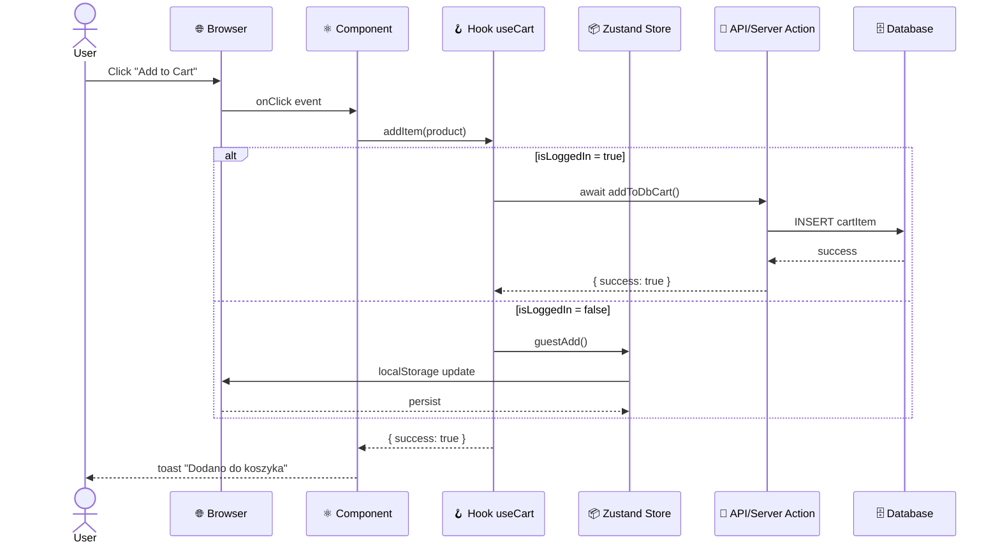

# Analiza Przepływu Danych

Utwórz szczegółową analizę przepływu danych dla scenariusza użytkownika w aplikacji.

## Input

Scenariusz powinien zawierać:
- **Ścieżka**: Sekwencja kroków użytkownika (np. niezalogowany → dodaj produkt → zaloguj → weryfikuj koszyk)
- **Kod źródłowy**: Dostęp do plików projektu (komponenty, API, hooki, akcje serwera)
- **Punkt startowy**: URL, ekran lub akcja początkowa

## Procedura

Dla **każdego kroku** w sekwencji:

### 1. Zidentyfikuj Akcję
- **Co się dzieje**: Krótko opisz akcję użytkownika lub system action
  - Przykłady: klik na przycisk, submit formularza, API call, wyzwolenie hooka
- **URL/Ekran**: Wskaż bieżący URL i widoczny stan UI
- **Trigger**: Jakie zdarzenie wyzwoliło ten krok

### 2. Mapuj Dotkniętych Pliki
Dla każdego pliku zaangażowanego w ten krok:
- **Ścieżka pliku**: Link markdown do pliku w workspace
- **Symbol**: Nazwa funkcji/komponentu/metody (bez @ symboli)
- **Linia**: Numer linii gdzie logika działa (jeśli dotyczy)
- **Akcja**: Jedno zdanie co symbol robi

**Format**:
```
- [path/to/file.tsx](path/to/file.tsx) 
  - `SymbolName` (linia XX) — opis akcji
```

### 3. Rysuj Diagram Komunikacji UML
Dla każdego kroku utwórz diagram komunikacji Mermaid pokazujący:
- **Sekwencja**: Kolejność komunikacji między aktorami (User, Browser, Component, Hook, API, Database)
- **Async/Await**: Zaznacz async calls (`async`, `await`) i callbacks
- **Data flow**: Jakie dane wysyłane (request/response)

**Struktura diagramu**:


## Output

Dokument powinien zawierać:

- **Nagłówek**: Nazwa scenariusza, data, status
- **Dla każdego kroku**:
  - Numer kroku
  - Krótki opis akcji
  - Bieżący URL
  - Tablica dotkniętych plików z linkami
  - Diagram Mermaid przepływu danych
- **Bez**: Map symboli, map typów, analiza storage strategy, instrukcje testów
- **Format**: Markdown z linkami, nie wklejaj fragmentów kodu

## Wyłączenia

- ❌ Nie wklejaj pseudokodu ani fragmentów kodu źródłowego
- ❌ Nie twórz ogólnych map (symbol map, type map, full dependency map)
- ❌ Nie opisuj storage mechanizmów szczegółowo (localStorage vs DB) — tylko gdzie się dane trafią
- ❌ Nie dodawaj instrukcji testów ani walidacji
- ❌ Nie twórz long summaries — bądź zwięźle, linkuj zamiast parafrazować

## Przykład Output

```markdown
# Analiza Przepływu Danych: Guest → Login → Cart

## Krok 1: Niezalogowany — Dodaj produkt do koszyka

**Akcja**: Klik "Dodaj do koszyka" na karcie produktu  
**URL**: `http://127.0.0.1:3100`  
**Trigger**: Click event na AddToCartButton

### Dotkniętych pliki

- [components/products/AddToCartButton.tsx](components/products/AddToCartButton.tsx)
  - `AddToCartButton` (linia ~20) — onClick handler
- [hooks/useCart.ts](hooks/useCart.ts)
  - `useCart()` (linia ~22) — Hook
  - `addItem()` (linia ~90-110) — Guest path logika
- [store/cart.ts](store/cart.ts)
  - `useCartStore` (linia ~23) — Zustand store
  - `addItem()` (linia ~27) — localStorage sync

### Diagram Komunikacji UML

\`\`\`mermaid
sequenceDiagram
    actor User
    participant Browser as 🌐 Browser
    participant AddToCartButton as ⚛️ AddToCartButton
    participant Hook as 🪝 useCart
    participant Store as 📦 useCartStore
    
    User->>Browser: Click "Dodaj do koszyka"
    Browser->>AddToCartButton: onClick
    AddToCartButton->>Hook: addItem(product)
    Hook->>Store: guestAdd()
    Store->>Browser: localStorage persist
    Browser-->>User: toast "Dodano do koszyka"
\`\`\`

## Krok 2: Zalogowanie

**Akcja**: Submit formularza logowania  
**URL**: `http://127.0.0.1:3100/login`  
**Trigger**: Klik "Zaloguj się"

### Dotkniętych pliki

[... itd]
```

## Iteracja

1. Przygotuj draft analizy dla pierwszego kroku
2. Zidentyfikuj niedoróżwistości lub słabe punkty:
   - Czy każdy diagram jest jasny?
   - Czy każdy link prowadzi do istniejącego pliku?
   - Czy opis akcji jest wystarczająco konkretny?
3. Zapytaj użytkownika o umiejscowienie wątpliwości
4. Zaktualizuj i ustabilizuj

## Post-Analiza

Kiedy analiza jest gotowa:

1. **Zaproponuj zapis do pliku**:
   - **Katalog**: `/notatki/`
   - **Format**: `YYYY-MM-DD-<nazwa-przepływu>-kod.md`
   - **Przykłady**:
     - `2026-10-06-guest-to-login-cart-kod.md`
     - `2026-10-06-checkout-multistep-kod.md`
     - `2026-10-06-logout-session-clear-kod.md`
   
2. **Strukturuj zawartość**:
   - Nagłówek (scenariusz, data)
   - Diagram komunikacji UML (na początek)
   - Dla każdego kroku: akcja + URL + pliki + mini-diagram
   
3. **Zasugeruj rozszerzenia**:
   - Error flows (wyjątki, błędy)
   - Performance flows (bottlenecks)
   - Security flows (auth checkpoints)
   - Alternative paths (user cancels, timeout, etc.)
   
4. **Refactoring hints**:
   - Gdzie logika mogłaby być uproszczona
   - Potencjalne race conditions
   - Miejsca do optymalizacji async/await
