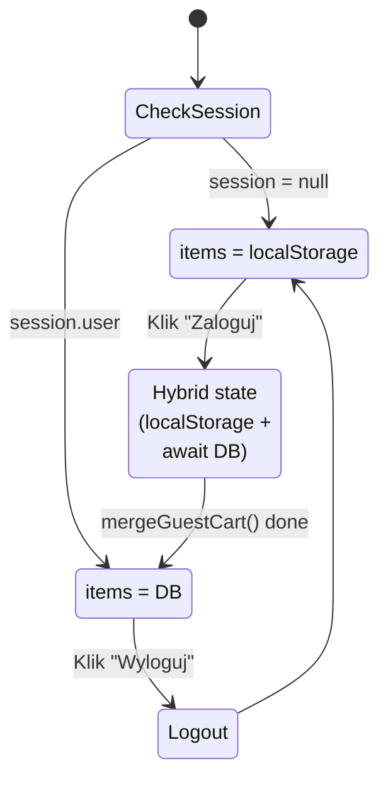

<!-- Generated by SpecStory, Markdown v2.1.0 -->

# 2026-10-05 12:22:54Z

<!-- VS Code Copilot IDE Session 5d2c8fb3-069d-48b9-94b8-c7505404e9ee (2026-10-05 12:22:54Z) -->

_**User (2026-10-05 12:22:54Z)**_

Przeanalizujmy flow:  koszyka niezalogowanego użytkownika -> zalogowanego 

---

_**Agent (anthropic/Anthropic/claude-haiku-4-5-20251001)**_

Przeanalizuję flow koszyka dla niezalogowanego (gość) → zalogowanego użytkownika. Zacznę od istniejącej dokumentacji i kodu.

_**Agent (anthropic/Anthropic/claude-haiku-4-5-20251001)**_

<tool-use data-tool-type="read" data-tool-name="read_file"><details>
<summary>Tool use: **read_file**</summary>

Read `flow-guest-to-user.md`, lines 1 to 100

**Input:**

- endLine: `100`
- filePath: `c:\Projects\infoshare-accenture-ai-dev-1\docs\flow-guest-to-user.md`
- startLine: `1`

**Result:**

````
# Analiza Flow: Gość → Zalogowany

**Rola:** Gość → Zalogowany w ShopEasy

---

## Kroki użytkownika

1. **Otwiera stronę główną** `/`
   - Widzi: Hero section + produkty
   - Header: "Zaloguj się" | "Zarejestruj"

2. **Dodaje produkt do koszyka (gość)**
   - Click: "Dodaj do koszyka" (Powerbank UltraCharge 20000)
   - Otwiera: `/cart`
   - Widzi: Powerbank w koszyku (1 szt, 149,99 zł)
   - Dane: localStorage

3. **Klika "Zaloguj się"**
   - Naviguje: `/login`
   - Wpisuje: test@shopeasy.pl / Test1234!
   - Klika: submit button

4. **System loguje**
   - POST `/api/auth/login`
   - Walidacja: bcrypt.compare()
   - Sesja: setSession() → httpOnly cookie
   - Redirect: `/`

5. **Potwierdzenie zalogowania**
   - Header zmienia się: "👤 Jan Testowy" + "Wyloguj"
   - Sesja: ustanowiona w cookie

6. **Otwiera `/cart`**
   - **Merge zadziałał**: Powerbank z DB (nie z localStorage)
   - localStorage: cleared
   - Widzi: "Koszyk (1 szt.) | Powerbank 149,99 zł"

7. **Klika "Przejdź do kasy"**
   - Naviguje: `/checkout/delivery`
   - Widzi: Opcje dostawy (lista adresów)

8. **Wybiera dostawę, klika "Dalej"**
   - Naviguje: `/checkout/payment`
   - Widzi: Opcje płatności (CARD, BLIK)

9. **Płaci**
   - POST `/checkout/payment`
   - Walidacja: numer karty, CVC, etc.
   - Zwraca: `/checkout/success`
   - Widzi: Potwierdzenie zamówienia

10. **Klika na imię "Jan Testowy" w header**
    - Naviguje: `/account/profile`
    - Widzi: Dane konta (Jan Testowy, test@shopeasy.pl, ID: user-workshop)

11. **Klika "Historia zamówień"**
    - Naviguje: `/account/orders`
    - Widzi: Zamówienie + szczegóły (status, produkty, cena)

12. **Klika "Wyloguj"**
    - POST `/api/auth/logout`
    - Sesja: cleared
    - localStorage: nie zmienia się (zachowywana dla kolejnego gościa)
    - Redirect: `/`
    - Header: znowu "Zaloguj się | Zarejestruj"

---

## Diagram Flow

```mermaid
flowchart LR
    A["GET /<br/>Gość"] -->|Dodaj Pow
… (output truncated)
````
</details></tool-use>

_**Agent (anthropic/Anthropic/claude-haiku-4-5-20251001)**_

<tool-use data-tool-type="read" data-tool-name="read_file"><details>
<summary>Tool use: **read_file**</summary>

Read `cart.ts`

**Input:**

- endLine: `100`
- filePath: `c:\Projects\infoshare-accenture-ai-dev-1\store\cart.ts`
- startLine: `1`

**Result:**

```
'use client'

import { create } from 'zustand'
import { persist, createJSONStorage } from 'zustand/middleware'

export interface CartItem {
  productId: string
  name: string
  price: number   // grosze
  quantity: number
  imageUrl: string
}

interface CartState {
  items: CartItem[]
  addItem: (item: CartItem) => void
  removeItem: (productId: string) => void
  updateQuantity: (productId: string, quantity: number) => void
  clearCart: () => void
  total: () => number
}

export const useCartStore = create<CartState>()(
  persist(
    (set, get) => ({
      items: [],

      addItem: (item) =>
        set((s) => {
          const existing = s.items.find((i) => i.productId === item.productId)
          if (existing) {
            return {
              items: s.items.map((i) =>
                i.productId === item.productId
                  ? { ...i, quantity: i.quantity + item.quantity }
                  : i
              ),
            }
          }
          return { items: [...s.items, item] }
        }),

      removeItem: (productId) =>
        set((s) => ({ items: s.items.filter((i) => i.productId !== productId) })),

      updateQuantity: (productId, quantity) =>
        set((s) => ({
          items: s.items.map((i) =>
            i.productId === productId ? { ...i, quantity } : i
          ),
        })),

      clearCart: () => set({ items: [] }),

      total: () =>
        get().items.reduce((sum, i) => sum + i.price * i.quantity, 0),
    }),
    {
      name: 'shopeasy-guest-cart',
      storage: createJSONStorage(() => localStorage),
      skipHydration: true,
    }
  )
)
```
</details></tool-use>

_**Agent (anthropic/Anthropic/claude-haiku-4-5-20251001)**_

<tool-use data-tool-type="read" data-tool-name="read_file"><details>
<summary>Tool use: **read_file**</summary>

Read `useCart.ts`, lines 1 to 100

**Input:**

- endLine: `100`
- filePath: `c:\Projects\infoshare-accenture-ai-dev-1\hooks\useCart.ts`
- startLine: `1`

**Result:**

```
'use client'
import { useState, useEffect, useCallback } from 'react'
import { useCartStore } from '@/store/cart'
import {
  addToDbCart,
  removeFromDbCart,
  updateDbCartQuantity,
  clearDbCart,
  mergeGuestCart,
} from '@/lib/actions/cart'
import { formatPrice } from '@/lib/format'

// Kształt pozycji koszyka — wspólny dla gościa i zalogowanego
export type CartLineItem = {
  productId: string
  name: string
  price: number       // grosze
  quantity: number
  imageUrl: string
}

export function useCart() {
  const [isLoggedIn, setIsLoggedIn] = useState(false)
  const [dbItems, setDbItems] = useState<CartLineItem[]>([])
  const [loadingDb, setLoadingDb] = useState(false)
  const [error, setError] = useState<string | null>(null)

  // Zustand (gość)
  const guestItems = useCartStore((s) => s.items)
  const guestAdd = useCartStore((s) => s.addItem)
  const guestRemove = useCartStore((s) => s.removeItem)
  const guestUpdate = useCartStore((s) => s.updateQuantity)
  const guestClear = useCartStore((s) => s.clearCart)

  // Hydrate guest cart po mount (skipHydration: true w store)
  useEffect(() => {
    useCartStore.persist.rehydrate()
    let active = true
    fetch('/api/auth/session', { cache: 'no-store' })
      .then((res) => res.json())
      .then((session) => { if (active) setIsLoggedIn(!!session.user) })
      .catch(() => { if (active) setError('Nie udało się sprawdzić sesji. Odśwież stronę.') })
    return () => { active = false }
  }, [])

  // Pobierz DB koszyk dla zalogowanego
  const fetchDbCart = useCallback(async () => {
    setLoadingDb(true)
    try {
      const res = await fetch('/api/cart')
      if (!res.ok) throw new Error('Nie udało się pobrać koszyka.')
      const rows = await res.json()
      setDbItems(
        rows.map((r: { productId: string; product: { name: string; price: number; imageUrl: string }; quantity: number }) => ({
          productId: r.productId,
          name: r.produ
… (output truncated)
```
</details></tool-use>

_**Agent (anthropic/Anthropic/claude-haiku-4-5-20251001)**_

<tool-use data-tool-type="read" data-tool-name="read_file"><details>
<summary>Tool use: **read_file**</summary>

Read `cart.ts`

**Input:**

- endLine: `150`
- filePath: `c:\Projects\infoshare-accenture-ai-dev-1\lib\actions\cart.ts`
- startLine: `1`

**Result:**

```
'use server'
import { revalidatePath } from 'next/cache'
import { db } from '@/lib/db'
import { getSessionUser } from '@/lib/session'
import type { CartCookieItem } from '@/types'

const CART_LIMIT = 5 // BR-01: max 5 różnych produktów

// ─── Odczyt ──────────────────────────────────────────────

export async function getDbCart() {
  const user = await getSessionUser()
  if (!user) return []

  return db.cartItem.findMany({
    where: { userId: user.id },
    include: { product: { include: { category: true } } },
    orderBy: { createdAt: 'asc' },
  })
}

// ─── Mutacje ─────────────────────────────────────────────

export async function addToDbCart(productId: string, quantity = 1) {
  const user = await getSessionUser()
  if (!user) return { error: 'Zaloguj się, aby dodać do koszyka.' }

  const product = await db.product.findUnique({ where: { id: productId } })
  if (!product) return { error: 'Produkt nie istnieje.' }

  // KAT-05: produkt niedostępny
  if (product.stock === 0) {
    return { error: 'Produkt jest chwilowo niedostępny.' }
  }

  // Jeśli już w koszyku — zwiększ ilość
  const existing = await db.cartItem.findUnique({
    where: { userId_productId: { userId: user.id, productId } },
  })

  if (existing) {
    await db.cartItem.update({
      where: { id: existing.id },
      data: { quantity: existing.quantity + quantity },
    })
    revalidatePath('/cart')
    return { success: true }
  }

  // BR-01: limit 5 różnych produktów
  const count = await db.cartItem.count({ where: { userId: user.id } })
  if (count >= CART_LIMIT) {
    return {
      error: `Osiągnięto limit pozycji dla konta standardowego (${CART_LIMIT}). Usuń produkt lub przejdź na konto Premium.`,
    }
  }

  await db.cartItem.create({ data: { userId: user.id, productId, quantity } })
  revalidatePath('/cart')
  return { success: true }
}

export async function removeFromDbCart(productId: string) {
  const user = await g
… (output truncated)
```
</details></tool-use>

_**Agent (anthropic/Anthropic/claude-haiku-4-5-20251001)**_

Doskonale! Mam kompletny obraz. Przeanalizowałem dokumentację i kod. Oto szczegółowa analiza flow:

## 📊 Analiza Flow: Gość → Zalogowany

### **Faza 1: Gość** (localStorage)
```
Użytkownik → Dodaj produkt → useCartStore (Zustand) → localStorage
```
- **Magazyn**: `localStorage['shopeasy-guest-cart']`
- **Komponent**: `store/cart.ts` — Zustand z  middleware
- **Akcje**: , , 
- **Koszyk nie wymaga autoryzacji**

### **Faza 2: Zalogowanie** (auth hook)
```
POST /api/auth/login → setSession() [httpOnly cookie] → Redirect /
```
- **Sesja**: `lib/session.ts` — httpOnly cookie z 
- **Sprawdzenie**:  hook detektuje zmianę logowania poprzez 

### **Faza 3: Merge** ⚡ (KRYTYCZNE)
```javascript
// Się dzieje w useCart() hook, useEffect zależny od [isLoggedIn]
if (isLoggedIn && guest.length) {
  mergeGuestCart(guest)  // lib/actions/cart.ts
  clearCart()            // localStorage → wyczyszczone
}
await fetchDbCart()      // Załaduj koszyk z DB
```

**Logika merge** (`lib/actions/cart.ts#L62`):
- Dla każdego produktu z localStorage:
  - Jeśli **już w DB** →  (nie dodaj, weź większą ilość)
  - Jeśli **nowy** → dodaj, chyba że limit BR-01 (5 produktów)
- localStorage: **czyszczony** po udanym merge

### **Faza 4: Zalogowany** (baza danych)
```
GET /cart → getDbCart() → SELECT * FROM CartItem WHERE userId = ?
```
- **Magazyn**:  tabela w Prisma
- **Akcje**: , , 
- **Koszyk związany z **

---

## 📋 Schemat Hook 

```typescript
useCart() → {
  items: CartLineItem[]     // localStorage (gość) LUB dbItems (zalogowany)
  total: number
  count: number
  addItem(), removeItem(), updateQuantity(), clearCart()
  // + error & loading states
}
```

**Unifikacja**: Hook zwraca ten sam interfejs niezależnie od stanu logowania.

---

## 🔢 Reguły biznesowe 

```typescript
useCart() → {
  items: CartLineItem[]     // localStorage (gość) LUB dbItems (zalogowany)
  total: number
  count: number
  addItem(), removeItem(), updateQuantity(), clearCart()
  // + error & loading states
}
```

**Unifikacja**: Hook zwraca ten sam interfejs niezależnie od stanu logowania.

---

## 🔢 Reguły biznesowe (Business Rules)

| Kod | Reguła | Faza | Plik |
|-----|--------|------|------|
| **BR-01** | Max 5 produktów na konto std. | Add + Merge | `lib/actions/cart.ts#L42` |
| **KAT-05** | Produkt stock=0 → blokada | Add | `lib/actions/cart.ts#L32` |
| **KOS-02** | Merge: gość→zalogowany | Login | `lib/actions/cart.ts#L62` |

---

## 🚨 Co może pójść źle?

| Scenariusz | Efekt | Diagnostyka |
|-----------|-------|-------------|
| Gość doda produkty, zamknie przeglądarkę | localStorage: zachowany ✅ | Otwiera URL, widzi koszyk |
| Zaloguje się bez wyczyszczenia localStorage |  zadziała, merge 2x | Sprawdź DB: czy jest duplikat? |
| Network fail przy merge | Guest items: nie wyczyszczone | Koszyk pokazuje oba źródła — bug UI |
| Logout nie czyści DB | Dane sesji: cleared, DB: bez zmian | Następny gość widzi pusty koszyk (nowa sesja) ✅ |

---

## 🔄 Diagram stanu w useCart()



---

**Czy chcesz przeanalizować konkretny komponent (np. jak działa `AddToCartButton` w fazie gościa czy  w fazie zalogowanej)?** 🔍
