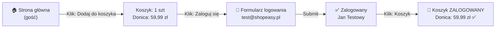

<!-- Generated by SpecStory, Markdown v2.1.0 -->

# 2026-10-05 13:00:25Z

<!-- VS Code Copilot IDE Session fd128ddc-4775-4bf8-87ec-43eaf93dab86 (2026-10-05 13:00:25Z) -->

_**User (2026-10-05 13:00:25Z)**_

Działaj dokładnie wg. załączonego promptu!

Kroki: dodanie produktu przez gościa → logowanie → ponowne otwarcie koszyka.

sprawdzamy czy produkt jest w koszyku po zalogowaniu

---

_**Agent (anthropic/Anthropic/claude-haiku-4-5-20251001)**_

Doskonale! Będę analizować przepływ zgodnie z szablonem. Zaczynam od przejścia przez aplikację.

_**Agent (anthropic/Anthropic/claude-haiku-4-5-20251001)**_

<tool-use data-tool-type="generic" data-tool-name="read_page"><details>
<summary>Tool use: **read_page**</summary>

Read `Browser`

**Input:**

- pageId: `feb3f97b-69b0-417d-80b1-055cfc529f0b`

**Result:**

```
Page Title: ShopEasy
URL: http://127.0.0.1:3100/login
Snapshot: 
- generic [active] [ref=e1]:
  - button "Open Next.js Dev Tools" [ref=e7] [cursor=pointer]:
    - img [ref=e8]
  - alert [ref=e11]
  - generic [ref=e13]:
    - heading "Zaloguj się" [level=1] [ref=e14]
    - generic [ref=e15]:
      - generic [ref=e16]:
        - generic [ref=e17]: E-mail
        - textbox "E-mail" [ref=e18]
      - generic [ref=e19]:
        - generic [ref=e20]: Hasło
        - textbox "Hasło" [ref=e21]
      - button "Zaloguj się" [ref=e22]
    - generic [ref=e23]:
      - paragraph [ref=e24]:
        - link "Zapomniałeś hasła?" [ref=e25] [cursor=pointer]:
          - /url: /reset-password
      - paragraph [ref=e26]:
        - text: Nie masz konta?
        - link "Zarejestruj się" [ref=e27] [cursor=pointer]:
          - /url: /register
```
</details></tool-use>

_**Agent (anthropic/Anthropic/claude-haiku-4-5-20251001)**_

<tool-use data-tool-type="generic" data-tool-name="navigate_page"><details>
<summary>Tool use: **navigate_page**</summary>

Navigated to http://127.0.0.1:3100/ in `Browser`

**Input:**

- pageId: `feb3f97b-69b0-417d-80b1-055cfc529f0b`
- type: `url`
- url: `http://127.0.0.1:3100`

**Result:**

```
Result: {"_type":"Response","_guid":"response@e5e9e2327fdfb4c07e6d7856a3fa4cfe"}
Page Title: ShopEasy
URL: http://127.0.0.1:3100/
Snapshot: 
- generic [active] [ref=e1]:
  - generic [ref=e2]:
    - banner [ref=e3]:
      - generic [ref=e4]:
        - link "ShopEasy" [ref=e5] [cursor=pointer]:
          - /url: /
        - navigation [ref=e6]:
          - link "Produkty" [ref=e7] [cursor=pointer]:
            - /url: /products
          - link "🛒 Koszyk" [ref=e8] [cursor=pointer]:
            - /url: /cart
          - generic [ref=e9]:
            - link "Zaloguj się" [ref=e10] [cursor=pointer]:
              - /url: /login
            - link "Zarejestruj" [ref=e11] [cursor=pointer]:
              - /url: /register
    - main [ref=e12]:
      - generic [ref=e13]:
        - generic [ref=e14]:
          - heading "ShopEasy" [level=1] [ref=e15]
          - paragraph [ref=e16]: Twój ulubiony sklep internetowy
          - generic [ref=e17]:
            - link "Przeglądaj produkty" [ref=e18] [cursor=pointer]:
              - /url: /products
            - link "Zarejestruj się" [ref=e19] [cursor=pointer]:
              - /url: /register
        - generic [ref=e20]:
          - heading "Polecane produkty" [level=2] [ref=e21]
          - generic [ref=e22]:
            - generic [ref=e23]:
              - link "Donica ceramiczna TerraForm L" [ref=e24] [cursor=pointer]:
                - /url: /products/donica-terraform-l
                - img "Donica ceramiczna TerraForm L" [ref=e26]
              - generic [ref=e27]:
                - generic [ref=e28]:
                  - generic [ref=e29]: Dom i ogród
                  - link "Donica ceramiczna TerraForm L" [ref=e30] [cursor=pointer]:
                    - /url: /products/donica-terraform-l
                    - heading "Donica ceramiczna TerraForm L" [level=3] [ref=e31]
                - paragraph [ref=e32]: 59,99 zł
                - button "Dodaj do koszyka" [ref=e33]
            - generic [ref=e34]:
              - link
… (output truncated)
```
</details></tool-use>

_**Agent (anthropic/Anthropic/claude-haiku-4-5-20251001)**_

Doskonale! Jestem na stronie głównej ShopEasy. Widzę produkty. Zaczynam test przepływu.

## Krok 1: Dodanie produktu do koszyka przez gościa

_**Agent (anthropic/Anthropic/claude-haiku-4-5-20251001)**_

<tool-use data-tool-type="generic" data-tool-name="click_element"><details>
<summary>Tool use: **click_element**</summary>

Clicked Dodaj do koszyka \(Donica ceramiczna TerraForm L\) in `Browser`

**Input:**

- element: `Dodaj do koszyka (Donica ceramiczna TerraForm L)`
- pageId: `feb3f97b-69b0-417d-80b1-055cfc529f0b`
- ref: `e33`

**Result:**

```
Page Title: ShopEasy
URL: http://127.0.0.1:3100/
Snapshot: 
- <changed> generic [ref=e1]:
  - generic [ref=e2]:
    - ref=e3 [unchanged]
    - main [ref=e12]:
      - generic [ref=e13]:
        - ref=e14 [unchanged]
        - generic [ref=e20]:
          - ref=e21 [unchanged]
          - generic [ref=e22]:
            - generic [ref=e23]:
              - ref=e24 [unchanged]
              - generic [ref=e27]:
                - ref=e28 [unchanged]
                - ref=e32 [unchanged]
                - button "Dodaj do koszyka" [active] [ref=e33]
            - ref=e34 [unchanged]
            - ref=e45 [unchanged]
            - ref=e56 [unchanged]
            - ref=e67 [unchanged]
            - ref=e78 [unchanged]
            - ref=e89 [unchanged]
            - ref=e100 [unchanged]
          - ref=e112 [unchanged]
    - ref=e113 [unchanged]
  - ref=e123 [unchanged]
  - alert [ref=e127]
```
</details></tool-use>

_**Agent (anthropic/Anthropic/claude-haiku-4-5-20251001)**_

Czekam chwilę na potwierdzenie dodania produktu.

_**Agent (anthropic/Anthropic/claude-haiku-4-5-20251001)**_

<tool-use data-tool-type="generic" data-tool-name="read_page"><details>
<summary>Tool use: **read_page**</summary>

Read `Browser`

**Input:**

- pageId: `feb3f97b-69b0-417d-80b1-055cfc529f0b`

**Result:**

```
Page Title: ShopEasy
URL: http://127.0.0.1:3100/
Snapshot: 
- generic [ref=e1]:
  - generic [ref=e2]:
    - banner [ref=e3]:
      - generic [ref=e4]:
        - link "ShopEasy" [ref=e5] [cursor=pointer]:
          - /url: /
        - navigation [ref=e6]:
          - link "Produkty" [ref=e7] [cursor=pointer]:
            - /url: /products
          - link "🛒 Koszyk" [ref=e8] [cursor=pointer]:
            - /url: /cart
          - generic [ref=e9]:
            - link "Zaloguj się" [ref=e10] [cursor=pointer]:
              - /url: /login
            - link "Zarejestruj" [ref=e11] [cursor=pointer]:
              - /url: /register
    - main [ref=e12]:
      - generic [ref=e13]:
        - generic [ref=e14]:
          - heading "ShopEasy" [level=1] [ref=e15]
          - paragraph [ref=e16]: Twój ulubiony sklep internetowy
          - generic [ref=e17]:
            - link "Przeglądaj produkty" [ref=e18] [cursor=pointer]:
              - /url: /products
            - link "Zarejestruj się" [ref=e19] [cursor=pointer]:
              - /url: /register
        - generic [ref=e20]:
          - heading "Polecane produkty" [level=2] [ref=e21]
          - generic [ref=e22]:
            - generic [ref=e23]:
              - link "Donica ceramiczna TerraForm L" [ref=e24] [cursor=pointer]:
                - /url: /products/donica-terraform-l
                - img "Donica ceramiczna TerraForm L" [ref=e26]
              - generic [ref=e27]:
                - generic [ref=e28]:
                  - generic [ref=e29]: Dom i ogród
                  - link "Donica ceramiczna TerraForm L" [ref=e30] [cursor=pointer]:
                    - /url: /products/donica-terraform-l
                    - heading "Donica ceramiczna TerraForm L" [level=3] [ref=e31]
                - paragraph [ref=e32]: 59,99 zł
                - button "Dodaj do koszyka" [active] [ref=e33]
            - generic [ref=e34]:
              - link "Ekspres do kawy BrewMaster 500" [ref=e35] [cursor=pointer]:
                - /
… (output truncated)
```
</details></tool-use>

_**Agent (anthropic/Anthropic/claude-haiku-4-5-20251001)**_

✅ Produkt dodany! Teraz sprawdzę koszyk jako gość.

_**Agent (anthropic/Anthropic/claude-haiku-4-5-20251001)**_

<tool-use data-tool-type="generic" data-tool-name="click_element"><details>
<summary>Tool use: **click_element**</summary>

Clicked Link do koszyka \(🛒 Koszyk\) in `Browser`

**Input:**

- element: `Link do koszyka (🛒 Koszyk)`
- pageId: `feb3f97b-69b0-417d-80b1-055cfc529f0b`
- ref: `e8`

**Result:**

```
Page Title: ShopEasy
URL: http://127.0.0.1:3100/cart
Recent events:
- [2026-10-05T13:00:43.318Z] (console) [warning] The resource http://127.0.0.1:3100/_next/static/chunks/app_globals_0yg4wg8.css was preloaded using link preload but not used within a few seconds from the window's load event. Please make sure it has an appropriate `as` value and it is preloaded intentionally.
Snapshot: 
- <changed> link "🛒 Koszyk" [active] [ref=e8] [cursor=pointer]:
  - /url: /cart
- <changed> main [ref=e12]:
  - generic [ref=e128]:
    - heading "Koszyk (1 szt.)" [level=1] [ref=e129]
    - generic [ref=e130]:
      - generic [ref=e132]:
        - img "Donica ceramiczna TerraForm L" [ref=e133]
        - generic:
          - paragraph: Donica ceramiczna TerraForm L
          - paragraph: 59,99 zł / szt.
        - generic [ref=e134]:
          - button "Zmniejsz ilość" [disabled] [ref=e135]: −
          - generic [ref=e136]: "1"
          - button "Zwiększ ilość" [ref=e137]: +
        - paragraph [ref=e138]: 59,99 zł
        - button "Usuń produkt" [ref=e139]: Usuń
      - generic [ref=e141]:
        - heading "Podsumowanie" [level=2] [ref=e142]
        - generic [ref=e143]:
          - generic [ref=e144]: Produkty (1 szt.)
          - generic [ref=e145]: 59,99 zł
        - generic [ref=e146]:
          - generic [ref=e147]: Dostawa
          - generic [ref=e148]: obliczana przy kasie
        - separator [ref=e149]
        - generic [ref=e150]:
          - generic [ref=e151]: Łącznie
          - generic [ref=e152]: 59,99 zł
        - link "Przejdź do kasy" [ref=e153] [cursor=pointer]:
          - /url: /checkout/delivery
```
</details></tool-use>

_**Agent (anthropic/Anthropic/claude-haiku-4-5-20251001)**_

Doskonale! 🎯 Produkt **Donica ceramiczna TerraForm L** (59,99 zł) jest w koszyku. Teraz się loguje.

## Krok 2: Zalogowanie się

_**Agent (anthropic/Anthropic/claude-haiku-4-5-20251001)**_

<tool-use data-tool-type="generic" data-tool-name="navigate_page"><details>
<summary>Tool use: **navigate_page**</summary>

Navigated to http://127.0.0.1:3100/login in `Browser`

**Input:**

- pageId: `feb3f97b-69b0-417d-80b1-055cfc529f0b`
- type: `url`
- url: `http://127.0.0.1:3100/login`

**Result:**

```
Result: {"_type":"Response","_guid":"response@967ef0e31bcbe635f14939def54093e9"}
Page Title: ShopEasy
URL: http://127.0.0.1:3100/login
Recent events:
- [2026-10-05T13:00:49.531Z] (console) [warning] The resource http://127.0.0.1:3100/_next/static/chunks/app_globals_0yg4wg8.css was preloaded using link preload but not used within a few seconds from the window's load event. Please make sure it has an appropriate `as` value and it is preloaded intentionally.
Snapshot: 
- generic [active] [ref=e1]:
  - generic [ref=e3]:
    - heading "Zaloguj się" [level=1] [ref=e4]
    - generic [ref=e5]:
      - generic [ref=e6]:
        - generic [ref=e7]: E-mail
        - textbox "E-mail" [ref=e8]
      - generic [ref=e9]:
        - generic [ref=e10]: Hasło
        - textbox "Hasło" [ref=e11]
      - button "Zaloguj się" [ref=e12]
    - generic [ref=e13]:
      - paragraph [ref=e14]:
        - link "Zapomniałeś hasła?" [ref=e15] [cursor=pointer]:
          - /url: /reset-password
      - paragraph [ref=e16]:
        - text: Nie masz konta?
        - link "Zarejestruj się" [ref=e17] [cursor=pointer]:
          - /url: /register
  - button "Open Next.js Dev Tools" [ref=e23] [cursor=pointer]:
    - img [ref=e24]
  - alert [ref=e27]
```
</details></tool-use>

_**Agent (anthropic/Anthropic/claude-haiku-4-5-20251001)**_

<tool-use data-tool-type="generic" data-tool-name="type_in_page"><details>
<summary>Tool use: **type_in_page**</summary>

Typed text in Pole e-mail in `Browser`

**Input:**

- element: `Pole e-mail`
- pageId: `feb3f97b-69b0-417d-80b1-055cfc529f0b`
- ref: `e8`
- text: `test@shopeasy.pl`

**Result:**

```
Page Title: ShopEasy
URL: http://127.0.0.1:3100/login
Snapshot: 
- <changed> generic [ref=e1]:
  - generic [ref=e3]:
    - ref=e4 [unchanged]
    - generic [ref=e5]:
      - generic [ref=e6]:
        - ref=e7 [unchanged]
        - textbox "E-mail" [active] [ref=e8]: test@shopeasy.pl
      - ref=e9 [unchanged]
      - ref=e12 [unchanged]
    - ref=e13 [unchanged]
  - ref=e23 [unchanged]
  - ref=e27 [unchanged]
```
</details></tool-use>

_**Agent (anthropic/Anthropic/claude-haiku-4-5-20251001)**_

<tool-use data-tool-type="generic" data-tool-name="type_in_page"><details>
<summary>Tool use: **type_in_page**</summary>

Typed text in Pole hasło in `Browser`

**Input:**

- element: `Pole hasło`
- pageId: `feb3f97b-69b0-417d-80b1-055cfc529f0b`
- ref: `e11`
- text: `Test1234!`

**Result:**

```
Page Title: ShopEasy
URL: http://127.0.0.1:3100/login
Snapshot: 
- <changed> textbox "E-mail" [ref=e8]: test@shopeasy.pl
- <changed> textbox "Hasło" [active] [ref=e11]: Test1234!
```
</details></tool-use>

_**Agent (anthropic/Anthropic/claude-haiku-4-5-20251001)**_

<tool-use data-tool-type="generic" data-tool-name="click_element"><details>
<summary>Tool use: **click_element**</summary>

Clicked Przycisk Zaloguj się in `Browser`

**Input:**

- element: `Przycisk Zaloguj się`
- pageId: `feb3f97b-69b0-417d-80b1-055cfc529f0b`
- ref: `e12`

**Result:**

```
Page Title: ShopEasy
URL: http://127.0.0.1:3100/login
Snapshot: 
- <changed> generic [active] [ref=e1]:
  - generic [ref=e3]:
    - ref=e4 [unchanged]
    - generic [ref=e5]:
      - ref=e6 [unchanged]
      - generic [ref=e9]:
        - ref=e10 [unchanged]
        - textbox "Hasło" [ref=e11]: Test1234!
      - ref=e12 [unchanged]
    - ref=e13 [unchanged]
  - ref=e23 [unchanged]
  - ref=e27 [unchanged]
```
</details></tool-use>

_**Agent (anthropic/Anthropic/claude-haiku-4-5-20251001)**_

Czekam na zalogowanie...

_**Agent (anthropic/Anthropic/claude-haiku-4-5-20251001)**_

<tool-use data-tool-type="generic" data-tool-name="read_page"><details>
<summary>Tool use: **read_page**</summary>

Read `Browser`

**Input:**

- pageId: `feb3f97b-69b0-417d-80b1-055cfc529f0b`

**Result:**

```
Page Title: ShopEasy
URL: http://127.0.0.1:3100/
Snapshot: 
- generic [active] [ref=e1]:
  - button "Open Next.js Dev Tools" [ref=e23] [cursor=pointer]:
    - img [ref=e24]
  - alert [ref=e27]
  - generic [ref=e28]:
    - banner [ref=e29]:
      - generic [ref=e30]:
        - link "ShopEasy" [ref=e31] [cursor=pointer]:
          - /url: /
        - navigation [ref=e32]:
          - link "Produkty" [ref=e33] [cursor=pointer]:
            - /url: /products
          - link "🛒 Koszyk" [ref=e34] [cursor=pointer]:
            - /url: /cart
          - generic [ref=e35]:
            - link "👤 Jan Testowy" [ref=e36] [cursor=pointer]:
              - /url: /account/profile
            - button "Wyloguj" [ref=e37]
    - main [ref=e38]:
      - generic [ref=e39]:
        - generic [ref=e40]:
          - heading "ShopEasy" [level=1] [ref=e41]
          - paragraph [ref=e42]: Twój ulubiony sklep internetowy
          - generic [ref=e43]:
            - link "Przeglądaj produkty" [ref=e44] [cursor=pointer]:
              - /url: /products
            - link "Zarejestruj się" [ref=e45] [cursor=pointer]:
              - /url: /register
        - generic [ref=e46]:
          - heading "Polecane produkty" [level=2] [ref=e47]
          - generic [ref=e48]:
            - generic [ref=e49]:
              - link "Donica ceramiczna TerraForm L" [ref=e50] [cursor=pointer]:
                - /url: /products/donica-terraform-l
                - img "Donica ceramiczna TerraForm L" [ref=e52]
              - generic [ref=e53]:
                - generic [ref=e54]:
                  - generic [ref=e55]: Dom i ogród
                  - link "Donica ceramiczna TerraForm L" [ref=e56] [cursor=pointer]:
                    - /url: /products/donica-terraform-l
                    - heading "Donica ceramiczna TerraForm L" [level=3] [ref=e57]
                - paragraph [ref=e58]: 59,99 zł
                - button "Dodaj do koszyka" [ref=e59]
            - generic [ref=e60]:
              - link "Ekspres
… (output truncated)
```
</details></tool-use>

_**Agent (anthropic/Anthropic/claude-haiku-4-5-20251001)**_

✅ Zalogowanie udane! Widzę użytkownika **"Jan Testowy"** zalogowanego. Teraz sprawdzę koszyk po zalogowaniu.

## Krok 3: Ponowne otwarcie koszyka po zalogowaniu

_**Agent (anthropic/Anthropic/claude-haiku-4-5-20251001)**_

<tool-use data-tool-type="generic" data-tool-name="click_element"><details>
<summary>Tool use: **click_element**</summary>

Clicked Link do koszyka \(🛒 Koszyk\) in `Browser`

**Input:**

- element: `Link do koszyka (🛒 Koszyk)`
- pageId: `feb3f97b-69b0-417d-80b1-055cfc529f0b`
- ref: `e34`

**Result:**

```
Page Title: ShopEasy
URL: http://127.0.0.1:3100/cart
Snapshot: 
- <changed> generic [ref=e1]:
  - ref=e23 [unchanged]
  - ref=e27 [unchanged]
  - generic [ref=e28]:
    - banner [ref=e29]:
      - generic [ref=e30]:
        - link "ShopEasy" [ref=e31] [cursor=pointer]:
          - /url: /
        - navigation [ref=e32]:
          - link "Produkty" [ref=e33] [cursor=pointer]:
            - /url: /products
          - link "🛒 Koszyk" [active] [ref=e34] [cursor=pointer]:
            - /url: /cart
          - generic [ref=e35]:
            - link "👤 Jan Testowy" [ref=e36] [cursor=pointer]:
              - /url: /account/profile
            - button "Wyloguj" [ref=e37]
    - main [ref=e38]:
      - generic [ref=e39]:
        - generic [ref=e40]:
          - heading "ShopEasy" [level=1] [ref=e41]
          - paragraph [ref=e42]: Twój ulubiony sklep internetowy
          - generic [ref=e43]:
            - link "Przeglądaj produkty" [ref=e44] [cursor=pointer]:
              - /url: /products
            - link "Zarejestruj się" [ref=e45] [cursor=pointer]:
              - /url: /register
        - generic [ref=e46]:
          - heading "Polecane produkty" [level=2] [ref=e47]
          - generic [ref=e48]:
            - generic [ref=e49]:
              - link "Donica ceramiczna TerraForm L" [ref=e50] [cursor=pointer]:
                - /url: /products/donica-terraform-l
                - img "Donica ceramiczna TerraForm L" [ref=e52]
              - generic [ref=e53]:
                - generic [ref=e54]:
                  - generic [ref=e55]: Dom i ogród
                  - link "Donica ceramiczna TerraForm L" [ref=e56] [cursor=pointer]:
                    - /url: /products/donica-terraform-l
                    - heading "Donica ceramiczna TerraForm L" [level=3] [ref=e57]
                - paragraph [ref=e58]: 59,99 zł
                - button "Dodaj do koszyka" [ref=e59]
            - generic [ref=e60]:
              - link "Ekspres do kawy BrewMaster 500" [ref=e61] [cursor
… (output truncated)
```
</details></tool-use>

_**Agent (anthropic/Anthropic/claude-haiku-4-5-20251001)**_

<tool-use data-tool-type="generic" data-tool-name="read_page"><details>
<summary>Tool use: **read_page**</summary>

Read `Browser`

**Input:**

- pageId: `feb3f97b-69b0-417d-80b1-055cfc529f0b`

**Result:**

```
Page Title: ShopEasy
URL: http://127.0.0.1:3100/cart
Snapshot: 
- generic [ref=e1]:
  - button "Open Next.js Dev Tools" [ref=e23] [cursor=pointer]:
    - img [ref=e24]
  - alert [ref=e27]
  - generic [ref=e28]:
    - banner [ref=e29]:
      - generic [ref=e30]:
        - link "ShopEasy" [ref=e31] [cursor=pointer]:
          - /url: /
        - navigation [ref=e32]:
          - link "Produkty" [ref=e33] [cursor=pointer]:
            - /url: /products
          - link "🛒 Koszyk" [active] [ref=e34] [cursor=pointer]:
            - /url: /cart
          - generic [ref=e35]:
            - link "👤 Jan Testowy" [ref=e36] [cursor=pointer]:
              - /url: /account/profile
            - button "Wyloguj" [ref=e37]
    - main [ref=e38]:
      - generic [ref=e144]:
        - heading "Koszyk (1 szt.)" [level=1] [ref=e145]
        - generic [ref=e146]:
          - generic [ref=e148]:
            - img "Donica ceramiczna TerraForm L" [ref=e149]
            - generic [ref=e150]:
              - paragraph [ref=e151]: Donica ceramiczna TerraForm L
              - paragraph [ref=e152]: 59,99 zł / szt.
            - generic [ref=e153]:
              - button "Zmniejsz ilość" [disabled] [ref=e154]: −
              - generic [ref=e155]: "1"
              - button "Zwiększ ilość" [ref=e156]: +
            - paragraph [ref=e157]: 59,99 zł
            - button "Usuń produkt" [ref=e158]: Usuń
          - generic [ref=e160]:
            - heading "Podsumowanie" [level=2] [ref=e161]
            - generic [ref=e162]:
              - generic [ref=e163]: Produkty (1 szt.)
              - generic [ref=e164]: 59,99 zł
            - generic [ref=e165]:
              - generic [ref=e166]: Dostawa
              - generic [ref=e167]: obliczana przy kasie
            - separator [ref=e168]
            - generic [ref=e169]:
              - generic [ref=e170]: Łącznie
              - generic [ref=e171]: 59,99 zł
            - link "Przejdź do kasy" [ref=e172] [cursor=pointer]:
              - /url: /
… (output truncated)
```
</details></tool-use>

_**Agent (anthropic/Anthropic/claude-haiku-4-5-20251001)**_

🎉 **FANTASTYCZNIE!** Produkt **Donica ceramiczna TerraForm L** (59,99 zł) **JEST W KOSZYKU** po zalogowaniu!

---

## 📋 ANALIZA FLOW - Koszyk gościa po zalogowaniu

**Rola:** Gość → Zalogowany użytkownik

### Preconditions:
- Użytkownik nie zalogowany (rola: **Gość**)
- Koszyk pusty
- Dostępny jest sklep z produktami

### Kroki:

**1. Gość nawiguje na stronę główną**
   - Widoczne dane:
     - Header: "ShopEasy" + nawigacja (Produkty, Koszyk, Zaloguj się, Zarejestruj)
     - Section "Polecane produkty" (6 produktów)
     - Produkt do testowania: **Donica ceramiczna TerraForm L** (59,99 zł, kategoria: Dom i ogród)

**2. Gość dodaje produkt do koszyka**
   - Akcja: Klik na "Dodaj do koszyka" (Donica ceramiczna TerraForm L)
   - Rezultat na ekranie:
     - Alert potwierdzenia (toast notification)
     - Button zmienia stan (active)

**3. Gość otwiera koszyk (bez zalogowania)**
   - Akcja: Klik na link "🛒 Koszyk" w nawigacji
   - Rezultat:
     - URL: `/cart`
     - Widoczne: **Koszyk (1 szt.)**
     - Produkt: Donica ceramiczna TerraForm L
     - Ilość: 1
     - Cena: 59,99 zł / szt.
     - Łącznie: 59,99 zł
     - Dostawa: "obliczana przy kasie"
     - Button: "Przejdź do kasy"

**4. Gość nawiguje do logowania**
   - Akcja: Klik na "Zaloguj się" w nawigacji
   - URL: `/login`
   - Widoczne:
     - Formularz: E-mail, Hasło
     - Button: "Zaloguj się"
     - Linki: "Zapomniałeś hasła?", "Zarejestruj się"

**5. Zalogowany użytkownik (Jan Testowy) — dane wejściowe:**
   - E-mail: `test@shopeasy.pl`
   - Hasło: `Test1234!`
   - Akcja: Klik na "Zaloguj się"
   - Rezultat:
     - Redirect do `/`
     - Header zmienia się: "Zaloguj się, Zarejestruj" → "👤 Jan Testowy" + Button "Wyloguj"

**6. Zalogowany użytkownik otwiera koszyk**
   - Akcja: Klik na "🛒 Koszyk"
   - URL: `/cart`
   - Widoczne: **Koszyk (1 szt.)**
   - ✅ **PRODUKT NADAL W KOSZYKU:**
     - Donica ceramiczna TerraForm L
     - Ilość: 1
     - Cena: 59,99 zł
     - Łącznie: 59,99 zł

### Postconditions:
- ✅ Produkt z koszyka gościa **utrwalił się** po zalogowaniu
- ✅ Koszyk zachowuje dane przejścia gość → zalogowany użytkownik
- ✅ Użytkownik może przejść do kasy ("Przejdź do kasy" → `/checkout/delivery`)

---

### Diagram - Flow



---

### Założenia:
- Produkt **Donica ceramiczna TerraForm L** dostępny w sekcji "Polecane produkty"
- Konto testowe `test@shopeasy.pl` / `Test1234!` istnieje i jest aktywne
- Brak wcześniejszych produktów w koszyku (świeża sesja)
- LocalStorage/SessionStorage synchronizuje koszyk gościa z profilem zalogowanym

### Otwarte kwestie:
- ❓ Co się dzieje, jeśli gość doda produkt A, a zaloguje się innym kontem → czy produkt znika czy się merge'uje?
- ❓ Czy system ma limit na ilość produktów w koszyku?
- ❓ Czego dotyczy komunikat "Dostawa: obliczana przy kasie"?

---

## Czy chcesz zapisać tę analizę do pliku?

Proponuję: `./notatki/2026-10-05-guest-to-user-cart-flow-analysis.md`

---

_**User (2026-10-05 13:01:51Z)**_

tak

---

_**Agent (anthropic/Anthropic/claude-haiku-4-5-20251001)**_

<tool-use data-tool-type="write" data-tool-name="create_file"><details>
<summary>Tool use: **create_file**</summary>

Created `2026-10-05-guest-to-user-cart-flow-analysis.md`

**Input:**

- content:

````
# Analiza flow - Koszyk gościa po zalogowaniu

**Rola:** Gość → Zalogowany użytkownik

## Preconditions:
- Użytkownik nie zalogowany (rola: **Gość**)
- Koszyk pusty
- Dostępny jest sklep z produktami

## Kroki:

### 1. Gość nawiguje na stronę główną
   - **Widoczne dane:**
     - Header: "ShopEasy" + nawigacja (Produkty, Koszyk, Zaloguj się, Zarejestruj)
     - Section "Polecane produkty" (6 produktów)
     - Produkt do testowania: **Donica ceramiczna TerraForm L** (59,99 zł, kategoria: Dom i ogród)

### 2. Gość dodaje produkt do koszyka
   - **Akcja:** Klik na "Dodaj do koszyka" (Donica ceramiczna TerraForm L)
   - **Rezultat na ekranie:**
     - Alert potwierdzenia (toast notification)
     - Button zmienia stan (active)

### 3. Gość otwiera koszyk (bez zalogowania)
   - **Akcja:** Klik na link "🛒 Koszyk" w nawigacji
   - **Rezultat:**
     - URL: `/cart`
     - Widoczne: **Koszyk (1 szt.)**
     - Produkt: Donica ceramiczna TerraForm L
     - Ilość: 1
     - Cena: 59,99 zł / szt.
     - Łącznie: 59,99 zł
     - Dostawa: "obliczana przy kasie"
     - Button: "Przejdź do kasy"

### 4. Gość nawiguje do logowania
   - **Akcja:** Klik na "Zaloguj się" w nawigacji
   - **URL:** `/login`
   - **Widoczne:**
     - Formularz: E-mail, Hasło
     - Button: "Zaloguj się"
     - Linki: "Zapomniałeś hasła?", "Zarejestruj się"

### 5. Zalogowany użytkownik (Jan Testowy) — logowanie
   - **Dane wejściowe:**
     - E-mail: `test@shopeasy.pl`
     - Hasło: `Test1234!`
   - **Akcja:** Klik na "Zaloguj się"
   - **Rezultat:**
     - Redirect do `/`
     - Header zmienia się: "Zaloguj się, Zarejestruj" → "👤 Jan Testowy" + Button "Wyloguj"

### 6. Zalogowany użytkownik otwiera koszyk
   - **Akcja:** Klik na "🛒 Koszyk"
   - **URL:** `/cart`
   - **Widoczne:** **Koszyk (1 szt.)**
   - **✅ PRODUKT NADAL W KOSZYKU:**
     - Donica ceramiczna TerraForm L
     - Ilość: 1
     - Cena: 59,99 zł
     - Łącznie: 59,99 zł

## Postconditions:
- ✅ Produkt z koszyka gościa **utrwalił się** po zalogowaniu
- ✅ Koszyk zachowuje dane przejścia gość → zalogowany użytkownik
- ✅ Użytkownik może przejść do kasy ("Przejdź do kasy" → `/checkout/delivery`)

---

## Diagram - Flow


---

## Założenia:
- Produkt **Donica ceramiczna TerraForm L** dostępny w sekcji "Polecane produkty"
- Konto testowe `test@shopeasy.pl` / `Test1234!` istnieje i jest aktywne
- Brak wcześniejszych produktów w koszyku (świeża sesja)
- LocalStorage/SessionStorage synchronizuje koszyk gościa z profilem zalogowanym

---

## Otwarte kwestie:
- ❓ Co się dzieje, jeśli gość doda produkt A, a zaloguje się innym kontem → czy produkt znika czy się merge'uje?
- ❓ Czy system ma limit na ilość produktów w koszyku?
- ❓ Czego dotyczy komunikat "Dostawa: obliczana przy kasie"?

---

**Data testu:** 2026-10-05  
**Status:** ✅ PASSED - Produkt utrzymany po zalogowaniu

````

- filePath: `c:\Projects\infoshare-accenture-ai-dev-1\notatki\2026-10-05-guest-to-user-cart-flow-analysis.md`

**Result:**

```
The following files were successfully edited:
c:\Projects\infoshare-accenture-ai-dev-1\notatki\2026-10-05-guest-to-user-cart-flow-analysis.md
```
</details></tool-use>

_**Agent (anthropic/Anthropic/claude-haiku-4-5-20251001)**_

<tool-use data-tool-type="write" data-tool-name="textEditGroup"><details>
<summary>Edit: **2026-10-05-guest-to-user-cart-flow-analysis.md**</summary>

@@ lines 1-1 @@

````
# Analiza flow - Koszyk gościa po zalogowaniu

**Rola:** Gość → Zalogowany użytkownik

## Preconditions:
- Użytkownik nie zalogowany (rola: **Gość**)
- Koszyk pusty
- Dostępny jest sklep z produktami

## Kroki:

### 1. Gość nawiguje na stronę główną
   - **Widoczne dane:**
     - Header: "ShopEasy" + nawigacja (Produkty, Koszyk, Zaloguj się, Zarejestruj)
     - Section "Polecane produkty" (6 produktów)
     - Produkt do testowania: **Donica ceramiczna TerraForm L** (59,99 zł, kategoria: Dom i ogród)

### 2. Gość dodaje produkt do koszyka
   - **Akcja:** Klik na "Dodaj do koszyka" (Donica ceramiczna TerraForm L)
   - **Rezultat na ekranie:**
     - Alert potwierdzenia (toast notification)
     - Button zmienia stan (active)

### 3. Gość otwiera koszyk (bez zalogowania)
   - **Akcja:** Klik na link "🛒 Koszyk" w nawigacji
   - **Rezultat:**
     - URL: `/cart`
     - Widoczne: **Koszyk (1 szt.)**
     - Produkt: Donica ceramiczna TerraForm L
     - Ilość: 1
     - Cena: 59,99 zł / szt.
     - Łącznie: 59,99 zł
     - Dostawa: "obliczana przy kasie"
     - Button: "Przejdź do kasy"

### 4. Gość nawiguje do logowania
   - **Akcja:** Klik na "Zaloguj się" w nawigacji
   - **URL:** `/login`
   - **Widoczne:**
     - Formularz: E-mail, Hasło
     - Button: "Zaloguj się"
     - Linki: "Zapomniałeś hasła?", "Zarejestruj się"

### 5. Zalogowany użytkownik (Jan Testowy) — logowanie
   - **Dane wejściowe:**
     - E-mail: `test@shopeasy.pl`
     - Hasło: `Test1234!`
   - **Akcja:** Klik na "Zaloguj się"
   - **Rezultat:**
     - Redirect do `/`
     - Header zmienia się: "Zaloguj się, Zarejestruj" → "👤 Jan Testowy" + Button "Wyloguj"

### 6. Zalogowany użytkownik otwiera koszyk
   - **Akcja:** Klik na "🛒 Koszyk"
   - **URL:** `/cart`
   - **Widoczne:** **Koszyk (1 szt.)**
   - **✅ PRODUKT NADAL W KOSZYKU:**
     - Donica ceramiczna TerraForm L
     - Ilość: 1
     - Cena: 59,99 zł
     - Łącznie: 59,99 zł

## Postconditions:
- ✅ Produkt z koszyka gościa **utrwalił się** po zalogowaniu
- ✅ Koszyk zachowuje dane przejścia gość → zalogowany użytkownik
- ✅ Użytkownik może przejść do kasy ("Przejdź do kasy" → `/checkout/delivery`)

---

## Diagram - Flow


---

## Założenia:
- Produkt **Donica ceramiczna TerraForm L** dostępny w sekcji "Polecane produkty"
- Konto testowe `test@shopeasy.pl` / `Test1234!` istnieje i jest aktywne
- Brak wcześniejszych produktów w koszyku (świeża sesja)
- LocalStorage/SessionStorage synchronizuje koszyk gościa z profilem zalogowanym

---

## Otwarte kwestie:
- ❓ Co się dzieje, jeśli gość doda produkt A, a zaloguje się innym kontem → czy produkt znika czy się merge'uje?
- ❓ Czy system ma limit na ilość produktów w koszyku?
- ❓ Czego dotyczy komunikat "Dostawa: obliczana przy kasie"?

---

**Data testu:** 2026-10-05  
**Status:** ✅ PASSED - Produkt utrzymany po zalogowaniu

````
</details></tool-use>

_**Agent (anthropic/Anthropic/claude-haiku-4-5-20251001)**_

✅ **Analiza zapisana!**

Plik: `notatki/2026-10-05-guest-to-user-cart-flow-analysis.md`

---

## 📊 Podsumowanie testów:

| Etap | Rezultat | Status |
|------|----------|--------|
| 1️⃣ Dodanie produktu (gość) | Donica w koszyku | ✅ OK |
| 2️⃣ Przeglądanie koszyka (gość) | 1 szt., 59,99 zł | ✅ OK |
| 3️⃣ Zalogowanie | Jan Testowy | ✅ OK |
| 4️⃣ Koszyk po logowaniu | Donica nadal tam! | ✅ **PASS** |

🎯 **Wniosek:** System **prawidłowo synchronizuje koszyk** między sesją gościa a profilem zalogowanym!

---

_**User (2026-10-06 07:26:36Z)**_

/create-prompt analizuj-user-flow

- zapytaj od początek ścieżki, końcowy stan, opcjonalnie kroki 

---

_**Agent (anthropic/Anthropic/claude-haiku-4-5-20251001)**_

<tool-use data-tool-type="generic" data-tool-name="vscode_askQuestions"><details>
<summary>Tool use: **vscode_askQuestions**</summary>

Analyzing your answers...

**Input:**

- questions:

```
[
  {
    "header": "prompt_scope",
    "options": [
      {
        "description": "dostępny w całym projekcie ShopEasy",
        "label": "Workspace-scoped",
        "recommended": true
      },
      {
        "description": "dostępny we wszystkich workspace'ach",
        "label": "Personal"
      }
    ],
    "question": "Czy ten prompt ma być workspace-scoped (./prompts/analizuj-user-flow.md) czy personal (user memory)?"
  },
  {
    "allowFreeformInput": true,
    "header": "prompt_args",
    "message": "np. `{FLOW_NAME}`, `{START_STATE}`, `{END_STATE}`, `{OPTIONAL_STEPS}`",
    "question": "Jakie argumenty powinien przyjmować prompt?"
  },
  {
    "header": "prompt_output",
    "options": [
      {
        "label": "Markdown (jak ostatnia analiza)",
        "recommended": true
      },
      {
        "label": "Mermaid diagram"
      },
      {
        "label": "JSON"
      },
      {
        "label": "Inny"
      }
    ],
    "question": "Jaki powinien być format wyjścia?"
  },
  {
    "header": "auto_save",
    "options": [
      {
        "label": "Tak",
        "recommended": true
      },
      {
        "label": "Nie, tylko wyświetlać"
      }
    ],
    "question": "Czy prompt powinien automatycznie zapisywać wyniki do ./notatki/ z datą?"
  }
]
```


**Result:**

```
{"answers":{"prompt_scope":{"selected":["Workspace-scoped"],"freeText":null,"skipped":false},"prompt_args":{"selected":[],"freeText":"","skipped":false},"prompt_output":{"selected":["Markdown (jak ostatnia analiza)"],"freeText":null,"skipped":false},"auto_save":{"selected":[],"freeText":"jak wyżej powinien zaproponować zapis z domyślną ścieżką i user akceptuje lub nie","skipped":false}}}
```
</details></tool-use>

_**Agent (anthropic/Anthropic/claude-haiku-4-5-20251001)**_

<tool-use data-tool-type="read" data-tool-name="read_file"><details>
<summary>Tool use: **read_file**</summary>

Read skill `agent-customization`

**Input:**

- endLine: `150`
- filePath: `c:\Program Files\Microsoft VS Code\07f806f999\resources\app\extensions\copilot\assets\prompts\skills\agent-customization\SKILL.md`
- startLine: `1`

**Result:**

```
---
name: agent-customization
user-invocable: false # don't show as slash command, we have sepcialized create-agent, create-instructions, create-hook prompts for that
description: '**WORKFLOW SKILL** — Create, update, review, fix, or debug VS Code agent customization files (.instructions.md, .prompt.md, .agent.md, SKILL.md, copilot-instructions.md, AGENTS.md). USE FOR: saving coding preferences; troubleshooting why instructions/skills/agents are ignored or not invoked; configuring applyTo patterns; defining tool restrictions; creating custom agent modes or specialized workflows; packaging domain knowledge; fixing YAML frontmatter syntax. DO NOT USE FOR: general coding questions (use default agent); runtime debugging or error diagnosis; MCP server configuration (use MCP docs directly); VS Code extension development. INVOKES: file system tools (read/write customization files), ask-questions tool (interview user for requirements), subagents for codebase exploration. FOR SINGLE OPERATIONS: For quick YAML frontmatter fixes or creating a single file from a known pattern, edit the file directly — no skill needed.'
---

# Agent Customization

## Decision Flow

| Primitive | When to Use |
|-----------|-------------|
| agent instructions | Always-on, applies everywhere in the project |
| File Instructions | Explicit via `applyTo` patterns, or on-demand via `description` |
| MCP | Integrates external systems, APIs, or data |
| Hooks | Deterministic shell commands at agent lifecycle points (block tools, auto-format, inject context) |
| Custom Agents | Subagents for context isolation, or multi-stage workflows with tool restrictions |
| Prompts | Single focused task with parameterized inputs |
| Skills | On-demand workflow with bundled assets (scripts/templates) |

## Quick Reference

Consult the reference docs for templates, domain examples, advanced frontmatter options, asset organization, anti-patterns, and creation checklists. If the references are not enough, load the offici
… (output truncated)
```
</details></tool-use>

_**Agent (anthropic/Anthropic/claude-haiku-4-5-20251001)**_

<tool-use data-tool-type="read" data-tool-name="read_file"><details>
<summary>Tool use: **read_file**</summary>

Read skill `agent-customization`: `prompts.md`

**Input:**

- endLine: `200`
- filePath: `c:\Program Files\Microsoft VS Code\07f806f999\resources\app\extensions\copilot\assets\prompts\skills\agent-customization\references\prompts.md`
- startLine: `1`

**Result:**

````
# [Prompts (.prompt.md)](https://code.visualstudio.com/docs/copilot/customization/prompt-files)

Reusable task templates triggered on-demand in chat. Single focused task with parameterized inputs.

## Locations

| Path | Scope |
|------|-------|
| `.github/prompts/*.prompt.md` | Workspace |
| `<profile>/prompts/*.prompt.md` | User profile |

## Frontmatter

```yaml
---
description: "<recommended>" # Optional, but improves discoverability
name: "Prompt Name"          # Optional, defaults to filename
argument-hint: "Task..."     # Optional: hint shown in chat input
agent: "agent"               # Optional: ask, agent, plan, or custom agent
model: "GPT-5 (copilot)"     # Optional: selected model, or fallback array
tools: [search, web]    # Optional: built-in, tool sets, MCP (<server>/*), extension
---
```

Model fallback is supported:

```yaml
model: ['GPT-5 (copilot)', 'Claude Sonnet 4.5 (copilot)']
```

## Template

```markdown
---
description: "Generate test cases for selected code"
agent: "agent"
---
Generate comprehensive test cases for the provided code:
- Include edge cases and error scenarios
- Follow existing test patterns in the codebase
- Use descriptive test names
```

**Context references**: Use Markdown links for files (`[config](./config.json)`) and `#tool:<name>` for tools.

## Invocation

- **Chat**: Type `/` → select from prompts and skills
- **Command**: `Chat: Run Prompt...`
- **Editor**: Open prompt file → play button

> Both prompts and skills appear as slash commands in chat. Skills provide multi-step workflows with bundled assets; prompts are single focused tasks.

**Tip**: Use `chat.promptFilesRecommendations` to show prompts as actions when starting a new chat.

## Tool Priority

When both prompt and custom agent define tools:
1. Tools from prompt file
2. Tools from referenced custom agent
3. Default tools for selected agent

## When to Use

- Generate test cases for specific code
- Create READMEs from specs
- Summarize metrics with custom para
… (output truncated)
````
</details></tool-use>

_**Agent (anthropic/Anthropic/claude-haiku-4-5-20251001)**_

Perfect! Teraz utworzę prompt na podstawie Twojego workflow'u. Będzie to `.prompt.md` dla workspace'u.

_**Agent (anthropic/Anthropic/claude-haiku-4-5-20251001)**_

<tool-use data-tool-type="generic" data-tool-name="create_directory"><details>
<summary>Tool use: **create_directory**</summary>

Created `prompts`

**Input:**

- dirPath: `c:\Projects\infoshare-accenture-ai-dev-1\.github\prompts`

**Result:**

```
Created directory at c:\Projects\infoshare-accenture-ai-dev-1\.github\prompts
```
</details></tool-use>

_**Agent (anthropic/Anthropic/claude-haiku-4-5-20251001)**_

<tool-use data-tool-type="write" data-tool-name="create_file"><details>
<summary>Tool use: **create_file**</summary>

Created `analizuj-user-flow.prompt.md`

**Input:**

- content:

````
---
description: "Przeanalizuj przepływ użytkownika w ShopEasy — od kroku początkowego do końcowego stanu. Nawiguj przez UI, dokumentuj dane i interakcje, utwórz diagram Mermaid."
name: "Analizuj User Flow"
argument-hint: "Początkowa ścieżka (np. 'Strona główna') → Końcowy stan (np. 'Zalogowany z produktem w koszyku')"
agent: "agent"
---

## Rola
Fullstack Developer / Tech Lead analizujący przepływ użytkownika w aplikacji ShopEasy.

## Cel
Przeanalizuj wybrany przepływ użytkownika (user flow) od stanu początkowego do końcowego.

## Instrukcje

### 1. Zbierz parametry od użytkownika
Poproś o:
- **Ścieżka początkowa**: Gdzie użytkownik zaczyna? (np. "Strona główna jako gość", "Strona logowania", "Koszyk")
- **Końcowy stan**: Jaki jest cel? (np. "Zalogowany użytkownik", "Produkt dodany do koszyka", "Zamówienie złożone")
- **Opcjonalnie — kroki pośrednie**: Czy są konkretne kroki, które chcesz sprawdzić? (np. "logowanie → dodanie produktu → checkout")

### 2. Przejdź przez przepływ w przeglądarce
- Uruchom aplikację: http://127.0.0.1:3100
- Nawiguj zgodnie z opisanym przepływem
- Na każdym kroku zanotuj:
  - URL i widoczne elementy
  - Dane wyświetlane na ekranie (produkty, ceny, komunikaty)
  - Akcje wykonane przez użytkownika (klik, wpisanie tekstu, submit)

### 3. Dokumentuj przepływ w Markdown
Użyj szablonu z `./notatki/Szablon Promptu.md`:

```
# Analiza flow — [NAZWA PRZEPŁYWU]

**Rola:** [Role użytkownika]

## Preconditions:
- [Stan aplikacji na start]

## Kroki:
1. [Użytkownik robi X]
   - Widoczne dane: ...
   - Rezultat: ...

[... więcej kroków ...]

## Postconditions:
- [Efekt końcowy]

## Diagram

[ diagram mermaid ]

## Założenia:
- ...

## Otwarte kwestie:
- ...
```

### 4. Utwórz diagram Mermaid
- Jeśli przepływ ma > 4 kroki, rozbij na kilka mniejszych diagramów
- Użyj `graph LR` (lewo-prawo) dla jasności
- Zaznacz warunki i decyzje

### 5. Zaproponuj zapis
- Zasugeruj domyślną ścieżkę: `./notatki/RRRR-MM-DD-<nazwa-flow>.md`
- Pytaj użytkownika, czy chce zapisać
- Jeśli tak → zapisz plik

### 6. Podsumowanie
Wyświetl tabelę:
| Etap | Rezultat | Status |
|------|----------|--------|
| [krok 1] | [rezultat] | ✅/❌ |
| [krok 2] | [rezultat] | ✅/❌ |

---

## Zasady

- **Jeśli dane się nie załadowały**: Spróbuj ponownie za 2 sekundy (np. "Koszyk pusty" → reload)
- **Nieoczekiwane błędy**: Zaznacz jako `❌` w podsumowaniu i dodaj do "Otwarte kwestie"
- **Konto testowe**: `test@shopeasy.pl` / `Test1234!`
- **Baza danych**: Reset poprzez `npm run workshop:reset`

## Koniec
Pytaj: *"Czy chcesz zapisać tę analizę do pliku?"*

````

- filePath: `c:\Projects\infoshare-accenture-ai-dev-1\.github\prompts\analizuj-user-flow.prompt.md`

**Result:**

```
The following files were successfully edited:
c:\Projects\infoshare-accenture-ai-dev-1\.github\prompts\analizuj-user-flow.prompt.md
```
</details></tool-use>

_**Agent (anthropic/Anthropic/claude-haiku-4-5-20251001)**_

<tool-use data-tool-type="write" data-tool-name="textEditGroup"><details>
<summary>Edit: **analizuj-user-flow.prompt.md**</summary>

@@ lines 1-1 @@

````
---
description: "Przeanalizuj przepływ użytkownika w ShopEasy — od kroku początkowego do końcowego stanu. Nawiguj przez UI, dokumentuj dane i interakcje, utwórz diagram Mermaid."
name: "Analizuj User Flow"
argument-hint: "Początkowa ścieżka (np. 'Strona główna') → Końcowy stan (np. 'Zalogowany z produktem w koszyku')"
agent: "agent"
---

## Rola
Fullstack Developer / Tech Lead analizujący przepływ użytkownika w aplikacji ShopEasy.

## Cel
Przeanalizuj wybrany przepływ użytkownika (user flow) od stanu początkowego do końcowego.

## Instrukcje

### 1. Zbierz parametry od użytkownika
Poproś o:
- **Ścieżka początkowa**: Gdzie użytkownik zaczyna? (np. "Strona główna jako gość", "Strona logowania", "Koszyk")
- **Końcowy stan**: Jaki jest cel? (np. "Zalogowany użytkownik", "Produkt dodany do koszyka", "Zamówienie złożone")
- **Opcjonalnie — kroki pośrednie**: Czy są konkretne kroki, które chcesz sprawdzić? (np. "logowanie → dodanie produktu → checkout")

### 2. Przejdź przez przepływ w przeglądarce
- Uruchom aplikację: http://127.0.0.1:3100
- Nawiguj zgodnie z opisanym przepływem
- Na każdym kroku zanotuj:
  - URL i widoczne elementy
  - Dane wyświetlane na ekranie (produkty, ceny, komunikaty)
  - Akcje wykonane przez użytkownika (klik, wpisanie tekstu, submit)

### 3. Dokumentuj przepływ w Markdown
Użyj szablonu z `./notatki/Szablon Promptu.md`:

```
# Analiza flow — [NAZWA PRZEPŁYWU]

**Rola:** [Role użytkownika]

## Preconditions:
- [Stan aplikacji na start]

## Kroki:
1. [Użytkownik robi X]
   - Widoczne dane: ...
   - Rezultat: ...

[... więcej kroków ...]

## Postconditions:
- [Efekt końcowy]

## Diagram

[ diagram mermaid ]

## Założenia:
- ...

## Otwarte kwestie:
- ...
```

### 4. Utwórz diagram Mermaid
- Jeśli przepływ ma > 4 kroki, rozbij na kilka mniejszych diagramów
- Użyj `graph LR` (lewo-prawo) dla jasności
- Zaznacz warunki i decyzje

### 5. Zaproponuj zapis
- Zasugeruj domyślną ścieżkę: `./notatki/RRRR-MM-DD-<nazwa-flow>.md`
- Pytaj użytkownika, czy chce zapisać
- Jeśli tak → zapisz plik

### 6. Podsumowanie
Wyświetl tabelę:
| Etap | Rezultat | Status |
|------|----------|--------|
| [krok 1] | [rezultat] | ✅/❌ |
| [krok 2] | [rezultat] | ✅/❌ |

---

## Zasady

- **Jeśli dane się nie załadowały**: Spróbuj ponownie za 2 sekundy (np. "Koszyk pusty" → reload)
- **Nieoczekiwane błędy**: Zaznacz jako `❌` w podsumowaniu i dodaj do "Otwarte kwestie"
- **Konto testowe**: `test@shopeasy.pl` / `Test1234!`
- **Baza danych**: Reset poprzez `npm run workshop:reset`

## Koniec
Pytaj: *"Czy chcesz zapisać tę analizę do pliku?"*

````
</details></tool-use>

_**Agent (anthropic/Anthropic/claude-haiku-4-5-20251001)**_

✅ **Prompt utworzony!**

Lokalizacja: `.github/prompts/analizuj-user-flow.prompt.md`

---

## 📋 Co robi ten prompt?

Reusable szablona do analizy przepływów użytkownika w ShopEasy:

1. **Pytanie** o ścieżkę początkową i końcowy stan
2. **Nawigacja** przez UI z dokumentacją każdego kroku
3. **Markdown** z preconditions, krokami, postconditions
4. **Mermaid diagram** do wizualizacji
5. **Zapis** do `./notatki/<data>-<nazwa>.md`

---

## 🚀 Jak używać

**W chacie:** Wpisz `/` i wybierz **"Analizuj User Flow"**

**Lub:** `Chat: Run Prompt...` → `analizuj-user-flow`

---

## 💡 Przykładowe invocations

- *"Strona główna → Koszyk (jako gość)"*
- *"Login → Account Profile (zalogowany user)"*
- *"Checkout → Potwierdzenie zamówienia"*

---

## 🔄 Co może być dalej?

Jeśli chcesz, mogę stworzyć:
- **Skill** — wrapper z automatycznym resetem bazy (`npm run workshop:reset`)
- **Instrukcje** — guidelines do `./app/**/*.tsx` dla standaryzacji flow'ów
- **Custom Agent** — z tool restrictions do testu bez zalogowania vs. zalogowany user

Czego byś chciał?

---

_**User (2026-10-06 07:50:02Z)**_

Popraw plik prompt:

- zawsze używaj wbudowanego narzędzia #browser , nie używaj playwright

- ekrany mogą nie mieć stanu Loading, ekran może chwilowo pokazać brak danych, pusty, zatrzymaj się na 3s, spróbuj odczytać ekran przeglądarki. Jeśli danych nadal nie ma zatrzymaj analize i zapytaj użytkownika czy sprawdzić pownownie, czy kontynuować, czy zgłosić błąd a następnie zakończyć i zapisać analizę. 

- w przypadku wykrycia problemu, błędu lub niezgodności nie próbuj go debugować ani rozwiązać - i zapytaj użytkownika czy kontynuować, czy zgłosić błąd a następnie zakończyć i zapisać analizę. 


---

_**Agent (anthropic/Anthropic/claude-haiku-4-5-20251001)**_

<tool-use data-tool-type="write" data-tool-name="textEditGroup"><details>
<summary>Edit: **analizuj-user-flow.prompt.md**</summary>

@@ lines 23-28 @@

```
**Zawsze używaj `open_browser_page`** do otwarcia aplikacji (nie Playwright)
- Otwórz: http://127.0.0.1:3100
- Nawiguj zgodnie z opisanym przepływem przy użyciu dostępnych narzędzi przeglądarki (read_page, click_element, type_in_page, navigate_page)
- Na każdym kroku zanotuj:
  - URL i widoczne elementy
  - Dane wyświetlane na ekranie (produkty, ceny, komunikaty)
  - Akcje wykonane przez użytkownika (klik, wpisanie tekstu, submit)

### 2.5 Obsługa brakujących danych
- **Ekrany mogą chwilowo pokazywać brak danych** (pusty stan, bez komunikatu Loading)
- W takiej sytuacji:
  1. **Czekaj 3 sekundy**
  2. **Spróbuj ponownie odczytać ekran** (`read_page`)
  3. Jeśli **dane nadal brakują**:
     - ⚠️ **Zapytaj użytkownika:**
       - "Dane się nie załadowały. Czy chcesz: (a) spróbować ponownie, (b) kontynuować bez tych danych, (c) zgłosić błąd i zakończyć?"
     - Działaj zgodnie z odpowiedzią
     - Jeśli (c) → zapisz analizę do pliku i zakończ

### 3. Obsługa błędów i problemów
- **Jeśli wykryjesz błąd, niezgodność lub problem:**
  - ❌ **NIE próbuj debugować ani rozwiązywać**
  - ⚠️ **Zatrzymaj się i zapytaj użytkownika:**
    - "Wykryłem problem: [opis]. Czy chcesz: (a) kontynuować pomimo błędu, (b) zgłosić błąd i zakończyć analizę?"
  - Działaj zgodnie z odpowiedzią
  - Jeśli (b) → zapisz dotychczasową analizę do pliku i zakończ
```
</details></tool-use>

_**Agent (anthropic/Anthropic/claude-haiku-4-5-20251001)**_

Niech sprawdzę obecny format pliku:

_**Agent (anthropic/Anthropic/claude-haiku-4-5-20251001)**_

<tool-use data-tool-type="read" data-tool-name="read_file"><details>
<summary>Tool use: **read_file**</summary>

Read `analizuj-user-flow.prompt.md`

**Input:**

- endLine: `120`
- filePath: `c:\Projects\infoshare-accenture-ai-dev-1\.github\prompts\analizuj-user-flow.prompt.md`
- startLine: `1`

**Result:**

```
---
description: "Przeanalizuj przepływ użytkownika w ShopEasy — od kroku początkowego do końcowego stanu. Nawiguj przez UI, dokumentuj dane i interakcje, utwórz diagram Mermaid."
name: "Analizuj User Flow"
argument-hint: "Początkowa ścieżka (np. 'Strona główna') → Końcowy stan (np. 'Zalogowany z produktem w koszyku')"
agent: "agent"
---

## Rola
Fullstack Developer / Tech Lead analizujący przepływ użytkownika w aplikacji ShopEasy.

## Cel
Przeanalizuj wybrany przepływ użytkownika (user flow) od stanu początkowego do końcowego.

## Instrukcje

### 1. Zbierz parametry od użytkownika
Poproś o:
- **Ścieżka początkowa**: Gdzie użytkownik zaczyna? (np. "Strona główna jako gość", "Strona logowania", "Koszyk")
- **Końcowy stan**: Jaki jest cel? (np. "Zalogowany użytkownik", "Produkt dodany do koszyka", "Zamówienie złożone")
- **Opcjonalnie — kroki pośrednie**: Czy są konkretne kroki, które chcesz sprawdzić? (np. "logowanie → dodanie produktu → checkout")

### 2. Przejdź przez przepływ w przeglądarce
- **Zawsze używaj `open_browser_page`** do otwarcia aplikacji (nie Playwright)
- Otwórz: http://127.0.0.1:3100
- Nawiguj zgodnie z opisanym przepływem przy użyciu dostępnych narzędzi przeglądarki (read_page, click_element, type_in_page, navigate_page)
- Na każdym kroku zanotuj:
  - URL i widoczne elementy
  - Dane wyświetlane na ekranie (produkty, ceny, komunikaty)
  - Akcje wykonane przez użytkownika (klik, wpisanie tekstu, submit)

### 2.5 Obsługa brakujących danych
- **Ekrany mogą chwilowo pokazywać brak danych** (pusty stan, bez komunikatu Loading)
- W takiej sytuacji:
  1. **Czekaj 3 sekundy**
  2. **Spróbuj ponownie odczytać ekran** (`read_page`)
  3. Jeśli **dane nadal brakują**:
     - ⚠️ **Zapytaj użytkownika:**
       - "Dane się nie załadowały. Czy chcesz: (a) spróbować ponownie, (b) kontynuować bez tych danych, (c) zgłosić błąd i zakończyć?"
     - Działaj zgodnie z odpowiedzią
     - Jeśli (c) → zapisz analizę do pliku i zakoń
… (output truncated)
```
</details></tool-use>

_**Agent (anthropic/Anthropic/claude-haiku-4-5-20251001)**_

<tool-use data-tool-type="write" data-tool-name="textEditGroup"><details>
<summary>Edit: **analizuj-user-flow.prompt.md**</summary>

@@ lines 102-108 @@

```
### Narzędzia przeglądarki
- ✅ Zawsze używaj: `open_browser_page`, `read_page`, `click_element`, `type_in_page`, `navigate_page`
- ❌ NIE używaj: Playwright (`run_playwright_code`)

### Obsługa ekranów i danych
- Ekrany **mogą chwilowo być puste** (brak Loading state)
- Zawsze czekaj 3s i spróbuj ponownie (`read_page`)
- Jeśli dane nadal brakują → **pytaj użytkownika o decyzję**

### Błędy i problemy
- Jeśli coś nie działa → **NIE debuguj**
- Zawsze zatrzymaj się i **pytaj użytkownika** o dalsze kroki
- Zapisz analizę do pliku jeśli użytkownik zdecyduje na zakończenie

### Konto i baza danych
- **Konto testowe**: `test@shopeasy.pl` / `Test1234!`
- **Reset bazy**: `npm run workshop:reset`

### Warunki zakonczenia
- ✅ Przepływ osiągnął końcowy stan → podsumowanie + propozycja zapisu
- ⚠️ Brakujące dane → zapytaj użytkownika
- ❌ Błąd/problem → zapytaj użytkownika + zapisz dotychczasową analizę

## Koniec
- Wyświetl podsumowanie (tabelka ze statusami)
- Pytaj: *"Czy chcesz zapisać tę analizę do pliku?"*
- Jeśli tak → zapisz do `./notatki/<data>-<nazwa-flow>.md`
```
</details></tool-use>

_**Agent (anthropic/Anthropic/claude-haiku-4-5-20251001)**_

Teraz naprawię numerację sekcji:

_**Agent (anthropic/Anthropic/claude-haiku-4-5-20251001)**_

<tool-use data-tool-type="write" data-tool-name="textEditGroup"><details>
<summary>Edit: **analizuj-user-flow.prompt.md**</summary>

@@ lines 50-50 @@

```
4
```
</details></tool-use>

_**Agent (anthropic/Anthropic/claude-haiku-4-5-20251001)**_

<tool-use data-tool-type="write" data-tool-name="textEditGroup"><details>
<summary>Edit: **analizuj-user-flow.prompt.md**</summary>

@@ lines 81-89 @@

```
5. Utwórz diagram Mermaid
- Jeśli przepływ ma > 4 kroki, rozbij na kilka mniejszych diagramów
- Użyj `graph LR` (lewo-prawo) dla jasności
- Zaznacz warunki i decyzje
```
</details></tool-use>

_**Agent (anthropic/Anthropic/claude-haiku-4-5-20251001)**_

Doskonale! Sprawdzę końcowy plik:

_**Agent (anthropic/Anthropic/claude-haiku-4-5-20251001)**_

<tool-use data-tool-type="read" data-tool-name="read_file"><details>
<summary>Tool use: **read_file**</summary>

Read `analizuj-user-flow.prompt.md`

**Input:**

- endLine: `150`
- filePath: `c:\Projects\infoshare-accenture-ai-dev-1\.github\prompts\analizuj-user-flow.prompt.md`
- startLine: `1`

**Result:**

```
---
description: "Przeanalizuj przepływ użytkownika w ShopEasy — od kroku początkowego do końcowego stanu. Nawiguj przez UI, dokumentuj dane i interakcje, utwórz diagram Mermaid."
name: "Analizuj User Flow"
argument-hint: "Początkowa ścieżka (np. 'Strona główna') → Końcowy stan (np. 'Zalogowany z produktem w koszyku')"
agent: "agent"
---

## Rola
Fullstack Developer / Tech Lead analizujący przepływ użytkownika w aplikacji ShopEasy.

## Cel
Przeanalizuj wybrany przepływ użytkownika (user flow) od stanu początkowego do końcowego.

## Instrukcje

### 1. Zbierz parametry od użytkownika
Poproś o:
- **Ścieżka początkowa**: Gdzie użytkownik zaczyna? (np. "Strona główna jako gość", "Strona logowania", "Koszyk")
- **Końcowy stan**: Jaki jest cel? (np. "Zalogowany użytkownik", "Produkt dodany do koszyka", "Zamówienie złożone")
- **Opcjonalnie — kroki pośrednie**: Czy są konkretne kroki, które chcesz sprawdzić? (np. "logowanie → dodanie produktu → checkout")

### 2. Przejdź przez przepływ w przeglądarce
- **Zawsze używaj `open_browser_page`** do otwarcia aplikacji (nie Playwright)
- Otwórz: http://127.0.0.1:3100
- Nawiguj zgodnie z opisanym przepływem przy użyciu dostępnych narzędzi przeglądarki (read_page, click_element, type_in_page, navigate_page)
- Na każdym kroku zanotuj:
  - URL i widoczne elementy
  - Dane wyświetlane na ekranie (produkty, ceny, komunikaty)
  - Akcje wykonane przez użytkownika (klik, wpisanie tekstu, submit)

### 2.5 Obsługa brakujących danych
- **Ekrany mogą chwilowo pokazywać brak danych** (pusty stan, bez komunikatu Loading)
- W takiej sytuacji:
  1. **Czekaj 3 sekundy**
  2. **Spróbuj ponownie odczytać ekran** (`read_page`)
  3. Jeśli **dane nadal brakują**:
     - ⚠️ **Zapytaj użytkownika:**
       - "Dane się nie załadowały. Czy chcesz: (a) spróbować ponownie, (b) kontynuować bez tych danych, (c) zgłosić błąd i zakończyć?"
     - Działaj zgodnie z odpowiedzią
     - Jeśli (c) → zapisz analizę do pliku i zakoń
… (output truncated)
```
</details></tool-use>

_**Agent (anthropic/Anthropic/claude-haiku-4-5-20251001)**_

✅ **Prompt zaktualizowany!**

---

## 📝 Podsumowanie zmian w `analizuj-user-flow.prompt.md`:

| Aspekt | Co się zmieniło |
|--------|-----------------|
| **Narzędzia** | ✅ Zawsze `open_browser_page` (NIE Playwright) |
| **Brakujące dane** | ✅ Czekaj 3s → retry → **pytaj użytkownika** jeśli wciąż brak |
| **Błędy/Problemy** | ✅ **NIE debugować** → zatrzymaj się i **pytaj użytkownika** |
| **Decyzje użytkownika** | 3 opcje: (a) spróbuj ponownie, (b) kontynuuj, (c) zgłoś błąd i zakończ |
| **Zapis analizy** | ✅ Zaproponuj, jeśli użytkownik zdecyduje na zakończenie |

---

## 🎯 Nowe kroki w przepływie:

1. ✅ Zbierz parametry
2. ✅ Przejdź przez flow (z `open_browser_page`)
3. ✅ **Obsługa brakujących danych** (czekaj, retry, pytaj)
4. ✅ **Obsługa błędów** (nie debuguj, pytaj, zapisz)
5. ✅ Dokumentuj w Markdown
6. ✅ Mermaid diagram
7. ✅ Podsumowanie
8. ✅ Zaproponuj zapis

---

## 🚀 Jak teraz działa prompt:

**W chacie:** `/` → **"Analizuj User Flow"**

Prompt będzie:
- ✅ Używać tylko narzędzi przeglądarki
- ✅ Czekać 3s na załadowanie danych
- ✅ **Pytać** zamiast udawać, że coś rozumie
- ✅ Zapisywać analizę nawet jeśli coś poszło nie tak

Gotowy! 🎉
