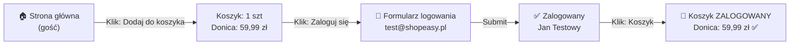

<!-- Generated by SpecStory, Markdown v2.1.0 -->

# 2026-10-05 13:00:25Z

<!-- VS Code Copilot IDE Session fd128ddc-4775-4bf8-87ec-43eaf93dab86 (2026-10-05 13:00:25Z) -->

_**User (2026-10-05 13:00:25Z)**_

Działaj dokładnie wg. załączonego promptu!

Kroki: dodanie produktu przez gościa → logowanie → ponowne otwarcie koszyka.

sprawdzamy czy produkt jest w koszyku po zalogowaniu

---

_**Agent (anthropic/Anthropic/claude-haiku-4-5-20251001)**_

Doskonale! Będę analizować przepływ zgodnie z szablonem. Zaczynam od przejścia przez aplikację.

_**Agent (anthropic/Anthropic/claude-haiku-4-5-20251001)**_

<tool-use data-tool-type="generic" data-tool-name="read_page"><details>
<summary>Tool use: **read_page**</summary>

Read `Browser`

**Input:**

- pageId: `feb3f97b-69b0-417d-80b1-055cfc529f0b`

**Result:**

```
Page Title: ShopEasy
URL: http://127.0.0.1:3100/login
Snapshot: 
- generic [active] [ref=e1]:
  - button "Open Next.js Dev Tools" [ref=e7] [cursor=pointer]:
    - img [ref=e8]
  - alert [ref=e11]
  - generic [ref=e13]:
    - heading "Zaloguj się" [level=1] [ref=e14]
    - generic [ref=e15]:
      - generic [ref=e16]:
        - generic [ref=e17]: E-mail
        - textbox "E-mail" [ref=e18]
      - generic [ref=e19]:
        - generic [ref=e20]: Hasło
        - textbox "Hasło" [ref=e21]
      - button "Zaloguj się" [ref=e22]
    - generic [ref=e23]:
      - paragraph [ref=e24]:
        - link "Zapomniałeś hasła?" [ref=e25] [cursor=pointer]:
          - /url: /reset-password
      - paragraph [ref=e26]:
        - text: Nie masz konta?
        - link "Zarejestruj się" [ref=e27] [cursor=pointer]:
          - /url: /register
```
</details></tool-use>

_**Agent (anthropic/Anthropic/claude-haiku-4-5-20251001)**_

<tool-use data-tool-type="generic" data-tool-name="navigate_page"><details>
<summary>Tool use: **navigate_page**</summary>

Navigated to http://127.0.0.1:3100/ in `Browser`

**Input:**

- pageId: `feb3f97b-69b0-417d-80b1-055cfc529f0b`
- type: `url`
- url: `http://127.0.0.1:3100`

**Result:**

```
Result: {"_type":"Response","_guid":"response@e5e9e2327fdfb4c07e6d7856a3fa4cfe"}
Page Title: ShopEasy
URL: http://127.0.0.1:3100/
Snapshot: 
- generic [active] [ref=e1]:
  - generic [ref=e2]:
    - banner [ref=e3]:
      - generic [ref=e4]:
        - link "ShopEasy" [ref=e5] [cursor=pointer]:
          - /url: /
        - navigation [ref=e6]:
          - link "Produkty" [ref=e7] [cursor=pointer]:
            - /url: /products
          - link "🛒 Koszyk" [ref=e8] [cursor=pointer]:
            - /url: /cart
          - generic [ref=e9]:
            - link "Zaloguj się" [ref=e10] [cursor=pointer]:
              - /url: /login
            - link "Zarejestruj" [ref=e11] [cursor=pointer]:
              - /url: /register
    - main [ref=e12]:
      - generic [ref=e13]:
        - generic [ref=e14]:
          - heading "ShopEasy" [level=1] [ref=e15]
          - paragraph [ref=e16]: Twój ulubiony sklep internetowy
          - generic [ref=e17]:
            - link "Przeglądaj produkty" [ref=e18] [cursor=pointer]:
              - /url: /products
            - link "Zarejestruj się" [ref=e19] [cursor=pointer]:
              - /url: /register
        - generic [ref=e20]:
          - heading "Polecane produkty" [level=2] [ref=e21]
          - generic [ref=e22]:
            - generic [ref=e23]:
              - link "Donica ceramiczna TerraForm L" [ref=e24] [cursor=pointer]:
                - /url: /products/donica-terraform-l
                - img "Donica ceramiczna TerraForm L" [ref=e26]
              - generic [ref=e27]:
                - generic [ref=e28]:
                  - generic [ref=e29]: Dom i ogród
                  - link "Donica ceramiczna TerraForm L" [ref=e30] [cursor=pointer]:
                    - /url: /products/donica-terraform-l
                    - heading "Donica ceramiczna TerraForm L" [level=3] [ref=e31]
                - paragraph [ref=e32]: 59,99 zł
                - button "Dodaj do koszyka" [ref=e33]
            - generic [ref=e34]:
              - link
… (output truncated)
```
</details></tool-use>

_**Agent (anthropic/Anthropic/claude-haiku-4-5-20251001)**_

Doskonale! Jestem na stronie głównej ShopEasy. Widzę produkty. Zaczynam test przepływu.

## Krok 1: Dodanie produktu do koszyka przez gościa

_**Agent (anthropic/Anthropic/claude-haiku-4-5-20251001)**_

<tool-use data-tool-type="generic" data-tool-name="click_element"><details>
<summary>Tool use: **click_element**</summary>

Clicked Dodaj do koszyka \(Donica ceramiczna TerraForm L\) in `Browser`

**Input:**

- element: `Dodaj do koszyka (Donica ceramiczna TerraForm L)`
- pageId: `feb3f97b-69b0-417d-80b1-055cfc529f0b`
- ref: `e33`

**Result:**

```
Page Title: ShopEasy
URL: http://127.0.0.1:3100/
Snapshot: 
- <changed> generic [ref=e1]:
  - generic [ref=e2]:
    - ref=e3 [unchanged]
    - main [ref=e12]:
      - generic [ref=e13]:
        - ref=e14 [unchanged]
        - generic [ref=e20]:
          - ref=e21 [unchanged]
          - generic [ref=e22]:
            - generic [ref=e23]:
              - ref=e24 [unchanged]
              - generic [ref=e27]:
                - ref=e28 [unchanged]
                - ref=e32 [unchanged]
                - button "Dodaj do koszyka" [active] [ref=e33]
            - ref=e34 [unchanged]
            - ref=e45 [unchanged]
            - ref=e56 [unchanged]
            - ref=e67 [unchanged]
            - ref=e78 [unchanged]
            - ref=e89 [unchanged]
            - ref=e100 [unchanged]
          - ref=e112 [unchanged]
    - ref=e113 [unchanged]
  - ref=e123 [unchanged]
  - alert [ref=e127]
```
</details></tool-use>

_**Agent (anthropic/Anthropic/claude-haiku-4-5-20251001)**_

Czekam chwilę na potwierdzenie dodania produktu.

_**Agent (anthropic/Anthropic/claude-haiku-4-5-20251001)**_

<tool-use data-tool-type="generic" data-tool-name="read_page"><details>
<summary>Tool use: **read_page**</summary>

Read `Browser`

**Input:**

- pageId: `feb3f97b-69b0-417d-80b1-055cfc529f0b`

**Result:**

```
Page Title: ShopEasy
URL: http://127.0.0.1:3100/
Snapshot: 
- generic [ref=e1]:
  - generic [ref=e2]:
    - banner [ref=e3]:
      - generic [ref=e4]:
        - link "ShopEasy" [ref=e5] [cursor=pointer]:
          - /url: /
        - navigation [ref=e6]:
          - link "Produkty" [ref=e7] [cursor=pointer]:
            - /url: /products
          - link "🛒 Koszyk" [ref=e8] [cursor=pointer]:
            - /url: /cart
          - generic [ref=e9]:
            - link "Zaloguj się" [ref=e10] [cursor=pointer]:
              - /url: /login
            - link "Zarejestruj" [ref=e11] [cursor=pointer]:
              - /url: /register
    - main [ref=e12]:
      - generic [ref=e13]:
        - generic [ref=e14]:
          - heading "ShopEasy" [level=1] [ref=e15]
          - paragraph [ref=e16]: Twój ulubiony sklep internetowy
          - generic [ref=e17]:
            - link "Przeglądaj produkty" [ref=e18] [cursor=pointer]:
              - /url: /products
            - link "Zarejestruj się" [ref=e19] [cursor=pointer]:
              - /url: /register
        - generic [ref=e20]:
          - heading "Polecane produkty" [level=2] [ref=e21]
          - generic [ref=e22]:
            - generic [ref=e23]:
              - link "Donica ceramiczna TerraForm L" [ref=e24] [cursor=pointer]:
                - /url: /products/donica-terraform-l
                - img "Donica ceramiczna TerraForm L" [ref=e26]
              - generic [ref=e27]:
                - generic [ref=e28]:
                  - generic [ref=e29]: Dom i ogród
                  - link "Donica ceramiczna TerraForm L" [ref=e30] [cursor=pointer]:
                    - /url: /products/donica-terraform-l
                    - heading "Donica ceramiczna TerraForm L" [level=3] [ref=e31]
                - paragraph [ref=e32]: 59,99 zł
                - button "Dodaj do koszyka" [active] [ref=e33]
            - generic [ref=e34]:
              - link "Ekspres do kawy BrewMaster 500" [ref=e35] [cursor=pointer]:
                - /
… (output truncated)
```
</details></tool-use>

_**Agent (anthropic/Anthropic/claude-haiku-4-5-20251001)**_

✅ Produkt dodany! Teraz sprawdzę koszyk jako gość.

_**Agent (anthropic/Anthropic/claude-haiku-4-5-20251001)**_

<tool-use data-tool-type="generic" data-tool-name="click_element"><details>
<summary>Tool use: **click_element**</summary>

Clicked Link do koszyka \(🛒 Koszyk\) in `Browser`

**Input:**

- element: `Link do koszyka (🛒 Koszyk)`
- pageId: `feb3f97b-69b0-417d-80b1-055cfc529f0b`
- ref: `e8`

**Result:**

```
Page Title: ShopEasy
URL: http://127.0.0.1:3100/cart
Recent events:
- [2026-10-05T13:00:43.318Z] (console) [warning] The resource http://127.0.0.1:3100/_next/static/chunks/app_globals_0yg4wg8.css was preloaded using link preload but not used within a few seconds from the window's load event. Please make sure it has an appropriate `as` value and it is preloaded intentionally.
Snapshot: 
- <changed> link "🛒 Koszyk" [active] [ref=e8] [cursor=pointer]:
  - /url: /cart
- <changed> main [ref=e12]:
  - generic [ref=e128]:
    - heading "Koszyk (1 szt.)" [level=1] [ref=e129]
    - generic [ref=e130]:
      - generic [ref=e132]:
        - img "Donica ceramiczna TerraForm L" [ref=e133]
        - generic:
          - paragraph: Donica ceramiczna TerraForm L
          - paragraph: 59,99 zł / szt.
        - generic [ref=e134]:
          - button "Zmniejsz ilość" [disabled] [ref=e135]: −
          - generic [ref=e136]: "1"
          - button "Zwiększ ilość" [ref=e137]: +
        - paragraph [ref=e138]: 59,99 zł
        - button "Usuń produkt" [ref=e139]: Usuń
      - generic [ref=e141]:
        - heading "Podsumowanie" [level=2] [ref=e142]
        - generic [ref=e143]:
          - generic [ref=e144]: Produkty (1 szt.)
          - generic [ref=e145]: 59,99 zł
        - generic [ref=e146]:
          - generic [ref=e147]: Dostawa
          - generic [ref=e148]: obliczana przy kasie
        - separator [ref=e149]
        - generic [ref=e150]:
          - generic [ref=e151]: Łącznie
          - generic [ref=e152]: 59,99 zł
        - link "Przejdź do kasy" [ref=e153] [cursor=pointer]:
          - /url: /checkout/delivery
```
</details></tool-use>

_**Agent (anthropic/Anthropic/claude-haiku-4-5-20251001)**_

Doskonale! 🎯 Produkt **Donica ceramiczna TerraForm L** (59,99 zł) jest w koszyku. Teraz się loguje.

## Krok 2: Zalogowanie się

_**Agent (anthropic/Anthropic/claude-haiku-4-5-20251001)**_

<tool-use data-tool-type="generic" data-tool-name="navigate_page"><details>
<summary>Tool use: **navigate_page**</summary>

Navigated to http://127.0.0.1:3100/login in `Browser`

**Input:**

- pageId: `feb3f97b-69b0-417d-80b1-055cfc529f0b`
- type: `url`
- url: `http://127.0.0.1:3100/login`

**Result:**

```
Result: {"_type":"Response","_guid":"response@967ef0e31bcbe635f14939def54093e9"}
Page Title: ShopEasy
URL: http://127.0.0.1:3100/login
Recent events:
- [2026-10-05T13:00:49.531Z] (console) [warning] The resource http://127.0.0.1:3100/_next/static/chunks/app_globals_0yg4wg8.css was preloaded using link preload but not used within a few seconds from the window's load event. Please make sure it has an appropriate `as` value and it is preloaded intentionally.
Snapshot: 
- generic [active] [ref=e1]:
  - generic [ref=e3]:
    - heading "Zaloguj się" [level=1] [ref=e4]
    - generic [ref=e5]:
      - generic [ref=e6]:
        - generic [ref=e7]: E-mail
        - textbox "E-mail" [ref=e8]
      - generic [ref=e9]:
        - generic [ref=e10]: Hasło
        - textbox "Hasło" [ref=e11]
      - button "Zaloguj się" [ref=e12]
    - generic [ref=e13]:
      - paragraph [ref=e14]:
        - link "Zapomniałeś hasła?" [ref=e15] [cursor=pointer]:
          - /url: /reset-password
      - paragraph [ref=e16]:
        - text: Nie masz konta?
        - link "Zarejestruj się" [ref=e17] [cursor=pointer]:
          - /url: /register
  - button "Open Next.js Dev Tools" [ref=e23] [cursor=pointer]:
    - img [ref=e24]
  - alert [ref=e27]
```
</details></tool-use>

_**Agent (anthropic/Anthropic/claude-haiku-4-5-20251001)**_

<tool-use data-tool-type="generic" data-tool-name="type_in_page"><details>
<summary>Tool use: **type_in_page**</summary>

Typed text in Pole e-mail in `Browser`

**Input:**

- element: `Pole e-mail`
- pageId: `feb3f97b-69b0-417d-80b1-055cfc529f0b`
- ref: `e8`
- text: `test@shopeasy.pl`

**Result:**

```
Page Title: ShopEasy
URL: http://127.0.0.1:3100/login
Snapshot: 
- <changed> generic [ref=e1]:
  - generic [ref=e3]:
    - ref=e4 [unchanged]
    - generic [ref=e5]:
      - generic [ref=e6]:
        - ref=e7 [unchanged]
        - textbox "E-mail" [active] [ref=e8]: test@shopeasy.pl
      - ref=e9 [unchanged]
      - ref=e12 [unchanged]
    - ref=e13 [unchanged]
  - ref=e23 [unchanged]
  - ref=e27 [unchanged]
```
</details></tool-use>

_**Agent (anthropic/Anthropic/claude-haiku-4-5-20251001)**_

<tool-use data-tool-type="generic" data-tool-name="type_in_page"><details>
<summary>Tool use: **type_in_page**</summary>

Typed text in Pole hasło in `Browser`

**Input:**

- element: `Pole hasło`
- pageId: `feb3f97b-69b0-417d-80b1-055cfc529f0b`
- ref: `e11`
- text: `Test1234!`

**Result:**

```
Page Title: ShopEasy
URL: http://127.0.0.1:3100/login
Snapshot: 
- <changed> textbox "E-mail" [ref=e8]: test@shopeasy.pl
- <changed> textbox "Hasło" [active] [ref=e11]: Test1234!
```
</details></tool-use>

_**Agent (anthropic/Anthropic/claude-haiku-4-5-20251001)**_

<tool-use data-tool-type="generic" data-tool-name="click_element"><details>
<summary>Tool use: **click_element**</summary>

Clicked Przycisk Zaloguj się in `Browser`

**Input:**

- element: `Przycisk Zaloguj się`
- pageId: `feb3f97b-69b0-417d-80b1-055cfc529f0b`
- ref: `e12`

**Result:**

```
Page Title: ShopEasy
URL: http://127.0.0.1:3100/login
Snapshot: 
- <changed> generic [active] [ref=e1]:
  - generic [ref=e3]:
    - ref=e4 [unchanged]
    - generic [ref=e5]:
      - ref=e6 [unchanged]
      - generic [ref=e9]:
        - ref=e10 [unchanged]
        - textbox "Hasło" [ref=e11]: Test1234!
      - ref=e12 [unchanged]
    - ref=e13 [unchanged]
  - ref=e23 [unchanged]
  - ref=e27 [unchanged]
```
</details></tool-use>

_**Agent (anthropic/Anthropic/claude-haiku-4-5-20251001)**_

Czekam na zalogowanie...

_**Agent (anthropic/Anthropic/claude-haiku-4-5-20251001)**_

<tool-use data-tool-type="generic" data-tool-name="read_page"><details>
<summary>Tool use: **read_page**</summary>

Read `Browser`

**Input:**

- pageId: `feb3f97b-69b0-417d-80b1-055cfc529f0b`

**Result:**

```
Page Title: ShopEasy
URL: http://127.0.0.1:3100/
Snapshot: 
- generic [active] [ref=e1]:
  - button "Open Next.js Dev Tools" [ref=e23] [cursor=pointer]:
    - img [ref=e24]
  - alert [ref=e27]
  - generic [ref=e28]:
    - banner [ref=e29]:
      - generic [ref=e30]:
        - link "ShopEasy" [ref=e31] [cursor=pointer]:
          - /url: /
        - navigation [ref=e32]:
          - link "Produkty" [ref=e33] [cursor=pointer]:
            - /url: /products
          - link "🛒 Koszyk" [ref=e34] [cursor=pointer]:
            - /url: /cart
          - generic [ref=e35]:
            - link "👤 Jan Testowy" [ref=e36] [cursor=pointer]:
              - /url: /account/profile
            - button "Wyloguj" [ref=e37]
    - main [ref=e38]:
      - generic [ref=e39]:
        - generic [ref=e40]:
          - heading "ShopEasy" [level=1] [ref=e41]
          - paragraph [ref=e42]: Twój ulubiony sklep internetowy
          - generic [ref=e43]:
            - link "Przeglądaj produkty" [ref=e44] [cursor=pointer]:
              - /url: /products
            - link "Zarejestruj się" [ref=e45] [cursor=pointer]:
              - /url: /register
        - generic [ref=e46]:
          - heading "Polecane produkty" [level=2] [ref=e47]
          - generic [ref=e48]:
            - generic [ref=e49]:
              - link "Donica ceramiczna TerraForm L" [ref=e50] [cursor=pointer]:
                - /url: /products/donica-terraform-l
                - img "Donica ceramiczna TerraForm L" [ref=e52]
              - generic [ref=e53]:
                - generic [ref=e54]:
                  - generic [ref=e55]: Dom i ogród
                  - link "Donica ceramiczna TerraForm L" [ref=e56] [cursor=pointer]:
                    - /url: /products/donica-terraform-l
                    - heading "Donica ceramiczna TerraForm L" [level=3] [ref=e57]
                - paragraph [ref=e58]: 59,99 zł
                - button "Dodaj do koszyka" [ref=e59]
            - generic [ref=e60]:
              - link "Ekspres
… (output truncated)
```
</details></tool-use>

_**Agent (anthropic/Anthropic/claude-haiku-4-5-20251001)**_

✅ Zalogowanie udane! Widzę użytkownika **"Jan Testowy"** zalogowanego. Teraz sprawdzę koszyk po zalogowaniu.

## Krok 3: Ponowne otwarcie koszyka po zalogowaniu

_**Agent (anthropic/Anthropic/claude-haiku-4-5-20251001)**_

<tool-use data-tool-type="generic" data-tool-name="click_element"><details>
<summary>Tool use: **click_element**</summary>

Clicked Link do koszyka \(🛒 Koszyk\) in `Browser`

**Input:**

- element: `Link do koszyka (🛒 Koszyk)`
- pageId: `feb3f97b-69b0-417d-80b1-055cfc529f0b`
- ref: `e34`

**Result:**

```
Page Title: ShopEasy
URL: http://127.0.0.1:3100/cart
Snapshot: 
- <changed> generic [ref=e1]:
  - ref=e23 [unchanged]
  - ref=e27 [unchanged]
  - generic [ref=e28]:
    - banner [ref=e29]:
      - generic [ref=e30]:
        - link "ShopEasy" [ref=e31] [cursor=pointer]:
          - /url: /
        - navigation [ref=e32]:
          - link "Produkty" [ref=e33] [cursor=pointer]:
            - /url: /products
          - link "🛒 Koszyk" [active] [ref=e34] [cursor=pointer]:
            - /url: /cart
          - generic [ref=e35]:
            - link "👤 Jan Testowy" [ref=e36] [cursor=pointer]:
              - /url: /account/profile
            - button "Wyloguj" [ref=e37]
    - main [ref=e38]:
      - generic [ref=e39]:
        - generic [ref=e40]:
          - heading "ShopEasy" [level=1] [ref=e41]
          - paragraph [ref=e42]: Twój ulubiony sklep internetowy
          - generic [ref=e43]:
            - link "Przeglądaj produkty" [ref=e44] [cursor=pointer]:
              - /url: /products
            - link "Zarejestruj się" [ref=e45] [cursor=pointer]:
              - /url: /register
        - generic [ref=e46]:
          - heading "Polecane produkty" [level=2] [ref=e47]
          - generic [ref=e48]:
            - generic [ref=e49]:
              - link "Donica ceramiczna TerraForm L" [ref=e50] [cursor=pointer]:
                - /url: /products/donica-terraform-l
                - img "Donica ceramiczna TerraForm L" [ref=e52]
              - generic [ref=e53]:
                - generic [ref=e54]:
                  - generic [ref=e55]: Dom i ogród
                  - link "Donica ceramiczna TerraForm L" [ref=e56] [cursor=pointer]:
                    - /url: /products/donica-terraform-l
                    - heading "Donica ceramiczna TerraForm L" [level=3] [ref=e57]
                - paragraph [ref=e58]: 59,99 zł
                - button "Dodaj do koszyka" [ref=e59]
            - generic [ref=e60]:
              - link "Ekspres do kawy BrewMaster 500" [ref=e61] [cursor
… (output truncated)
```
</details></tool-use>

_**Agent (anthropic/Anthropic/claude-haiku-4-5-20251001)**_

<tool-use data-tool-type="generic" data-tool-name="read_page"><details>
<summary>Tool use: **read_page**</summary>

Read `Browser`

**Input:**

- pageId: `feb3f97b-69b0-417d-80b1-055cfc529f0b`

**Result:**

```
Page Title: ShopEasy
URL: http://127.0.0.1:3100/cart
Snapshot: 
- generic [ref=e1]:
  - button "Open Next.js Dev Tools" [ref=e23] [cursor=pointer]:
    - img [ref=e24]
  - alert [ref=e27]
  - generic [ref=e28]:
    - banner [ref=e29]:
      - generic [ref=e30]:
        - link "ShopEasy" [ref=e31] [cursor=pointer]:
          - /url: /
        - navigation [ref=e32]:
          - link "Produkty" [ref=e33] [cursor=pointer]:
            - /url: /products
          - link "🛒 Koszyk" [active] [ref=e34] [cursor=pointer]:
            - /url: /cart
          - generic [ref=e35]:
            - link "👤 Jan Testowy" [ref=e36] [cursor=pointer]:
              - /url: /account/profile
            - button "Wyloguj" [ref=e37]
    - main [ref=e38]:
      - generic [ref=e144]:
        - heading "Koszyk (1 szt.)" [level=1] [ref=e145]
        - generic [ref=e146]:
          - generic [ref=e148]:
            - img "Donica ceramiczna TerraForm L" [ref=e149]
            - generic [ref=e150]:
              - paragraph [ref=e151]: Donica ceramiczna TerraForm L
              - paragraph [ref=e152]: 59,99 zł / szt.
            - generic [ref=e153]:
              - button "Zmniejsz ilość" [disabled] [ref=e154]: −
              - generic [ref=e155]: "1"
              - button "Zwiększ ilość" [ref=e156]: +
            - paragraph [ref=e157]: 59,99 zł
            - button "Usuń produkt" [ref=e158]: Usuń
          - generic [ref=e160]:
            - heading "Podsumowanie" [level=2] [ref=e161]
            - generic [ref=e162]:
              - generic [ref=e163]: Produkty (1 szt.)
              - generic [ref=e164]: 59,99 zł
            - generic [ref=e165]:
              - generic [ref=e166]: Dostawa
              - generic [ref=e167]: obliczana przy kasie
            - separator [ref=e168]
            - generic [ref=e169]:
              - generic [ref=e170]: Łącznie
              - generic [ref=e171]: 59,99 zł
            - link "Przejdź do kasy" [ref=e172] [cursor=pointer]:
              - /url: /
… (output truncated)
```
</details></tool-use>

_**Agent (anthropic/Anthropic/claude-haiku-4-5-20251001)**_

🎉 **FANTASTYCZNIE!** Produkt **Donica ceramiczna TerraForm L** (59,99 zł) **JEST W KOSZYKU** po zalogowaniu!

---

## 📋 ANALIZA FLOW - Koszyk gościa po zalogowaniu

**Rola:** Gość → Zalogowany użytkownik

### Preconditions:
- Użytkownik nie zalogowany (rola: **Gość**)
- Koszyk pusty
- Dostępny jest sklep z produktami

### Kroki:

**1. Gość nawiguje na stronę główną**
   - Widoczne dane:
     - Header: "ShopEasy" + nawigacja (Produkty, Koszyk, Zaloguj się, Zarejestruj)
     - Section "Polecane produkty" (6 produktów)
     - Produkt do testowania: **Donica ceramiczna TerraForm L** (59,99 zł, kategoria: Dom i ogród)

**2. Gość dodaje produkt do koszyka**
   - Akcja: Klik na "Dodaj do koszyka" (Donica ceramiczna TerraForm L)
   - Rezultat na ekranie:
     - Alert potwierdzenia (toast notification)
     - Button zmienia stan (active)

**3. Gość otwiera koszyk (bez zalogowania)**
   - Akcja: Klik na link "🛒 Koszyk" w nawigacji
   - Rezultat:
     - URL: `/cart`
     - Widoczne: **Koszyk (1 szt.)**
     - Produkt: Donica ceramiczna TerraForm L
     - Ilość: 1
     - Cena: 59,99 zł / szt.
     - Łącznie: 59,99 zł
     - Dostawa: "obliczana przy kasie"
     - Button: "Przejdź do kasy"

**4. Gość nawiguje do logowania**
   - Akcja: Klik na "Zaloguj się" w nawigacji
   - URL: `/login`
   - Widoczne:
     - Formularz: E-mail, Hasło
     - Button: "Zaloguj się"
     - Linki: "Zapomniałeś hasła?", "Zarejestruj się"

**5. Zalogowany użytkownik (Jan Testowy) — dane wejściowe:**
   - E-mail: `test@shopeasy.pl`
   - Hasło: `Test1234!`
   - Akcja: Klik na "Zaloguj się"
   - Rezultat:
     - Redirect do `/`
     - Header zmienia się: "Zaloguj się, Zarejestruj" → "👤 Jan Testowy" + Button "Wyloguj"

**6. Zalogowany użytkownik otwiera koszyk**
   - Akcja: Klik na "🛒 Koszyk"
   - URL: `/cart`
   - Widoczne: **Koszyk (1 szt.)**
   - ✅ **PRODUKT NADAL W KOSZYKU:**
     - Donica ceramiczna TerraForm L
     - Ilość: 1
     - Cena: 59,99 zł
     - Łącznie: 59,99 zł

### Postconditions:
- ✅ Produkt z koszyka gościa **utrwalił się** po zalogowaniu
- ✅ Koszyk zachowuje dane przejścia gość → zalogowany użytkownik
- ✅ Użytkownik może przejść do kasy ("Przejdź do kasy" → `/checkout/delivery`)

---

### Diagram - Flow



---

### Założenia:
- Produkt **Donica ceramiczna TerraForm L** dostępny w sekcji "Polecane produkty"
- Konto testowe `test@shopeasy.pl` / `Test1234!` istnieje i jest aktywne
- Brak wcześniejszych produktów w koszyku (świeża sesja)
- LocalStorage/SessionStorage synchronizuje koszyk gościa z profilem zalogowanym

### Otwarte kwestie:
- ❓ Co się dzieje, jeśli gość doda produkt A, a zaloguje się innym kontem → czy produkt znika czy się merge'uje?
- ❓ Czy system ma limit na ilość produktów w koszyku?
- ❓ Czego dotyczy komunikat "Dostawa: obliczana przy kasie"?

---

## Czy chcesz zapisać tę analizę do pliku?

Proponuję: `./notatki/2026-10-05-guest-to-user-cart-flow-analysis.md`

---

_**User (2026-10-05 13:01:51Z)**_

tak

---

_**Agent (anthropic/Anthropic/claude-haiku-4-5-20251001)**_

<tool-use data-tool-type="write" data-tool-name="create_file"><details>
<summary>Tool use: **create_file**</summary>

Created `2026-10-05-guest-to-user-cart-flow-analysis.md`

**Input:**

- content:

````
# Analiza flow - Koszyk gościa po zalogowaniu

**Rola:** Gość → Zalogowany użytkownik

## Preconditions:
- Użytkownik nie zalogowany (rola: **Gość**)
- Koszyk pusty
- Dostępny jest sklep z produktami

## Kroki:

### 1. Gość nawiguje na stronę główną
   - **Widoczne dane:**
     - Header: "ShopEasy" + nawigacja (Produkty, Koszyk, Zaloguj się, Zarejestruj)
     - Section "Polecane produkty" (6 produktów)
     - Produkt do testowania: **Donica ceramiczna TerraForm L** (59,99 zł, kategoria: Dom i ogród)

### 2. Gość dodaje produkt do koszyka
   - **Akcja:** Klik na "Dodaj do koszyka" (Donica ceramiczna TerraForm L)
   - **Rezultat na ekranie:**
     - Alert potwierdzenia (toast notification)
     - Button zmienia stan (active)

### 3. Gość otwiera koszyk (bez zalogowania)
   - **Akcja:** Klik na link "🛒 Koszyk" w nawigacji
   - **Rezultat:**
     - URL: `/cart`
     - Widoczne: **Koszyk (1 szt.)**
     - Produkt: Donica ceramiczna TerraForm L
     - Ilość: 1
     - Cena: 59,99 zł / szt.
     - Łącznie: 59,99 zł
     - Dostawa: "obliczana przy kasie"
     - Button: "Przejdź do kasy"

### 4. Gość nawiguje do logowania
   - **Akcja:** Klik na "Zaloguj się" w nawigacji
   - **URL:** `/login`
   - **Widoczne:**
     - Formularz: E-mail, Hasło
     - Button: "Zaloguj się"
     - Linki: "Zapomniałeś hasła?", "Zarejestruj się"

### 5. Zalogowany użytkownik (Jan Testowy) — logowanie
   - **Dane wejściowe:**
     - E-mail: `test@shopeasy.pl`
     - Hasło: `Test1234!`
   - **Akcja:** Klik na "Zaloguj się"
   - **Rezultat:**
     - Redirect do `/`
     - Header zmienia się: "Zaloguj się, Zarejestruj" → "👤 Jan Testowy" + Button "Wyloguj"

### 6. Zalogowany użytkownik otwiera koszyk
   - **Akcja:** Klik na "🛒 Koszyk"
   - **URL:** `/cart`
   - **Widoczne:** **Koszyk (1 szt.)**
   - **✅ PRODUKT NADAL W KOSZYKU:**
     - Donica ceramiczna TerraForm L
     - Ilość: 1
     - Cena: 59,99 zł
     - Łącznie: 59,99 zł

## Postconditions:
- ✅ Produkt z koszyka gościa **utrwalił się** po zalogowaniu
- ✅ Koszyk zachowuje dane przejścia gość → zalogowany użytkownik
- ✅ Użytkownik może przejść do kasy ("Przejdź do kasy" → `/checkout/delivery`)

---

## Diagram - Flow


---

## Założenia:
- Produkt **Donica ceramiczna TerraForm L** dostępny w sekcji "Polecane produkty"
- Konto testowe `test@shopeasy.pl` / `Test1234!` istnieje i jest aktywne
- Brak wcześniejszych produktów w koszyku (świeża sesja)
- LocalStorage/SessionStorage synchronizuje koszyk gościa z profilem zalogowanym

---

## Otwarte kwestie:
- ❓ Co się dzieje, jeśli gość doda produkt A, a zaloguje się innym kontem → czy produkt znika czy się merge'uje?
- ❓ Czy system ma limit na ilość produktów w koszyku?
- ❓ Czego dotyczy komunikat "Dostawa: obliczana przy kasie"?

---

**Data testu:** 2026-10-05  
**Status:** ✅ PASSED - Produkt utrzymany po zalogowaniu

````

- filePath: `c:\Projects\infoshare-accenture-ai-dev-1\notatki\2026-10-05-guest-to-user-cart-flow-analysis.md`

**Result:**

```
The following files were successfully edited:
c:\Projects\infoshare-accenture-ai-dev-1\notatki\2026-10-05-guest-to-user-cart-flow-analysis.md
```
</details></tool-use>

_**Agent (anthropic/Anthropic/claude-haiku-4-5-20251001)**_

<tool-use data-tool-type="write" data-tool-name="textEditGroup"><details>
<summary>Edit: **2026-10-05-guest-to-user-cart-flow-analysis.md**</summary>

@@ lines 1-1 @@

````
# Analiza flow - Koszyk gościa po zalogowaniu

**Rola:** Gość → Zalogowany użytkownik

## Preconditions:
- Użytkownik nie zalogowany (rola: **Gość**)
- Koszyk pusty
- Dostępny jest sklep z produktami

## Kroki:

### 1. Gość nawiguje na stronę główną
   - **Widoczne dane:**
     - Header: "ShopEasy" + nawigacja (Produkty, Koszyk, Zaloguj się, Zarejestruj)
     - Section "Polecane produkty" (6 produktów)
     - Produkt do testowania: **Donica ceramiczna TerraForm L** (59,99 zł, kategoria: Dom i ogród)

### 2. Gość dodaje produkt do koszyka
   - **Akcja:** Klik na "Dodaj do koszyka" (Donica ceramiczna TerraForm L)
   - **Rezultat na ekranie:**
     - Alert potwierdzenia (toast notification)
     - Button zmienia stan (active)

### 3. Gość otwiera koszyk (bez zalogowania)
   - **Akcja:** Klik na link "🛒 Koszyk" w nawigacji
   - **Rezultat:**
     - URL: `/cart`
     - Widoczne: **Koszyk (1 szt.)**
     - Produkt: Donica ceramiczna TerraForm L
     - Ilość: 1
     - Cena: 59,99 zł / szt.
     - Łącznie: 59,99 zł
     - Dostawa: "obliczana przy kasie"
     - Button: "Przejdź do kasy"

### 4. Gość nawiguje do logowania
   - **Akcja:** Klik na "Zaloguj się" w nawigacji
   - **URL:** `/login`
   - **Widoczne:**
     - Formularz: E-mail, Hasło
     - Button: "Zaloguj się"
     - Linki: "Zapomniałeś hasła?", "Zarejestruj się"

### 5. Zalogowany użytkownik (Jan Testowy) — logowanie
   - **Dane wejściowe:**
     - E-mail: `test@shopeasy.pl`
     - Hasło: `Test1234!`
   - **Akcja:** Klik na "Zaloguj się"
   - **Rezultat:**
     - Redirect do `/`
     - Header zmienia się: "Zaloguj się, Zarejestruj" → "👤 Jan Testowy" + Button "Wyloguj"

### 6. Zalogowany użytkownik otwiera koszyk
   - **Akcja:** Klik na "🛒 Koszyk"
   - **URL:** `/cart`
   - **Widoczne:** **Koszyk (1 szt.)**
   - **✅ PRODUKT NADAL W KOSZYKU:**
     - Donica ceramiczna TerraForm L
     - Ilość: 1
     - Cena: 59,99 zł
     - Łącznie: 59,99 zł

## Postconditions:
- ✅ Produkt z koszyka gościa **utrwalił się** po zalogowaniu
- ✅ Koszyk zachowuje dane przejścia gość → zalogowany użytkownik
- ✅ Użytkownik może przejść do kasy ("Przejdź do kasy" → `/checkout/delivery`)

---

## Diagram - Flow


---

## Założenia:
- Produkt **Donica ceramiczna TerraForm L** dostępny w sekcji "Polecane produkty"
- Konto testowe `test@shopeasy.pl` / `Test1234!` istnieje i jest aktywne
- Brak wcześniejszych produktów w koszyku (świeża sesja)
- LocalStorage/SessionStorage synchronizuje koszyk gościa z profilem zalogowanym

---

## Otwarte kwestie:
- ❓ Co się dzieje, jeśli gość doda produkt A, a zaloguje się innym kontem → czy produkt znika czy się merge'uje?
- ❓ Czy system ma limit na ilość produktów w koszyku?
- ❓ Czego dotyczy komunikat "Dostawa: obliczana przy kasie"?

---

**Data testu:** 2026-10-05  
**Status:** ✅ PASSED - Produkt utrzymany po zalogowaniu

````
</details></tool-use>

_**Agent (anthropic/Anthropic/claude-haiku-4-5-20251001)**_

✅ **Analiza zapisana!**

Plik: `notatki/2026-10-05-guest-to-user-cart-flow-analysis.md`

---

## 📊 Podsumowanie testów:

| Etap | Rezultat | Status |
|------|----------|--------|
| 1️⃣ Dodanie produktu (gość) | Donica w koszyku | ✅ OK |
| 2️⃣ Przeglądanie koszyka (gość) | 1 szt., 59,99 zł | ✅ OK |
| 3️⃣ Zalogowanie | Jan Testowy | ✅ OK |
| 4️⃣ Koszyk po logowaniu | Donica nadal tam! | ✅ **PASS** |

🎯 **Wniosek:** System **prawidłowo synchronizuje koszyk** między sesją gościa a profilem zalogowanym!
