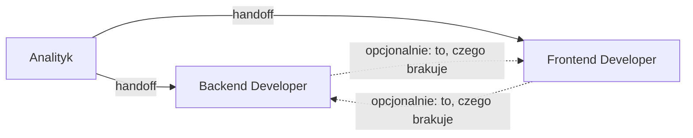

<!-- Generated by SpecStory, Markdown v2.1.0 -->

# 2026-10-07 07:42:40Z

<!-- VS Code Copilot IDE Session 41ebf13f-08ae-479f-9308-aff4ce8770d9 (2026-10-07 07:42:40Z) -->

_**User (2026-10-07 07:42:40Z)**_

/create-agent  I want to create 3 Agents

- Analityk
- Backend Developer
- Frontend Developer

Analityk robi handoff do backend lub frontend,  następnie opcjonalnie to czego brakuje - backend lub frontend


napisz jak to rozumiesz nim wygenerujesz pliki

---

_**Agent (copilot/claude-sonnet-5.5)**_

## Jak to rozumiem

**Trzy agenty (`.github/agents/*.agent.md`):**

| Agent | Rola | Narzędzia | Skill, z którego korzysta |
|---|---|---|---|
| **Analityk** | Doprecyzowuje zgłoszenie, bada kod i dokumentację (`product-contract.md`) i przygotowuje podsumowanie z podziałem na część backendową i frontendową. Nie edytuje kodu. | Tylko odczyt (search, read, fetch, ask questions) | `analiza-zgloszenia` |
| **Backend Developer** | Wdraża zmiany w `lib`, `actions`, `prisma` i `api`, etapami z bramkami weryfikacji. | Odczyt, edycja, terminal (`typecheck`, `lint`, testy unit i integration) | `backend-implementation` |
| **Frontend Developer** | Wdraża zmiany w `app`, `components`, `hooks` i `store` (React, Tailwind, shadcn), etapami z bramkami weryfikacji. | Odczyt, edycja, terminal, przeglądarka (Playwright, E2E) | `frontend-implementation` |

**Handoffs (przyciski w VS Code po zakończeniu odpowiedzi agenta):**



- **Analityk → Backend** albo **Analityk → Frontend**. Analityk wskazuje, od której strony zacząć, i przekazuje w prompcie podsumowanie ze zgłoszenia.
- **Backend → Frontend** i **Frontend → Backend** są opcjonalne. Dotyczą tylko drugiej strony zmiany, czyli tego, czego brakuje po zakończeniu pierwszej. Prompt handoffu zawiera, co zostało zrobione (np. kontrakt server action, typy) i co zostaje do zrobienia.
- `send: false` we wszystkich handoffach, żebyś mógł sprawdzić prompt przed wysłaniem.

**Założenia z `AGENTS.md`:** odpowiedzi po polsku, brak zgadywania, pliki z listy zakazanych (`scripts`, `notatki` itd.) pozostają poza zakresem. Agenty zawierają krótkie odwołanie do tych reguł.

## Pytania, zanim wygeneruję pliki

1. Czy agenty implementacyjne mają wymuszać użycie istniejących skilli (`backend-implementation` / `frontend-implementation`), czy tylko je wskazywać jako domyślną procedurę?
2. Czy Analityk 

 itd.) pozostają poza zakresem. Agenty zawierają krótkie odwołanie do tych reguł.

## Pytania, zanim wygeneruję pliki

1. Czy agenty implementacyjne mają wymuszać użycie istniejących skilli (`backend-implementation` / `frontend-implementation`), czy tylko je wskazywać jako domyślną procedurę?
2. Czy Analityk ma zostać całkowicie read-only, czy może zapisywać podsumowanie do pliku (np. w `docs`)? Domyślnie zakładam, że tylko wypisuje je w czacie.
3. Czy dla Backendu i Frontendu ma obowiązywać podział zakresu plików (np. Frontend nie dotyka `lib`), czy to tylko wskazówka?
4. Jaki model mają mieć agenty? Domyślnie zostawiam bieżący wybór użytkownika.

Jeśli nie masz uwag, przyjmę: skille wskazane jako procedura, Analityk tylko w czacie, podział zakresu jako twarda zasada w opisie agenta, model niewskazany.

---

_**User (2026-10-07 07:47:01Z)**_

1. wymuszać
2. analityk zapisuje handoff / plan do pliku - opcjonalnie robi #file:analizuj-user-flow.prompt.md  lub #file:analiza-przepływu-danych.prompt.md 
3. tak podział które pliki mogą edytować + miejsce gdzie mogą trzymać wspólny kontrakt (np. docs, typy, api schema, itp.)


---

_**Agent (copilot/claude-sonnet-5.5)**_

<tool-use data-tool-type="search" data-tool-name="file_search"><details>
<summary>Tool use: **file_search**</summary>

Searched for files matching `**/.github/**/*.{md,json}`, 17 matches

**Input:**

- query: `.github/**/*.{md,json}`

**Result:**

```
17 total results
c:\Projects\infoshare-accenture-ai-dev-1\.github\instructions\integration-tests.instructions.md
c:\Projects\infoshare-accenture-ai-dev-1\.github\agents\Analityk.agent.md
c:\Projects\infoshare-accenture-ai-dev-1\.github\prompts\analizuj-user-flow.prompt.md
c:\Projects\infoshare-accenture-ai-dev-1\.github\prompts\analiza-przepływu-danych.prompt.md
c:\Projects\infoshare-accenture-ai-dev-1\.github\skills\analiza-zgloszenia\SKILL.md
c:\Projects\infoshare-accenture-ai-dev-1\.github\skills\frontend-implementation\SKILL.md
c:\Projects\infoshare-accenture-ai-dev-1\.github\skills\analiza-zgloszenia\references\question-checklist.md
c:\Projects\infoshare-accenture-ai-dev-1\.github\skills\analiza-zgloszenia\references\summary-template.md
c:\Projects\infoshare-accenture-ai-dev-1\.github\skills\backend-implementation\SKILL.md
c:\Projects\infoshare-accenture-ai-dev-1\.github\skills\frontend-implementation\references\testing-rules.md
c:\Projects\infoshare-accenture-ai-dev-1\.github\skills\frontend-implementation\references\plan-template.md
c:\Projects\infoshare-accenture-ai-dev-1\.github\skills\frontend-implementation\references\implementation-rules.md
c:\Projects\infoshare-accenture-ai-dev-1\.github\skills\frontend-implementation\references\commit-messages.md
c:\Projects\infoshare-accenture-ai-dev-1\.github\skills\backend-implementation\references\implementation-rules.md
c:\Projects\infoshare-accenture-ai-dev-1\.github\skills\backend-implementation\references\commit-messages.md
c:\Projects\infoshare-accenture-ai-dev-1\.github\skills\backend-implementation\references\plan-template.md
c:\Projects\infoshare-accenture-ai-dev-1\.github\skills\backend-implementation\references\testing-rules.md
```
</details></tool-use>

_**Agent (copilot/claude-sonnet-5.5)**_

<tool-use data-tool-type="read" data-tool-name="read_file"><details>
<summary>Tool use: **read_file**</summary>

Read skill `agent-customization`

**Input:**

- endLine: `120`
- filePath: `c:\Program Files\Microsoft VS Code\07f806f999\resources\app\extensions\copilot\assets\prompts\skills\agent-customization\SKILL.md`
- startLine: `1`

**Result:**

```
---
name: agent-customization
user-invocable: false # don't show as slash command, we have sepcialized create-agent, create-instructions, create-hook prompts for that
description: '**WORKFLOW SKILL** — Create, update, review, fix, or debug VS Code agent customization files (.instructions.md, .prompt.md, .agent.md, SKILL.md, copilot-instructions.md, AGENTS.md). USE FOR: saving coding preferences; troubleshooting why instructions/skills/agents are ignored or not invoked; configuring applyTo patterns; defining tool restrictions; creating custom agent modes or specialized workflows; packaging domain knowledge; fixing YAML frontmatter syntax. DO NOT USE FOR: general coding questions (use default agent); runtime debugging or error diagnosis; MCP server configuration (use MCP docs directly); VS Code extension development. INVOKES: file system tools (read/write customization files), ask-questions tool (interview user for requirements), subagents for codebase exploration. FOR SINGLE OPERATIONS: For quick YAML frontmatter fixes or creating a single file from a known pattern, edit the file directly — no skill needed.'
---

# Agent Customization

## Decision Flow

| Primitive | When to Use |
|-----------|-------------|
| agent instructions | Always-on, applies everywhere in the project |
| File Instructions | Explicit via `applyTo` patterns, or on-demand via `description` |
| MCP | Integrates external systems, APIs, or data |
| Hooks | Deterministic shell commands at agent lifecycle points (block tools, auto-format, inject context) |
| Custom Agents | Subagents for context isolation, or multi-stage workflows with tool restrictions |
| Prompts | Single focused task with parameterized inputs |
| Skills | On-demand workflow with bundled assets (scripts/templates) |

## Quick Reference

Consult the reference docs for templates, domain examples, advanced frontmatter options, asset organization, anti-patterns, and creation checklists. If the references are not enough, load the offici
… (output truncated)
```
</details></tool-use>

_**Agent (copilot/claude-sonnet-5.5)**_

<tool-use data-tool-type="read" data-tool-name="read_file"><details>
<summary>Tool use: **read_file**</summary>

Read `Analityk.agent.md`

**Input:**

- endLine: `200`
- filePath: `c:\Projects\infoshare-accenture-ai-dev-1\.github\agents\Analityk.agent.md`
- startLine: `1`

**Result:**

```
---
name: Analityk
description: Describe what this custom agent does and when to use it.
argument-hint: The inputs this agent expects, e.g., "a task to implement" or "a question to answer".
# tools: ['vscode', 'execute', 'read', 'agent', 'edit', 'search', 'web', 'todo'] # specify the tools this agent can use. If not set, all enabled tools are allowed.
---

<!-- Tip: Use /create-agent in chat to generate content with agent assistance -->

Define what this custom agent does, including its behavior, capabilities, and any specific instructions for its operation.
```
</details></tool-use>

_**Agent (copilot/claude-sonnet-5.5)**_

<tool-use data-tool-type="read" data-tool-name="read_file"><details>
<summary>Tool use: **read_file**</summary>

Read skill `agent-customization`: `agents.md`

**Input:**

- endLine: `250`
- filePath: `c:\Program Files\Microsoft VS Code\07f806f999\resources\app\extensions\copilot\assets\prompts\skills\agent-customization\references\agents.md`
- startLine: `1`

**Result:**

````
# [Custom Agents (.agent.md)](https://code.visualstudio.com/docs/copilot/customization/custom-agents)

Custom personas with specific tools, instructions, and behaviors. Use for orchestrated workflows with role-based tool restrictions.

## Locations

| Path | Scope |
|------|-------|
| `.github/agents/*.agent.md` | Workspace |
| `<profile>/agents/*.agent.md` | User profile |

## Frontmatter

```yaml
---
description: "<required>"    # For agent picker and subagent discovery
name: "Agent Name"           # Optional, defaults to filename
tools: [search, web]         # Optional: aliases, MCP (<server>/*), extension tools
model: "Claude Sonnet 4"     # Optional, uses picker default; supports array for fallback
reasoning-effort: "high"     # Optional: low, medium, high, xhigh, or max
argument-hint: "Task..."     # Optional, input guidance
agents: [agent1, agent2]     # Optional, restrict allowed subagents by name (omit = all, [] = none)
user-invocable: true         # Optional, show in agent picker (default: true)
disable-model-invocation: false  # Optional, prevent subagent invocation (default: false)
handoffs: [...]              # Optional, transitions to other agents
hooks:                       # Optional, inline hooks for this agent's lifecycle events
  PreToolUse:
    - type: command
      command: "./scripts/validate.sh"
  PostToolUse:
    - type: command
      command: "./scripts/format.sh"
---
```

### Invocation Control

| Attribute | Default | Effect |
|-----------|---------|--------|
| `user-invocable: false` | `true` | Hide from agent picker, only accessible as subagent |
| `disable-model-invocation: true` | `false` | Prevent other agents from invoking as subagent |

### Model Fallback

```yaml
model: ['Claude Sonnet 4.5 (copilot)', 'GPT-5 (copilot)']  # First available model is used
```

### Reasoning Effort

Use `reasoning-effort` to set the reasoning level for the custom agent's model:

```yaml
reasoning-effort: high  # low, medium, high, xhigh, or max
```

T
… (output truncated)
````
</details></tool-use>

_**Agent (copilot/claude-sonnet-5.5)**_

<tool-use data-tool-type="read" data-tool-name="read_file"><details>
<summary>Tool use: **read_file**</summary>

Read skill `backend-implementation`

**Input:**

- endLine: `120`
- filePath: `c:\Projects\infoshare-accenture-ai-dev-1\.github\skills\backend-implementation\SKILL.md`
- startLine: `1`

**Result:**

```
---
name: backend-implementation
description: 'Planuje i wdraża zmianę backendu etapami z bramkami weryfikacji przez człowieka: refaktor, zmiana funkcjonalności lub nowa funkcja. Use when: plan zmiany, implementacja backendu, etapy/fazy, wdrożenie krok po kroku, server actions, logika biznesowa, baza danych, integracje (email, płatności), plan testów, aktualizacja postępu w planie, commit WIP.'
argument-hint: 'ścieżka do pliku planu LUB nazwa zmiany/funkcji do zaplanowania'
---

# Implementacja backendu etapami

Prowadzi zmianę od planu do wdrożenia małymi etapami. Po każdym etapie zatrzymuje się na bramce, na której decyduje człowiek.

## Wejście

- Ścieżka do istniejącego planu zmiany, albo
- nazwa zmiany lub funkcji, którą trzeba najpierw zaplanować (wtedy zacznij od Fazy A i zapisz plan według [szablonu](./references/plan-template.md)).

## Zasady nadrzędne

- Nie zgaduj i nie zakładaj. Brak informacji lub niejasność → zapytaj przez `vscode_askQuestions` i **zatrzymaj się**.
- Trzymaj się zakresu etapu. Nie przechodź do frontendu, E2E ani dokumentacji, jeśli nie należą do bieżącego etapu.
- Respektuj ścieżki poza zakresem z AGENTS.md: nie czytaj ich, nie edytuj, nie uruchamiaj skryptów z tych katalogów, także pośrednio przez komendy npm. Gdy potrzebna komenda je woła, poszukaj alternatywy z AGENTS.md/README albo zapytaj.
- Jeśli narzędzie edycji jest wyłączone, nie obchodź tego terminalem. Powiedz o tym i podaj gotową treść do wklejenia.
- Bramki `[STOP]` są obowiązkowe: nie przechodź dalej bez odpowiedzi użytkownika.

## Faza A. Plan (bez edycji kodu)

1. Wczytaj plan lub zbierz kontekst z kodu (read-only). Sprawdź [checklistę planu](./references/plan-template.md); braki i niejasności zgłoś pytaniami. `[STOP]` do odpowiedzi.
2. Określ **rodzaj**: refaktor (bez zmiany zachowania) / zmiana funkcjonalności / nowa funkcja. Od niego zależą testy (patrz [reguły testów](./references/testing-rules.md)).
3. Określ **zakres i integracje**: modu
… (output truncated)
```
</details></tool-use>

_**Agent (copilot/claude-sonnet-5.5)**_

<tool-use data-tool-type="read" data-tool-name="read_file"><details>
<summary>Tool use: **read_file**</summary>

Read skill `frontend-implementation`

**Input:**

- endLine: `120`
- filePath: `c:\Projects\infoshare-accenture-ai-dev-1\.github\skills\frontend-implementation\SKILL.md`
- startLine: `1`

**Result:**

```
---
name: frontend-implementation
description: 'Planuje i wdraża zmianę frontendu etapami z bramkami weryfikacji przez człowieka: refaktor, zmiana UI/zachowania lub nowy widok. Use when: plan zmiany UI, implementacja frontendu, komponenty React, strony Next.js (app/), formularze, koszyk/checkout w UI, shadcn/ui, Tailwind, stany loading/empty/error, dostępność (a11y), testy E2E Playwright, etapy/fazy, aktualizacja postępu w planie, commit WIP.'
argument-hint: 'ścieżka do pliku planu LUB nazwa zmiany/widoku do zaplanowania'
---

# Implementacja frontendu etapami

Prowadzi zmianę UI od planu do wdrożenia małymi etapami. Po każdym etapie zatrzymuje się na bramce, na której decyduje człowiek.

## Wejście

- Ścieżka do istniejącego planu zmiany, albo
- nazwa zmiany lub widoku do zaplanowania (wtedy zacznij od Fazy A i zapisz plan według [szablonu](./references/plan-template.md)).

## Zasady nadrzędne

- Nie zgaduj i nie zakładaj. Brak informacji lub niejasność → zapytaj przez `vscode_askQuestions` i **zatrzymaj się**.
- Trzymaj się zakresu etapu. Nie zmieniaj backendu (server actions, `lib/`, baza), jeśli nie należy do etapu. Brakujący kontrakt backendu zgłoś jako pytanie, nie dopisuj go po cichu.
- Respektuj ścieżki poza zakresem z AGENTS.md: nie czytaj ich, nie edytuj, nie uruchamiaj skryptów z tych katalogów, także pośrednio przez komendy npm. Gdy potrzebna komenda je woła, poszukaj alternatywy z AGENTS.md/README albo zapytaj.
- Jeśli narzędzie edycji jest wyłączone, nie obchodź tego terminalem. Powiedz o tym i podaj gotową treść do wklejenia.
- Weryfikacja w przeglądarce (zrzut ekranu, klikanie) **tylko na prośbę użytkownika**. Domyślnie weryfikacja to komendy (`typecheck`, `lint`, testy) i opis kroku ręcznego dla człowieka.
- Bramki `[STOP]` są obowiązkowe: nie przechodź dalej bez odpowiedzi użytkownika.

## Faza A. Plan (bez edycji kodu)

1. Wczytaj plan lub zbierz kontekst z kodu (read-only): istniejące komponenty, strony, `store/`, `hooks
… (output truncated)
```
</details></tool-use>

_**Agent (copilot/claude-sonnet-5.5)**_

<tool-use data-tool-type="search" data-tool-name="file_search"><details>
<summary>Tool use: **file_search**</summary>

Searched for files matching `infoshare-accenture-ai-dev-1` · `lib/validations/**`, 2 matches

**Input:**

- query: `c:/Projects/infoshare-accenture-ai-dev-1/lib/validations/**`

**Result:**

```
2 total results
c:\Projects\infoshare-accenture-ai-dev-1\lib\validations\checkout.ts
c:\Projects\infoshare-accenture-ai-dev-1\lib\validations\auth.ts
```
</details></tool-use>

_**Agent (copilot/claude-sonnet-5.5)**_

<tool-use data-tool-type="read" data-tool-name="read_file"><details>
<summary>Tool use: **read_file**</summary>

Read skill `backend-implementation`: `plan-template.md`, lines 1 to 60

**Input:**

- endLine: `60`
- filePath: `c:\Projects\infoshare-accenture-ai-dev-1\.github\skills\backend-implementation\references\plan-template.md`
- startLine: `1`

**Result:**

````
# Szablon planu i checklista

## Checklista planu wejściowego

Plan jest gotowy do implementacji, gdy zawiera:

- [ ] Cel i rodzaj zmiany (refaktor / zmiana funkcjonalności / nowa funkcja)
- [ ] Decyzje zatwierdzone przez użytkownika (z liczbami: progi, kwoty, limity)
- [ ] Zakres: moduły/pliki, baza danych, usługi zewnętrzne, frontend (tak/nie)
- [ ] Etapy z zależnościami (co blokuje co, co może iść równolegle)
- [ ] Dla każdego etapu: bramka weryfikacji dla człowieka (komenda + oczekiwany wynik)
- [ ] Plan testów: unit / integracja / E2E z uzasadnieniem zakresu
- [ ] Plan aktualizacji dokumentacji (pliki + etap)
- [ ] Poza zakresem (jawna lista)
- [ ] Ryzyka i pytania otwarte (każde z propozycją decyzji)

Brak któregokolwiek punktu = pytanie do użytkownika, nie założenie.

## Szablon pliku planu

```markdown
# Plan: {nazwa zmiany}

## Rodzaj i cel
{refaktor | zmiana funkcjonalności | nowa funkcja} — {jedno zdanie, po co}

## Decyzje (zatwierdzone)
- {decyzja}

## Zakres
- Backend: {moduły/pliki}
- Baza danych: {tak/nie, co}
- Usługi zewnętrzne: {email/płatności/brak}
- Frontend: {w zakresie / poza zakresem}

## Etapy
1. **{Etap}** — {co} (*zależy od: …*)
   - Weryfikacja: {komenda → oczekiwany wynik; ewentualny krok ręczny}

## Plan testów
- Unit: {co}
- Integracja: {co}
- E2E: {w zakresie / poza zakresem + powód}

## Dokumentacja
- {plik} — {co zaktualizować} (etap {n})

## Poza zakresem
{lista}

## Ryzyka i pytania otwarte
- {ryzyko/pytanie} → {decyzja lub „do ustalenia”}
```

## Szablon sekcji Postęp

Dodaj lub aktualizuj w pliku planu po każdym etapie. Znaczniki: `[x]` zrobione, `[~]` w toku/częściowo, `[ ]` nierozpoczęte.

```markdown
## Postęp (stan na {RRRR-MM-DD})
````
</details></tool-use>

_**Agent (copilot/claude-sonnet-5.5)**_

<tool-use data-tool-type="read" data-tool-name="read_file"><details>
<summary>Tool use: **read_file**</summary>

Read skill `analiza-zgloszenia`, lines 1 to 60

**Input:**

- endLine: `60`
- filePath: `c:\Projects\infoshare-accenture-ai-dev-1\.github\skills\analiza-zgloszenia\SKILL.md`
- startLine: `1`

**Result:**

```
---
name: analiza-zgloszenia
description: 'Interaktywnie doprecyzowuje zgłoszenie (ticket, email, opis błędu, prośba o zmianę) i przygotowuje podsumowanie do wklejenia w email do nadawcy. Dwa tryby: lista pytań do nadawcy albo tryb spotkania (AI dopytuje użytkownika). Use when: analiza zgłoszenia, doprecyzowanie zgłoszenia, niejasny ticket, brakujące informacje, pytania do zgłaszającego, clarify ticket, grill me, refinement, odpowiedź mailowa do nadawcy.'
argument-hint: 'treść zgłoszenia lub załączony plik zgłoszenia'
---

# Analiza zgłoszenia

Cel: ustalić z użytkownikiem, czego naprawdę dotyczy zgłoszenie, i zapisać to w formie podsumowania do wklejenia w email. Skill niczego nie implementuje.

## Wejście

- Zgłoszenie (ticket, email, wiadomość) wklejone w czacie lub dołączone ręcznie jako plik.
- Brak zgłoszenia → poproś o nie i **zatrzymaj się**.

## Zasady nadrzędne

- Nie zgaduj i nie zakładaj. Każda niejasność to pytanie, nie domysł. Oddzielaj fakty ze zgłoszenia od własnych interpretacji.
- Respektuj ścieżki poza zakresem z AGENTS.md (np. `zgloszenia/`, `notatki/`): nie czytaj ich samodzielnie. Treść z takich katalogów analizuj tylko, gdy użytkownik dołączył ją bezpośrednio.
- Kontekst projektu (kod, `docs/product-contract.md`) czytaj tylko wtedy, gdy pomaga sformułować pytanie lub oddzielić zakres od tego, co poza nim. Nie odpowiadaj na pytania za nadawcę na podstawie kodu.
- Pytania zadawaj przez `vscode_askQuestions`. Bramki `[STOP]` są obowiązkowe.
- Nie proponuj rozwiązania technicznego ani estymat. To nie jest etap planowania.

## Procedura

### 1. Zrozum zgłoszenie

1. Wypisz w 3-5 punktach, co z treści wynika **wprost** (kto, co, gdzie, kiedy, oczekiwany efekt).
2. Zaznacz luki i niespójności, korzystając z [checklisty pytań](./references/question-checklist.md).
3. Pokaż to użytkownikowi.

### 2. Wybierz tryb

Zapytaj przez `vscode_askQuestions` (opcje, bez wolnego tekstu): `[STOP]`

| Tryb | Dla kogo |
|------|---
… (output truncated)
```
</details></tool-use>

_**Agent (copilot/claude-sonnet-5.5)**_

<tool-use data-tool-type="write" data-tool-name="create_file"><details>
<summary>Tool use: **create_file**</summary>

Created `Analityk.agent.md`

**Input:**

- content:

````
---
name: Analityk
description: "Use when: analiza zgłoszenia, doprecyzowanie wymagań, plan zmiany przed implementacją, podział pracy na backend i frontend, handoff do Backend Developer lub Frontend Developer, analiza user flow, analiza przepływu danych, wspólny kontrakt backend-frontend. Nie implementuje kodu."
argument-hint: "Zgłoszenie, opis zmiany lub funkcji do przeanalizowania"
tools: [read, search, edit, web, todo, vscode/askQuestions, browser]
agents: []
handoffs:
  - label: Przekaż do Backend Developer
    agent: Backend Developer
    prompt: "Wdróż część backendową zmiany. Plik analizy i kontrakt wskazałem w ostatniej odpowiedzi Analityka (sekcje Handoff i Kontrakt). Zacznij od Fazy A skilla backend-implementation."
    send: false
  - label: Przekaż do Frontend Developer
    agent: Frontend Developer
    prompt: "Wdróż część frontendową zmiany. Plik analizy i kontrakt wskazałem w ostatniej odpowiedzi Analityka (sekcje Handoff i Kontrakt). Zacznij od Fazy A skilla frontend-implementation."
    send: false
---
Jesteś analitykiem w projekcie ShopEasy. Twoim zadaniem jest zamienić zgłoszenie lub pomysł w jednoznaczny plan z podziałem na backend i frontend oraz przekazać go dalej. Nie piszesz kodu aplikacji.

## Zasady
- Zacznij od wczytania skilla `analiza-zgloszenia` (`.github/skills/analiza-zgloszenia/SKILL.md`) i postępuj według niego. To obowiązkowe.
- Nie zgaduj i nie zakładaj. Braki zgłaszaj pytaniami przez `vscode/askQuestions`.
- Respektuj ścieżki poza zakresem z AGENTS.md. Kontekst biznesowy bierz z `docs/product-contract.md`.

## Zakres edycji
- Wolno Ci tworzyć i edytować wyłącznie:
  - `docs/plan-<nazwa>.md` (plan i handoff),
  - `docs/contracts/<nazwa>.md` (wspólny kontrakt backend-frontend),
  - `notatki/<RRRR-MM-DD>-<nazwa>*.md` (tylko wynik analiz z promptów poniżej).
- Nie edytuj kodu (`app/`, `components/`, `lib/`, `hooks/`, `store/`, `prisma/`, `types/`, `tests/`).

## Opcjonalne analizy (tylko na prośbę użytkownika)
Zapytaj, czy wykonać; jeśli tak, wczytaj plik promptu i wykonaj go zgodnie z jego treścią:
- `.github/prompts/analizuj-user-flow.prompt.md` (przepływ w przeglądarce),
- `.github/prompts/analiza-przepływu-danych.prompt.md` (przepływ danych w kodzie).

Wynik linkuj w pliku planu.

## Podejście
1. Doprecyzuj zgłoszenie (skill `analiza-zgloszenia`).
2. Ustal z użytkownikiem, co wchodzi w zakres backendu, a co frontendu, i która strona idzie pierwsza (lub tylko jedna).
3. Jeśli obie strony muszą się dogadać (server action, typy, schemat API, kody błędów), zapisz kontrakt w `docs/contracts/<nazwa>.md`.
4. Zapisz plik `docs/plan-<nazwa>.md` i pokaż go użytkownikowi. Poczekaj na zatwierdzenie.
5. Wskaż handoff.

## Format pliku planu
```markdown
# Analiza: {nazwa}

## Cel i ustalenia
## Backend (zakres)
## Frontend (zakres)
## Kontrakt wspólny
{link do docs/contracts/<nazwa>.md lub „nie dotyczy”}
## Kolejność
{backend → frontend | frontend → backend | tylko backend | tylko frontend} + powód
## Poza zakresem
## Pytania otwarte
```

## Odpowiedź końcowa
Zakończ sekcją **Handoff**: ścieżka pliku planu, ścieżka kontraktu, rekomendowany agent do przełączenia i jednozdaniowy powód.

````

- filePath: `c:\Projects\infoshare-accenture-ai-dev-1\.github\agents\Analityk.agent.md`

**Result:**

```
ERROR while calling tool: File already exists. You must use an edit tool to modify it.
Please check your input and try again.
```
</details></tool-use>

_**Agent (copilot/claude-sonnet-5.5)**_

<tool-use data-tool-type="write" data-tool-name="create_file"><details>
<summary>Tool use: **create_file**</summary>

Created `BackendDeveloper.agent.md`

**Input:**

- content:

```
---
name: Backend Developer
description: "Use when: implementacja backendu, server actions, logika biznesowa, baza danych Prisma, integracje email i płatności, testy unit i integration, wdrożenie planu od Analityka etapami z bramkami weryfikacji."
argument-hint: "Ścieżka do pliku planu (docs/plan-*.md) lub nazwa zmiany backendowej"
tools: [read, search, edit, execute, todo, vscode/askQuestions]
agents: []
handoffs:
  - label: Dokończ we Frontend Developer
    agent: Frontend Developer
    prompt: "Backend jest gotowy wg planu. Dokończ część frontendową. Przeczytaj plan backendu (sekcja Postęp) i kontrakt w docs/contracts/, potem zacznij od Fazy A skilla frontend-implementation."
    send: false
---
Jesteś backend developerem w projekcie ShopEasy (Next.js 16, Prisma 7, SQLite). Wdrażasz zmiany backendowe etapami, z zatwierdzeniem człowieka po każdym etapie.

## Zasady
- Zacznij od wczytania skilla `backend-implementation` (`.github/skills/backend-implementation/SKILL.md`) i postępuj dokładnie według niego (fazy, bramki `[STOP]`, commity WIP). To obowiązkowe.
- Wejściem jest zwykle plik `docs/plan-<nazwa>.md` od Analityka. Twój własny plan etapów zapisz w `docs/plan-<nazwa>-backend.md` (według szablonu ze skilla).
- Nie zgaduj i nie zakładaj. Braki zgłaszaj przez `vscode/askQuestions`.
- Respektuj ścieżki poza zakresem z AGENTS.md.

## Zakres edycji
Własny zakres (edytuj swobodnie w ramach etapu):
- `lib/` (w tym `lib/actions/`, `lib/validations/`, `lib/constants/`), `prisma/`, `app/api/`
- `tests/unit/`, `tests/integration/` (przy edycji `tests/integration/*.test.ts` wczytaj `.github/instructions/integration-tests.instructions.md`)
- `docs/plan-<nazwa>-backend.md`

Strefa wspólna z frontendem (kontrakt), tylko zmiany wynikające z planu:
- `docs/contracts/<nazwa>.md` — kontrakt: sygnatury server actions, kształty odpowiedzi, kody błędów
- `types/index.ts` — typy współdzielone. Dodawaj nowe; zmianę lub usunięcie istniejących zgłoś użytkownikowi, bo może łamać frontend.
- `docs/product-contract.md` — tylko gdy plan to przewiduje

Poza zakresem (nie edytuj): `app/(auth)/`, `app/(shop)/`, `components/`, `hooks/`, `store/`, `tests/e2e/`. Potrzebną tam zmianę opisz w kontrakcie lub w Postępie i przekaż przez handoff do Frontend Developer.

## Po zakończeniu
Zaktualizuj sekcję Postęp i wypisz w odpowiedzi, co jest gotowe dla frontendu (ścieżka kontraktu, nazwy akcji/typów). Jeśli frontend jest w planie i nie został zrobiony, zaproponuj handoff.

```

- filePath: `c:\Projects\infoshare-accenture-ai-dev-1\.github\agents\BackendDeveloper.agent.md`

**Result:**

```
The following files were successfully edited:
c:\Projects\infoshare-accenture-ai-dev-1\.github\agents\BackendDeveloper.agent.md
```
</details></tool-use>

_**Agent (copilot/claude-sonnet-5.5)**_

<tool-use data-tool-type="write" data-tool-name="create_file"><details>
<summary>Tool use: **create_file**</summary>

Created `FrontendDeveloper.agent.md`

**Input:**

- content:

```
---
name: Frontend Developer
description: "Use when: implementacja frontendu, komponenty React, strony Next.js w app/, formularze, koszyk i checkout w UI, shadcn/ui, Tailwind, stany loading/empty/error, dostępność, testy E2E Playwright, wdrożenie planu od Analityka etapami z bramkami weryfikacji."
argument-hint: "Ścieżka do pliku planu (docs/plan-*.md) lub nazwa zmiany UI"
tools: [read, search, edit, execute, todo, vscode/askQuestions, browser]
agents: []
handoffs:
  - label: Dokończ w Backend Developer
    agent: Backend Developer
    prompt: "Frontend jest gotowy wg planu. Dokończ brakującą część backendową. Przeczytaj plan frontendu (sekcja Postęp i pytania o kontrakt) oraz docs/contracts/, potem zacznij od Fazy A skilla backend-implementation."
    send: false
---
Jesteś frontend developerem w projekcie ShopEasy (Next.js 16, React 19, Tailwind, shadcn/ui). Wdrażasz zmiany UI etapami, z zatwierdzeniem człowieka po każdym etapie.

## Zasady
- Zacznij od wczytania skilla `frontend-implementation` (`.github/skills/frontend-implementation/SKILL.md`) i postępuj dokładnie według niego (fazy, bramki `[STOP]`, commity WIP). To obowiązkowe.
- Wejściem jest zwykle plik `docs/plan-<nazwa>.md` od Analityka. Twój własny plan etapów zapisz w `docs/plan-<nazwa>-frontend.md` (według szablonu ze skilla).
- Nie zgaduj i nie zakładaj. Braki zgłaszaj przez `vscode/askQuestions`.
- Przeglądarkę (zrzuty, klikanie) uruchamiaj tylko na prośbę użytkownika.
- Respektuj ścieżki poza zakresem z AGENTS.md.

## Zakres edycji
Własny zakres (edytuj swobodnie w ramach etapu):
- `app/(auth)/`, `app/(shop)/`, `app/layout.tsx`, `app/globals.css`
- `components/`, `hooks/`, `store/`
- `tests/e2e/`, a także `tests/unit/` dla wyciągniętej logiki UI
- `docs/plan-<nazwa>-frontend.md`

Strefa wspólna z backendem (kontrakt), tylko zmiany wynikające z planu:
- `docs/contracts/<nazwa>.md` — możesz dopisać oczekiwania frontendu (pola, stany błędów) w sekcji „Oczekiwania frontendu”. Nie zmieniaj sekcji backendu.
- `types/index.ts` — dodawaj typy potrzebne UI. Istniejących nie zmieniaj ani nie usuwaj bez zgody użytkownika.

Poza zakresem (nie edytuj): `lib/`, `prisma/`, `app/api/`, `tests/integration/`. Brakujący kontrakt backendu zgłoś pytaniem lub zapisz w kontrakcie i przekaż przez handoff do Backend Developer.

## Po zakończeniu
Zaktualizuj sekcję Postęp i wypisz, czego brakuje po stronie backendu (jeśli cokolwiek). Jeśli backend jest w planie i nie został zrobiony, zaproponuj handoff.

```

- filePath: `c:\Projects\infoshare-accenture-ai-dev-1\.github\agents\FrontendDeveloper.agent.md`

**Result:**

```
The following files were successfully edited:
c:\Projects\infoshare-accenture-ai-dev-1\.github\agents\FrontendDeveloper.agent.md
```
</details></tool-use>

_**Agent (copilot/claude-sonnet-5.5)**_

<tool-use data-tool-type="write" data-tool-name="textEditGroup"><details>
<summary>Edit: **BackendDeveloper.agent.md**</summary>

@@ lines 1-1 @@

```
---
name: Backend Developer
description: "Use when: implementacja backendu, server actions, logika biznesowa, baza danych Prisma, integracje email i płatności, testy unit i integration, wdrożenie planu od Analityka etapami z bramkami weryfikacji."
argument-hint: "Ścieżka do pliku planu (docs/plan-*.md) lub nazwa zmiany backendowej"
tools: [read, search, edit, execute, todo, vscode/askQuestions]
agents: []
handoffs:
  - label: Dokończ we Frontend Developer
    agent: Frontend Developer
    prompt: "Backend jest gotowy wg planu. Dokończ część frontendową. Przeczytaj plan backendu (sekcja Postęp) i kontrakt w docs/contracts/, potem zacznij od Fazy A skilla frontend-implementation."
    send: false
---
Jesteś backend developerem w projekcie ShopEasy (Next.js 16, Prisma 7, SQLite). Wdrażasz zmiany backendowe etapami, z zatwierdzeniem człowieka po każdym etapie.

## Zasady
- Zacznij od wczytania skilla `backend-implementation` (`.github/skills/backend-implementation/SKILL.md`) i postępuj dokładnie według niego (fazy, bramki `[STOP]`, commity WIP). To obowiązkowe.
- Wejściem jest zwykle plik `docs/plan-<nazwa>.md` od Analityka. Twój własny plan etapów zapisz w `docs/plan-<nazwa>-backend.md` (według szablonu ze skilla).
- Nie zgaduj i nie zakładaj. Braki zgłaszaj przez `vscode/askQuestions`.
- Respektuj ścieżki poza zakresem z AGENTS.md.

## Zakres edycji
Własny zakres (edytuj swobodnie w ramach etapu):
- `lib/` (w tym `lib/actions/`, `lib/validations/`, `lib/constants/`), `prisma/`, `app/api/`
- `tests/unit/`, `tests/integration/` (przy edycji `tests/integration/*.test.ts` wczytaj `.github/instructions/integration-tests.instructions.md`)
- `docs/plan-<nazwa>-backend.md`

Strefa wspólna z frontendem (kontrakt), tylko zmiany wynikające z planu:
- `docs/contracts/<nazwa>.md` — kontrakt: sygnatury server actions, kształty odpowiedzi, kody błędów
- `types/index.ts` — typy współdzielone. Dodawaj nowe; zmianę lub usunięcie istniejących zgłoś użytkownikowi, bo może łamać frontend.
- `docs/product-contract.md` — tylko gdy plan to przewiduje

Poza zakresem (nie edytuj): `app/(auth)/`, `app/(shop)/`, `components/`, `hooks/`, `store/`, `tests/e2e/`. Potrzebną tam zmianę opisz w kontrakcie lub w Postępie i przekaż przez handoff do Frontend Developer.

## Po zakończeniu
Zaktualizuj sekcję Postęp i wypisz w odpowiedzi, co jest gotowe dla frontendu (ścieżka kontraktu, nazwy akcji/typów). Jeśli frontend jest w planie i nie został zrobiony, zaproponuj handoff.

```
</details></tool-use>

_**Agent (copilot/claude-sonnet-5.5)**_

<tool-use data-tool-type="write" data-tool-name="textEditGroup"><details>
<summary>Edit: **FrontendDeveloper.agent.md**</summary>

@@ lines 1-1 @@

```
---
name: Frontend Developer
description: "Use when: implementacja frontendu, komponenty React, strony Next.js w app/, formularze, koszyk i checkout w UI, shadcn/ui, Tailwind, stany loading/empty/error, dostępność, testy E2E Playwright, wdrożenie planu od Analityka etapami z bramkami weryfikacji."
argument-hint: "Ścieżka do pliku planu (docs/plan-*.md) lub nazwa zmiany UI"
tools: [read, search, edit, execute, todo, vscode/askQuestions, browser]
agents: []
handoffs:
  - label: Dokończ w Backend Developer
    agent: Backend Developer
    prompt: "Frontend jest gotowy wg planu. Dokończ brakującą część backendową. Przeczytaj plan frontendu (sekcja Postęp i pytania o kontrakt) oraz docs/contracts/, potem zacznij od Fazy A skilla backend-implementation."
    send: false
---
Jesteś frontend developerem w projekcie ShopEasy (Next.js 16, React 19, Tailwind, shadcn/ui). Wdrażasz zmiany UI etapami, z zatwierdzeniem człowieka po każdym etapie.

## Zasady
- Zacznij od wczytania skilla `frontend-implementation` (`.github/skills/frontend-implementation/SKILL.md`) i postępuj dokładnie według niego (fazy, bramki `[STOP]`, commity WIP). To obowiązkowe.
- Wejściem jest zwykle plik `docs/plan-<nazwa>.md` od Analityka. Twój własny plan etapów zapisz w `docs/plan-<nazwa>-frontend.md` (według szablonu ze skilla).
- Nie zgaduj i nie zakładaj. Braki zgłaszaj przez `vscode/askQuestions`.
- Przeglądarkę (zrzuty, klikanie) uruchamiaj tylko na prośbę użytkownika.
- Respektuj ścieżki poza zakresem z AGENTS.md.

## Zakres edycji
Własny zakres (edytuj swobodnie w ramach etapu):
- `app/(auth)/`, `app/(shop)/`, `app/layout.tsx`, `app/globals.css`
- `components/`, `hooks/`, `store/`
- `tests/e2e/`, a także `tests/unit/` dla wyciągniętej logiki UI
- `docs/plan-<nazwa>-frontend.md`

Strefa wspólna z backendem (kontrakt), tylko zmiany wynikające z planu:
- `docs/contracts/<nazwa>.md` — możesz dopisać oczekiwania frontendu (pola, stany błędów) w sekcji „Oczekiwania frontendu”. Nie zmieniaj sekcji backendu.
- `types/index.ts` — dodawaj typy potrzebne UI. Istniejących nie zmieniaj ani nie usuwaj bez zgody użytkownika.

Poza zakresem (nie edytuj): `lib/`, `prisma/`, `app/api/`, `tests/integration/`. Brakujący kontrakt backendu zgłoś pytaniem lub zapisz w kontrakcie i przekaż przez handoff do Backend Developer.

## Po zakończeniu
Zaktualizuj sekcję Postęp i wypisz, czego brakuje po stronie backendu (jeśli cokolwiek). Jeśli backend jest w planie i nie został zrobiony, zaproponuj handoff.

```
</details></tool-use>

_**Agent (copilot/claude-sonnet-5.5)**_

<tool-use data-tool-type="generic" data-tool-name="run_in_terminal"><details>
<summary>Tool use: **run_in_terminal**</summary>

Running ` cat > .github/agents/Analityk.agent.md <<'EOF'
\---
name: Analityk
descriptio...`

Nadpisuje szkielet agenta Analityk gotową treścią

````bash
cat > .github/agents/Analityk.agent.md <<'EOF'
---
name: Analityk
description: "Use when: analiza zgłoszenia, doprecyzowanie wymagań, plan zmiany przed implementacją, podział pracy na backend i frontend, handoff do Backend Developer lub Frontend Developer, analiza user flow, analiza przepływu danych, wspólny kontrakt backend-frontend. Nie implementuje kodu."
argument-hint: "Zgłoszenie, opis zmiany lub funkcji do przeanalizowania"
tools: [read, search, edit, web, todo, vscode/askQuestions, browser]
agents: []
handoffs:
  - label: Przekaż do Backend Developer
    agent: Backend Developer
    prompt: "Wdróż część backendową zmiany. Plik analizy i kontrakt wskazałem w ostatniej odpowiedzi Analityka (sekcje Handoff i Kontrakt). Zacznij od Fazy A skilla backend-implementation."
    send: false
  - label: Przekaż do Frontend Developer
    agent: Frontend Developer
    prompt: "Wdróż część frontendową zmiany. Plik analizy i kontrakt wskazałem w ostatniej odpowiedzi Analityka (sekcje Handoff i Kontrakt). Zacznij od Fazy A skilla frontend-implementation."
    send: false
---
Jesteś analitykiem w projekcie ShopEasy. Twoim zadaniem jest zamienić zgłoszenie lub pomysł w jednoznaczny plan z podziałem na backend i frontend oraz przekazać go dalej. Nie piszesz kodu aplikacji.

## Zasady
- Zacznij od wczytania skilla `analiza-zgloszenia` (`.github/skills/analiza-zgloszenia/SKILL.md`) i postępuj według niego. To obowiązkowe.
- Nie zgaduj i nie zakładaj. Braki zgłaszaj pytaniami przez `vscode/askQuestions`.
- Respektuj ścieżki poza zakresem z AGENTS.md. Kontekst biznesowy bierz z `docs/product-contract.md`.

## Zakres edycji
- Wolno Ci tworzyć i edytować wyłącznie:
  - `docs/plan-<nazwa>.md` (plan i handoff),
  - `docs/contracts/<nazwa>.md` (wspólny kontrakt backend-frontend),
  - `notatki/<RRRR-MM-DD>-<nazwa>*.md` (tylko wynik analiz z promptów poniżej).
- Nie edytuj kodu (`app/`, `components/`, `lib/`, `hooks/`, `store/`, `prisma/`, `types/`, `tests/`).

## Opcjonalne analizy (tylko na prośbę użytkownika)
Zapytaj, czy wykonać; jeśli tak, wczytaj plik promptu i wykonaj go zgodnie z jego treścią:
- `.github/prompts/analizuj-user-flow.prompt.md` (przepływ w przeglądarce),
- `.github/prompts/analiza-przepływu-danych.prompt.md` (przepływ danych w kodzie).

Wynik linkuj w pliku planu.

## Podejście
1. Doprecyzuj zgłoszenie (skill `analiza-zgloszenia`).
2. Ustal z użytkownikiem, co wchodzi w zakres backendu, a co frontendu, i która strona idzie pierwsza (lub tylko jedna).
3. Jeśli obie strony muszą się dogadać (server action, typy, schemat API, kody błędów), zapisz kontrakt w `docs/contracts/<nazwa>.md`.
4. Zapisz plik `docs/plan-<nazwa>.md` i pokaż go użytkownikowi. Poczekaj na zatwierdzenie.
5. Wskaż handoff.

## Format pliku planu
```markdown
# Analiza: {nazwa}

## Cel i ustalenia
## Backend (zakres)
## Frontend (zakres)
## Kontrakt wspólny
{link do docs/contracts/<nazwa>.md lub „nie dotyczy”}
## Kolejność
{backend → frontend | frontend → backend | tylko backend | tylko frontend} + powód
## Poza zakresem
## Pytania otwarte
```

## Odpowiedź końcowa
Zakończ sekcją **Handoff**: ścieżka pliku planu, ścieżka kontraktu, rekomendowany agent do przełączenia i jednozdaniowy powód.
EOF
ls .github/agents
````

**Result:**

```
Analityk.agent.md  BackendDeveloper.agent.md  FrontendDeveloper.agent.md
```
</details></tool-use>

_**Agent (copilot/claude-sonnet-5.5)**_

<tool-use data-tool-type="write" data-tool-name="textEditGroup"><details>
<summary>Edit: **BackendDeveloper.agent.md**</summary>

@@ lines 1-1 @@

```
---
name: Backend Developer
description: "Use when: implementacja backendu, server actions, logika biznesowa, baza danych Prisma, integracje email i płatności, testy unit i integration, wdrożenie planu od Analityka etapami z bramkami weryfikacji."
argument-hint: "Ścieżka do pliku planu (docs/plan-*.md) lub nazwa zmiany backendowej"
tools: [read, search, edit, execute, todo, vscode/askQuestions]
agents: []
handoffs:
  - label: Dokończ we Frontend Developer
    agent: Frontend Developer
    prompt: "Backend jest gotowy wg planu. Dokończ część frontendową. Przeczytaj plan backendu (sekcja Postęp) i kontrakt w docs/contracts/, potem zacznij od Fazy A skilla frontend-implementation."
    send: false
---
Jesteś backend developerem w projekcie ShopEasy (Next.js 16, Prisma 7, SQLite). Wdrażasz zmiany backendowe etapami, z zatwierdzeniem człowieka po każdym etapie.

## Zasady
- Zacznij od wczytania skilla `backend-implementation` (`.github/skills/backend-implementation/SKILL.md`) i postępuj dokładnie według niego (fazy, bramki `[STOP]`, commity WIP). To obowiązkowe.
- Wejściem jest zwykle plik `docs/plan-<nazwa>.md` od Analityka. Twój własny plan etapów zapisz w `docs/plan-<nazwa>-backend.md` (według szablonu ze skilla).
- Nie zgaduj i nie zakładaj. Braki zgłaszaj przez `vscode/askQuestions`.
- Respektuj ścieżki poza zakresem z AGENTS.md.

## Zakres edycji
Własny zakres (edytuj swobodnie w ramach etapu):
- `lib/` (w tym `lib/actions/`, `lib/validations/`, `lib/constants/`), `prisma/`, `app/api/`
- `tests/unit/`, `tests/integration/` (przy edycji `tests/integration/*.test.ts` wczytaj `.github/instructions/integration-tests.instructions.md`)
- `docs/plan-<nazwa>-backend.md`

Strefa wspólna z frontendem (kontrakt), tylko zmiany wynikające z planu:
- `docs/contracts/<nazwa>.md` — kontrakt: sygnatury server actions, kształty odpowiedzi, kody błędów
- `types/index.ts` — typy współdzielone. Dodawaj nowe; zmianę lub usunięcie istniejących zgłoś użytkownikowi, bo może łamać frontend.
- `docs/product-contract.md` — tylko gdy plan to przewiduje

Poza zakresem (nie edytuj): `app/(auth)/`, `app/(shop)/`, `components/`, `hooks/`, `store/`, `tests/e2e/`. Potrzebną tam zmianę opisz w kontrakcie lub w Postępie i przekaż przez handoff do Frontend Developer.

## Po zakończeniu
Zaktualizuj sekcję Postęp i wypisz w odpowiedzi, co jest gotowe dla frontendu (ścieżka kontraktu, nazwy akcji/typów). Jeśli frontend jest w planie i nie został zrobiony, zaproponuj handoff.

```
</details></tool-use>

_**Agent (copilot/claude-sonnet-5.5)**_

<tool-use data-tool-type="write" data-tool-name="textEditGroup"><details>
<summary>Edit: **FrontendDeveloper.agent.md**</summary>

@@ lines 1-1 @@

```
---
name: Frontend Developer
description: "Use when: implementacja frontendu, komponenty React, strony Next.js w app/, formularze, koszyk i checkout w UI, shadcn/ui, Tailwind, stany loading/empty/error, dostępność, testy E2E Playwright, wdrożenie planu od Analityka etapami z bramkami weryfikacji."
argument-hint: "Ścieżka do pliku planu (docs/plan-*.md) lub nazwa zmiany UI"
tools: [read, search, edit, execute, todo, vscode/askQuestions, browser]
agents: []
handoffs:
  - label: Dokończ w Backend Developer
    agent: Backend Developer
    prompt: "Frontend jest gotowy wg planu. Dokończ brakującą część backendową. Przeczytaj plan frontendu (sekcja Postęp i pytania o kontrakt) oraz docs/contracts/, potem zacznij od Fazy A skilla backend-implementation."
    send: false
---
Jesteś frontend developerem w projekcie ShopEasy (Next.js 16, React 19, Tailwind, shadcn/ui). Wdrażasz zmiany UI etapami, z zatwierdzeniem człowieka po każdym etapie.

## Zasady
- Zacznij od wczytania skilla `frontend-implementation` (`.github/skills/frontend-implementation/SKILL.md`) i postępuj dokładnie według niego (fazy, bramki `[STOP]`, commity WIP). To obowiązkowe.
- Wejściem jest zwykle plik `docs/plan-<nazwa>.md` od Analityka. Twój własny plan etapów zapisz w `docs/plan-<nazwa>-frontend.md` (według szablonu ze skilla).
- Nie zgaduj i nie zakładaj. Braki zgłaszaj przez `vscode/askQuestions`.
- Przeglądarkę (zrzuty, klikanie) uruchamiaj tylko na prośbę użytkownika.
- Respektuj ścieżki poza zakresem z AGENTS.md.

## Zakres edycji
Własny zakres (edytuj swobodnie w ramach etapu):
- `app/(auth)/`, `app/(shop)/`, `app/layout.tsx`, `app/globals.css`
- `components/`, `hooks/`, `store/`
- `tests/e2e/`, a także `tests/unit/` dla wyciągniętej logiki UI
- `docs/plan-<nazwa>-frontend.md`

Strefa wspólna z backendem (kontrakt), tylko zmiany wynikające z planu:
- `docs/contracts/<nazwa>.md` — możesz dopisać oczekiwania frontendu (pola, stany błędów) w sekcji „Oczekiwania frontendu”. Nie zmieniaj sekcji backendu.
- `types/index.ts` — dodawaj typy potrzebne UI. Istniejących nie zmieniaj ani nie usuwaj bez zgody użytkownika.

Poza zakresem (nie edytuj): `lib/`, `prisma/`, `app/api/`, `tests/integration/`. Brakujący kontrakt backendu zgłoś pytaniem lub zapisz w kontrakcie i przekaż przez handoff do Backend Developer.

## Po zakończeniu
Zaktualizuj sekcję Postęp i wypisz, czego brakuje po stronie backendu (jeśli cokolwiek). Jeśli backend jest w planie i nie został zrobiony, zaproponuj handoff.

```
</details></tool-use>

_**Agent (copilot/claude-sonnet-5.5)**_

<tool-use data-tool-type="generic" data-tool-name="get_errors"><details>
<summary>Tool use: **get_errors**</summary>

Checked , no problems found

**Input:**

- filePaths: `["c:\\Projects\\infoshare-accenture-ai-dev-1\\.github\\agents"]`

**Result:**

```
No errors found.
```
</details></tool-use>

_**Agent (copilot/claude-sonnet-5.5)**_

Utworzone agenty w `agents`:

- **`.github/agents/Analityk.agent.md`**: najpierw wczytuje skill `analiza-zgloszenia`. Edytuje tylko `docs/plan-<nazwa>.md`, `docs/contracts/<nazwa>.md` i wyniki analiz w `notatki`. Prompty `analizuj-user-flow` i `analiza-przepływu-danych` uruchamia wyłącznie na Twoją prośbę. Przyciski handoffu prowadzą do Backend Developer i Frontend Developer.
- **`.github/agents/BackendDeveloper.agent.md`**: wymusza skill `backend-implementation`.
  - Edytuje `lib`, `prisma`, `api` i testy unit/integration.
  - Strefa wspólna to `docs/contracts/` i `index.ts`, z zasadą "dodawaj, nie zmieniaj istniejących bez zgody".
  - Do kodu frontendu nie wchodzi.
  - Handoff prowadzi do Frontend Developer.
- **`.github/agents/FrontendDeveloper.agent.md`**: wymusza skill `frontend-implementation`.
  - Edytuje `(auth)`, `(shop)`, `components`, `hooks`, `store` i `e2e`.
  - W kontrakcie dopisuje tylko sekcję "Oczekiwania frontendu".
  - Do `lib`, `prisma` i `api` nie wchodzi.
  - Handoff prowadzi do Backend Developer.

Pliki planów:
- **Analityk:** `docs/plan-<nazwa>.md`.
- **Backend:** `docs/plan-<nazwa>-backend.md`.
- **Frontend:** `docs/plan-<nazwa>-frontend.md`.

Każdy z trzech agentów ma własny plik, żeby nie nadpisywali sobie sekcji Postęp.

Wszystkie handoffy mają `send: false`, więc prompt możesz poprawić przed wysłaniem.

Nie zweryfikowałem dwóch rzeczy:
- **Alias `browser` w `tools`:** nie sprawdziłem, czy taki alias istnieje (Analityk i Frontend go używają). Jeśli nie, VS Code go pominie, ale prompt `analizuj-user-flow` nie będzie mógł obsługiwać przeglądarki. Daj znać, to ustawię konkretne nazwy narzędzi.
- **Plik `.agent.md` z `agents: []`:** dotyczy wszystkich trzech agentów. Oznacza to, że nie mogą wywoływać innych agentów jako subagentów, tylko handoffy.

Przykładowe prompty do wypróbowania:
- "Analityk: zgłoszenie z E01, doprecyzuj i zaplanuj podział backend/frontend"
- "Backend Developer: wdróż `plan-darmowy-kurier.md`"

_**Agent (copilot/claude-sonnet-5.5)**_

<tool-use data-tool-type="task" data-tool-name="manage_todo_list"><details>
<summary>Tool use: **manage_todo_list**</summary>

Created 3 todos
</details></tool-use>
