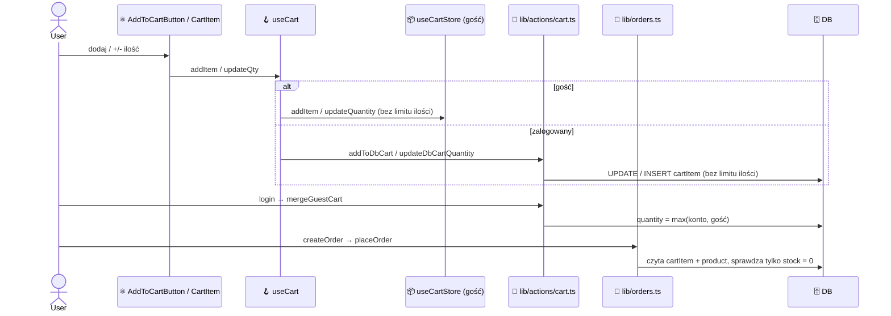
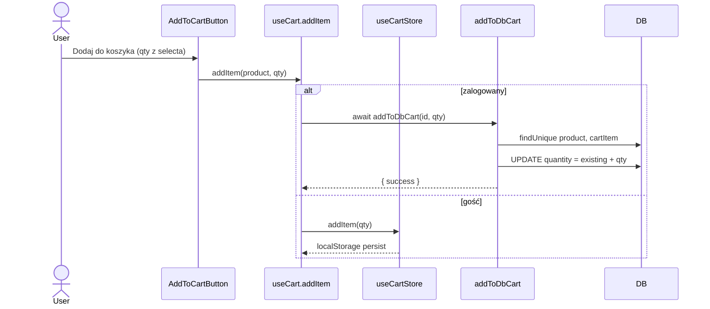
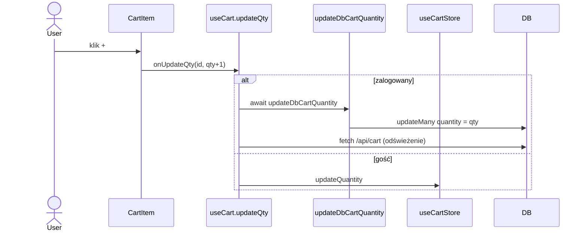
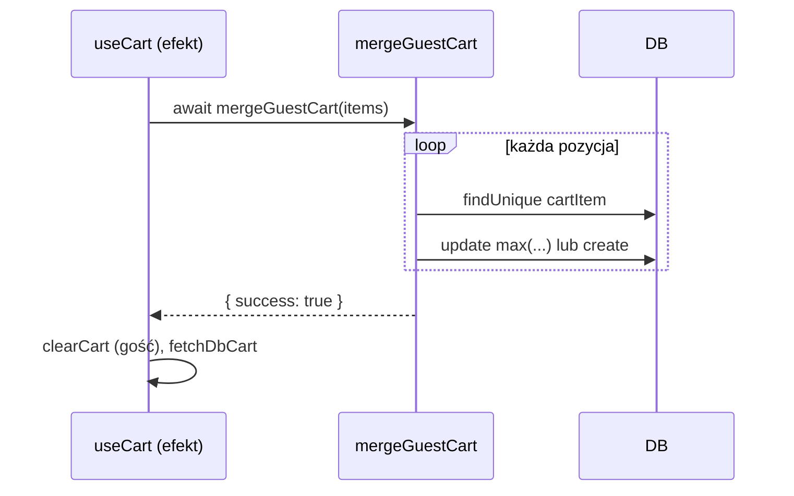
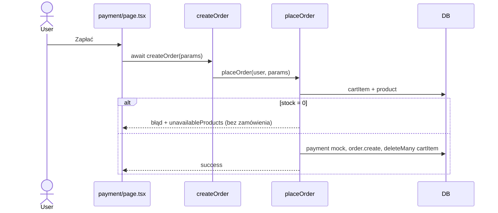

<!-- Generated by SpecStory, Markdown v2.1.0 -->

# 2026-10-07 09:32:42Z

<!-- VS Code Copilot IDE Session 58b7819b-ba3f-4a02-a9ea-aea5436be6b0 (2026-10-07 09:32:42Z) -->

_**User (2026-10-07 09:32:42Z)**_

**Od:** Ola, właścicielka koszyka
**Do:** Zespół developerski
**Temat:** Nie więcej niż 10 sztuk produktu

```
Cześć,

Chcemy ograniczyć zakup do 10 sztuk jednego produktu, z uwzględnieniem dostępnego stanu. Kontrolki w sklepie już ograniczają część wyborów, ale potrzebujemy ochrony reguły w całym koszyku. Przygotuj zmianę i dowody, że nie da się jej obejść zwykłą operacją koszyka.

Ola
```

---

_**Agent (copilot/claude-sonnet-5.5)**_

<tool-use data-tool-type="read" data-tool-name="read_file"><details>
<summary>Tool use: **read_file**</summary>

Read `product-contract.md`

**Input:**

- endLine: `200`
- filePath: `c:\Projects\infoshare-accenture-ai-dev-1\docs\product-contract.md`
- startLine: `1`

**Result:**

```
# ShopEasy — kontrakt produktu bazowego W01

Ten dokument opisuje zachowanie bazowego środowiska, nie nowe wymagania poszczególnych ćwiczeń. Wersja: W01 / 0.1.

## Katalog i dane

Cena jest całkowitą liczbą groszy, prezentowaną jako PLN. Katalog odczytuje produkty i kategorie z SQLite. Dostępne są wyszukiwanie, filtr kategorii, dostępności, sortowanie oraz paginacja. Szczegóły produktu pokazują nazwę, opis, cenę i dostępność. Obrazy są lokalne i nie wymagają dostępu do zewnętrznego serwisu. W fixtures są trzy kategorie, 12 produktów i jeden produkt ze stanem zero.

ID i wartości fixtures są stabilne po resecie. Identyfikatory nowych zdarzeń i czasy ich utworzenia powstają podczas działania; nie należy porównywać ich do jednej zapamiętanej wartości. Konto testowe jest aktywne po seeding; nowe konta wymagają weryfikacji lokalną wiadomością.

## Koszyk i sesja

Koszyk gościa jest zapisany w localStorage, koszyk zalogowanego w bazie. Po logowaniu pozycje gościa są łączone z koszykiem konta; dla istniejącej pozycji obecna implementacja wybiera większą ilość. Limit wynosi pięć różnych produktów. Widoczny koszt koszyka jest sumą cen produktów razy ilość; dostawa jest wybierana w checkout.

Sesja trwa 30 minut. Serwer sprawdza podpis i wygaśnięcie tokenu. Cookie jest HttpOnly; klient pobiera stan konta z /api/auth/session. Proxy chroni wejście do konta i checkout, a operacje serwerowe weryfikują użytkownika. Jest to lokalne środowisko warsztatowe, bez integracji z firmowym systemem tożsamości. Reset sekretu i bazy poprzedza reset cookie przeglądarki.

## Dostawa i zamówienie

W bazowym kontrakcie kurier kosztuje 1499 groszy, paczkomat 999. Razem to koszt produktów plus wybrana dostawa. Adres i wybrana metoda są przechowywane między krokami w sessionStorage; serwer waliduje adres oraz metodę i oblicza kwotę na podstawie danych produktów w bazie.

Płatność normalnego mocka zwraca sukces i identyfikator. Udany zakup zapisuje adres, zamówienie PAID, snapshot nazwy/ceny/ilości o
… (output truncated)
```
</details></tool-use>

_**Agent (copilot/claude-sonnet-5.5)**_

<tool-use data-tool-type="read" data-tool-name="read_file"><details>
<summary>Tool use: **read_file**</summary>

Read skill `analiza-zgloszenia`

**Input:**

- endLine: `200`
- filePath: `c:\Projects\infoshare-accenture-ai-dev-1\.github\skills\analiza-zgloszenia\SKILL.md`
- startLine: `1`

**Result:**

```
---
name: analiza-zgloszenia
description: 'Interaktywnie doprecyzowuje zgłoszenie (ticket, email, opis błędu, prośba o zmianę) i przygotowuje podsumowanie do wklejenia w email do nadawcy. Dwa tryby: lista pytań do nadawcy albo tryb spotkania (AI dopytuje użytkownika). Use when: analiza zgłoszenia, doprecyzowanie zgłoszenia, niejasny ticket, brakujące informacje, pytania do zgłaszającego, clarify ticket, grill me, refinement, odpowiedź mailowa do nadawcy.'
argument-hint: 'treść zgłoszenia lub załączony plik zgłoszenia'
---

# Analiza zgłoszenia

Cel: ustalić z użytkownikiem, czego naprawdę dotyczy zgłoszenie, i zapisać to w formie podsumowania do wklejenia w email. Skill niczego nie implementuje.

## Wejście

- Zgłoszenie (ticket, email, wiadomość) wklejone w czacie lub dołączone ręcznie jako plik.
- Brak zgłoszenia → poproś o nie i **zatrzymaj się**.

## Zasady nadrzędne

- Nie zgaduj i nie zakładaj. Każda niejasność to pytanie, nie domysł. Oddzielaj fakty ze zgłoszenia od własnych interpretacji.
- Respektuj ścieżki poza zakresem z AGENTS.md (np. `zgloszenia/`, `notatki/`): nie czytaj ich samodzielnie. Treść z takich katalogów analizuj tylko, gdy użytkownik dołączył ją bezpośrednio.
- Kontekst projektu (kod, `docs/product-contract.md`) czytaj tylko wtedy, gdy pomaga sformułować pytanie lub oddzielić zakres od tego, co poza nim. Nie odpowiadaj na pytania za nadawcę na podstawie kodu.
- Pytania zadawaj przez `vscode_askQuestions`. Bramki `[STOP]` są obowiązkowe.
- Nie proponuj rozwiązania technicznego ani estymat. To nie jest etap planowania.

## Procedura

### 1. Zrozum zgłoszenie

1. Wypisz w 3-5 punktach, co z treści wynika **wprost** (kto, co, gdzie, kiedy, oczekiwany efekt).
2. Zaznacz luki i niespójności, korzystając z [checklisty pytań](./references/question-checklist.md).
3. Pokaż to użytkownikowi.

### 2. Wybierz tryb

Zapytaj przez `vscode_askQuestions` (opcje, bez wolnego tekstu): `[STOP]`

| Tryb | Dla kogo |
|------|---
… (output truncated)
```
</details></tool-use>

_**Agent (copilot/claude-sonnet-5.5)**_

<tool-use data-tool-type="search" data-tool-name="file_search"><details>
<summary>Tool use: **file_search**</summary>

Searched for files matching `**/lib/actions/*.ts`, 2 matches

**Input:**

- query: `lib/actions/*.ts`

**Result:**

```
2 total results
c:\Projects\infoshare-accenture-ai-dev-1\lib\actions\checkout.ts
c:\Projects\infoshare-accenture-ai-dev-1\lib\actions\cart.ts
```
</details></tool-use>

_**Agent (copilot/claude-sonnet-5.5)**_

<tool-use data-tool-type="read" data-tool-name="read_file"><details>
<summary>Tool use: **read_file**</summary>

Read skill `analiza-zgloszenia`: `question-checklist.md`

**Input:**

- endLine: `200`
- filePath: `c:\Projects\infoshare-accenture-ai-dev-1\.github\skills\analiza-zgloszenia\references\question-checklist.md`
- startLine: `1`

**Result:**

```
# Checklista pytań

## Rodzaje pytań (o co pytać)

Pytaj tylko o to, czego zgłoszenie nie rozstrzyga.

| Kategoria | Przykładowe pytania |
|-----------|---------------------|
| **Rodzaj zgłoszenia** | Błąd, zmiana istniejącego zachowania, nowa funkcja, pytanie? |
| **Cel i wartość** | Jaki problem biznesowy lub użytkowy to rozwiązuje? Co się stanie, jeśli tego nie zrobimy? |
| **Kto i gdzie** | Kogo dotyczy (rola, grupa)? Którego widoku, procesu, funkcji? |
| **Stan obecny** | Co dzieje się dziś? Od kiedy? Jak często? |
| **Oczekiwany efekt** | Co ma się dziać po zmianie? Kryteria akceptacji, przykład „przed / po”. |
| **Odtworzenie (błędy)** | Kroki, dane wejściowe, środowisko, konto, komunikat błędu, zrzut ekranu. |
| **Przypadki brzegowe** | Puste dane, wartości graniczne, użytkownik niezalogowany, błąd zewnętrznej usługi. |
| **Reguły biznesowe** | Progi, wyjątki, kolejność stosowania reguł, zgodność z kontraktem produktu. |
| **Zakres** | Co wchodzi, co jawnie nie wchodzi? Wersja minimalna a pełna. |
| **Zależności** | Inne funkcje, zespoły, integracje (email, płatności), dane do przygotowania. |
| **Priorytet i termin** | Pilność, powód terminu, kto zatwierdza. |
| **Sposób odbioru** | Kto i jak sprawdzi, że zgłoszenie jest zrobione? |

## O co nie pytać

- O rzeczy podane wprost w zgłoszeniu (nie powtarzaj pytania, na które jest odpowiedź).
- O rozwiązanie techniczne, architekturę, technologie, nazwy plików i tabel. To decyzja zespołu, nie nadawcy.
- O estymaty pracy i terminy realizacji po stronie wykonawcy.
- O informacje, które da się ustalić z kodu lub dokumentacji produktu (sprawdź sam, zamiast pytać nadawcy).
- O wiele rzeczy naraz w jednym pytaniu. Jedno pytanie = jedna kwestia.
- Pytania sugerujące odpowiedź lub zamknięte „tak/nie”, gdy potrzebny jest opis.
- O dane wrażliwe (hasła, pełne numery kart, dane osobowe). Rzeczywiste dane są zbędne, wystarczą fikcyjne przykłady.

## Zakres vs poza zakresem

Przy każdym wątku
… (output truncated)
```
</details></tool-use>

_**Agent (copilot/claude-sonnet-5.5)**_

<tool-use data-tool-type="read" data-tool-name="read_file"><details>
<summary>Tool use: **read_file**</summary>

Read skill `analiza-zgloszenia`: `summary-template.md`

**Input:**

- endLine: `200`
- filePath: `c:\Projects\infoshare-accenture-ai-dev-1\.github\skills\analiza-zgloszenia\references\summary-template.md`
- startLine: `1`

**Result:**

````
# Szablon podsumowania (do wklejenia w email)

Wypełnij wszystkie sekcje. Pusta sekcja = „brak”. Pisz zwięźle, językiem zrozumiałym dla nadawcy. Bez rozwiązań technicznych i estymat.

```text
Temat: Doprecyzowanie zgłoszenia: <krótki tytuł / numer zgłoszenia>

Dzień dobry <imię>,

dziękuję za zgłoszenie. Poniżej podsumowanie tego, jak je rozumiem, oraz pytania, które pozwolą nam przejść dalej.

1. Jak rozumiem zgłoszenie
<2-4 zdania: rodzaj (błąd / zmiana / nowa funkcja), cel, kogo i czego dotyczy>

2. Ustalenia
- <ustalenie 1>
- <ustalenie 2>

3. Zakres
- W zakresie: <punkty>
- Poza zakresem: <punkty>

4. Przypadki brzegowe i reguły
- <przypadek / reguła>

5. Pytania otwarte (prosimy o odpowiedź)
1. <pytanie>
2. <pytanie>

6. Założenia do potwierdzenia
- <założenie, jeśli jakieś zostało przyjęte za zgodą użytkownika; w innym wypadku „brak”>

7. Kryteria odbioru
- <jak sprawdzimy, że zgłoszenie jest zrobione; jeśli nieznane: „do ustalenia”>

8. Priorytet / termin
<informacja od nadawcy lub „do ustalenia”>

Po otrzymaniu odpowiedzi na pytania z pkt 5 możemy przejść do kolejnego kroku.

Pozdrawiam
<podpis>
```

## Zasady wypełniania

- Sekcja 2 zawiera wyłącznie to, co potwierdzone (ze zgłoszenia lub odpowiedzi). Interpretacje trafiają do sekcji 6.
- Sekcja 5 w trybie A zawiera zatwierdzoną listę pytań; w trybie B tylko te, które pozostały niejasne.
- Numeruj pytania, aby nadawca mógł odpowiedzieć „1: …, 2: …”.
- Jedno pytanie = jedna kwestia.
- Nie dodawaj danych wrażliwych ani prawdziwych danych osobowych.
````
</details></tool-use>

_**Agent (copilot/claude-sonnet-5.5)**_

<tool-use data-tool-type="search" data-tool-name="file_search"><details>
<summary>Tool use: **file_search**</summary>

Searched for files matching `**/app/api/cart/**`, 1 match

**Input:**

- query: `app/api/cart/**`

**Result:**

```
1 total result
c:\Projects\infoshare-accenture-ai-dev-1\app\api\cart\route.ts
```
</details></tool-use>

_**Agent (copilot/claude-sonnet-5.5)**_

<tool-use data-tool-type="read" data-tool-name="read_file"><details>
<summary>Tool use: **read_file**</summary>

Read `cart.ts`

**Input:**

- endLine: `250`
- filePath: `c:\Projects\infoshare-accenture-ai-dev-1\lib\actions\cart.ts`
- startLine: `1`

**Result:**

```
'use server'
import { revalidatePath } from 'next/cache'
import { db } from '@/lib/db'
import { getSessionUser } from '@/lib/session'
import type { CartCookieItem } from '@/types'

const CART_LIMIT = 5 // BR-01: max 5 różnych produktów

// ─── Odczyt ──────────────────────────────────────────────

export async function getDbCart() {
  const user = await getSessionUser()
  if (!user) return []

  return db.cartItem.findMany({
    where: { userId: user.id },
    include: { product: { include: { category: true } } },
    orderBy: { createdAt: 'asc' },
  })
}

// ─── Mutacje ─────────────────────────────────────────────

export async function addToDbCart(productId: string, quantity = 1) {
  const user = await getSessionUser()
  if (!user) return { error: 'Zaloguj się, aby dodać do koszyka.' }

  const product = await db.product.findUnique({ where: { id: productId } })
  if (!product) return { error: 'Produkt nie istnieje.' }

  // KAT-05: produkt niedostępny
  if (product.stock === 0) {
    return { error: 'Produkt jest chwilowo niedostępny.' }
  }

  // Jeśli już w koszyku — zwiększ ilość
  const existing = await db.cartItem.findUnique({
    where: { userId_productId: { userId: user.id, productId } },
  })

  if (existing) {
    await db.cartItem.update({
      where: { id: existing.id },
      data: { quantity: existing.quantity + quantity },
    })
    revalidatePath('/cart')
    return { success: true }
  }

  // BR-01: limit 5 różnych produktów
  const count = await db.cartItem.count({ where: { userId: user.id } })
  if (count >= CART_LIMIT) {
    return {
      error: `Osiągnięto limit pozycji dla konta standardowego (${CART_LIMIT}). Usuń produkt lub przejdź na konto Premium.`,
    }
  }

  await db.cartItem.create({ data: { userId: user.id, productId, quantity } })
  revalidatePath('/cart')
  return { success: true }
}

export async function removeFromDbCart(productId: string) {
  const user = await g
… (output truncated)
```
</details></tool-use>

_**Agent (copilot/claude-sonnet-5.5)**_

<tool-use data-tool-type="read" data-tool-name="read_file"><details>
<summary>Tool use: **read_file**</summary>

Read `cart.ts`

**Input:**

- endLine: `200`
- filePath: `c:\Projects\infoshare-accenture-ai-dev-1\store\cart.ts`
- startLine: `1`

**Result:**

```
'use client'

import { create } from 'zustand'
import { persist, createJSONStorage } from 'zustand/middleware'

export interface CartItem {
  productId: string
  name: string
  price: number   // grosze
  quantity: number
  imageUrl: string
}

interface CartState {
  items: CartItem[]
  addItem: (item: CartItem) => void
  removeItem: (productId: string) => void
  updateQuantity: (productId: string, quantity: number) => void
  clearCart: () => void
  total: () => number
}

export const useCartStore = create<CartState>()(
  persist(
    (set, get) => ({
      items: [],

      addItem: (item) =>
        set((s) => {
          const existing = s.items.find((i) => i.productId === item.productId)
          if (existing) {
            return {
              items: s.items.map((i) =>
                i.productId === item.productId
                  ? { ...i, quantity: i.quantity + item.quantity }
                  : i
              ),
            }
          }
          return { items: [...s.items, item] }
        }),

      removeItem: (productId) =>
        set((s) => ({ items: s.items.filter((i) => i.productId !== productId) })),

      updateQuantity: (productId, quantity) =>
        set((s) => ({
          items: s.items.map((i) =>
            i.productId === productId ? { ...i, quantity } : i
          ),
        })),

      clearCart: () => set({ items: [] }),

      total: () =>
        get().items.reduce((sum, i) => sum + i.price * i.quantity, 0),
    }),
    {
      name: 'shopeasy-guest-cart',
      storage: createJSONStorage(() => localStorage),
      skipHydration: true,
    }
  )
)
```
</details></tool-use>

_**Agent (copilot/claude-sonnet-5.5)**_

<tool-use data-tool-type="generic" data-tool-name="vscode_askQuestions"><details>
<summary>Tool use: **vscode_askQuestions**</summary>

Analyzing your answers...

**Input:**

- questions:

```
[
  {
    "allowFreeformInput": false,
    "header": "Tryb analizy",
    "options": [
      {
        "description": "Przygotuję pytania do wysłania Oli",
        "label": "A. Lista pytań do nadawcy"
      },
      {
        "description": "Dopytuję Ciebie, odpowiadasz za nadawcę",
        "label": "B. Tryb spotkania",
        "recommended": true
      }
    ],
    "question": "Jak chcesz doprecyzować zgłoszenie?"
  }
]
```


**Result:**

```
{"answers":{"Tryb analizy":{"selected":["B. Tryb spotkania"],"freeText":null,"skipped":false}}}
```
</details></tool-use>

_**Agent (copilot/claude-sonnet-5.5)**_

<tool-use data-tool-type="generic" data-tool-name="vscode_askQuestions"><details>
<summary>Tool use: **vscode_askQuestions**</summary>

Analyzing your answers...

**Input:**

- questions:

```
[
  {
    "header": "Formuła limitu",
    "message": "Np. stan 3 → limit 3; stan 50 → limit 10.",
    "options": [
      {
        "label": "min(10, dostępny stan)",
        "recommended": true
      },
      {
        "label": "Zawsze 10, stan sprawdzany osobno przy checkout"
      }
    ],
    "question": "Jaki jest efektywny limit ilości jednego produktu w koszyku?"
  },
  {
    "header": "Przekroczenie limitu",
    "options": [
      {
        "label": "Odrzucenie operacji z komunikatem błędu, koszyk bez zmian",
        "recommended": true
      },
      {
        "label": "Przycięcie ilości do limitu z komunikatem"
      },
      {
        "label": "Przycięcie po cichu"
      }
    ],
    "question": "Co ma się stać przy próbie przekroczenia limitu?"
  },
  {
    "header": "Koszyk gościa vs konto",
    "options": [
      {
        "label": "Oba: gość (localStorage) i zalogowany (baza)",
        "recommended": true
      },
      {
        "label": "Tylko zalogowany (baza)"
      }
    ],
    "question": "Których koszyków dotyczy reguła?"
  },
  {
    "header": "Merge po logowaniu",
    "message": "Kontrakt: dziś dla istniejącej pozycji wybierana jest większa ilość.",
    "options": [
      {
        "label": "Przycięcie do limitu",
        "recommended": true
      },
      {
        "label": "Pominięcie takiej pozycji"
      },
      {
        "label": "Do decyzji Oli"
      }
    ],
    "question": "Co ma się stać, gdy łączenie koszyka gościa z kontem dałoby wynik ponad limit?"
  },
  {
    "header": "Obrona w checkout",
    "options": [
      {
        "label": "Tak, z czytelnym błędem i bez utworzenia zamówienia",
        "recommended": true
      },
      {
        "label": "Nie, tylko operacje koszyka"
      },
      {
        "label": "Do decyzji Oli"
      }
    ],
    "question": "Czy checkout ma też weryfikować regułę (np. gdy stan spadł lub dane w koszyku są stare)?"
  }
]
```


**Result:**

```
{"answers":{"Formuła limitu":{"selected":["min(10, dostępny stan)"],"freeText":null,"skipped":false},"Przekroczenie limitu":{"selected":["Odrzucenie operacji z komunikatem błędu, koszyk bez zmian"],"freeText":null,"skipped":false},"Koszyk gościa vs konto":{"selected":["Oba: gość (localStorage) i zalogowany (baza)"],"freeText":null,"skipped":false},"Merge po logowaniu":{"selected":["Przycięcie do limitu"],"freeText":null,"skipped":false},"Obrona w checkout":{"selected":["Tak, z czytelnym błędem i bez utworzenia zamówienia"],"freeText":null,"skipped":false}}}
```
</details></tool-use>

_**Agent (copilot/claude-sonnet-5.5)**_

<tool-use data-tool-type="generic" data-tool-name="vscode_askQuestions"><details>
<summary>Tool use: **vscode_askQuestions**</summary>

Analyzing your answers...

**Input:**

- questions:

```
[
  {
    "header": "Pozycje ponad limit",
    "message": "Dotyczy danych już istniejących w bazie / localStorage przed wdrożeniem.",
    "options": [
      {
        "label": "Przyciąć do limitu przy następnym odczycie/operacji"
      },
      {
        "label": "Nie migrować; blokować dopiero checkout i dalsze zwiększanie",
        "recommended": true
      },
      {
        "label": "Do decyzji Oli"
      }
    ],
    "question": "Co z pozycjami, które już dziś mają ilość ponad 10 lub ponad stan?"
  },
  {
    "header": "Zmiana ilości na niższą",
    "options": [
      {
        "label": "Zawsze dozwolone (zmniejszanie i usuwanie)",
        "recommended": true
      },
      {
        "label": "Też sprawdza regułę"
      }
    ],
    "question": "Czy zmniejszenie ilości pozycji, która jest ponad limit, ma być dozwolone?"
  },
  {
    "header": "Stan = 0 w koszyku",
    "options": [
      {
        "label": "Checkout odrzuca; w koszyku pozycja zostaje do ręcznego usunięcia",
        "recommended": true
      },
      {
        "label": "Pozycja jest usuwana automatycznie"
      },
      {
        "label": "Do decyzji Oli"
      }
    ],
    "question": "Co z pozycją w koszyku, gdy produkt ma już stan 0?"
  },
  {
    "header": "Komunikat",
    "message": "Np. „Maksymalnie 10 szt. tego produktu (dostępne: 4).”",
    "options": [
      {
        "label": "Komunikat z limitem i dostępną ilością",
        "recommended": true
      },
      {
        "label": "Do decyzji Oli (wpisz treść w odpowiedzi)"
      }
    ],
    "question": "Jaki komunikat ma zobaczyć klient przy odrzuceniu?"
  },
  {
    "header": "Forma dowodów",
    "multiSelect": true,
    "options": [
      {
        "label": "Testy integracyjne (bezpośrednie wywołania akcji serwerowych/API)",
        "recommended": true
      },
      {
        "label": "Testy jednostkowe reguły"
      },
      {
        "label": "Test E2E w przeglądarce"
      },
      {
        "label": "Krótki raport w mailu"
      }
    ],
    "question": "Jakie dowody mają być dostarczone?"
  },
  {
    "header": "Zakres UI",
    "options": [
      {
        "label": "Backend + frontend (UI zgodne z regułą i pokazuje komunikat)",
        "recommended": true
      },
      {
        "label": "Tylko backend, UI bez zmian"
      }
    ],
    "question": "Czy zmiana obejmuje też UI (kontrolki, komunikaty), czy tylko ochronę reguły?"
  }
]
```


**Result:**

```
{"answers":{"Pozycje ponad limit":{"selected":[],"freeText":"2, ale z komunikatem że max 10","skipped":false},"Zmiana ilości na niższą":{"selected":["Zawsze dozwolone (zmniejszanie i usuwanie)"],"freeText":null,"skipped":false},"Stan = 0 w koszyku":{"selected":[],"freeText":"produkt wyszarzony + komunikat - ten produkt nie jest dostępny - usuwane ręcznie koszyku, automatycznie przy checkout","skipped":false},"Komunikat":{"selected":["Komunikat z limitem i dostępną ilością"],"freeText":null,"skipped":false},"Forma dowodów":{"selected":["Testy integracyjne (bezpośrednie wywołania akcji serwerowych/API)","Testy jednostkowe reguły","Test E2E w przeglądarce","Krótki raport w mailu"],"freeText":null,"skipped":false},"Zakres UI":{"selected":["Backend + frontend (UI zgodne z regułą i pokazuje komunikat)"],"freeText":null,"skipped":false}}}
```
</details></tool-use>

_**Agent (copilot/claude-sonnet-5.5)**_

<tool-use data-tool-type="generic" data-tool-name="vscode_askQuestions"><details>
<summary>Tool use: **vscode_askQuestions**</summary>

Analyzing your answers...

**Input:**

- questions:

```
[
  {
    "header": "Pozycje ponad limit - potwierdzenie",
    "message": "Odczytałem „2” jako opcję drugą: bez migracji danych, blokada dalszego zwiększania i checkoutu, z komunikatem „max 10”.",
    "options": [
      {
        "label": "Tak, tak to rozumiem",
        "recommended": true
      },
      {
        "label": "Nie, chodzi o coś innego (opisz w odpowiedzi)"
      }
    ],
    "question": "Czy to poprawna interpretacja?"
  },
  {
    "header": "Stan 0 w checkout",
    "message": "Wcześniej wybrano: checkout z czytelnym błędem i bez utworzenia zamówienia. Teraz: automatyczne usunięcie przy checkout. To trzeba ujednolicić.",
    "options": [
      {
        "label": "Checkout usuwa niedostępną pozycję, NIE tworzy zamówienia, pokazuje komunikat; klient ponawia z zaktualizowanym koszykiem",
        "recommended": true
      },
      {
        "label": "Checkout usuwa niedostępną pozycję i od razu realizuje zamówienie z pozostałymi"
      },
      {
        "label": "Inaczej (opisz w odpowiedzi)"
      }
    ],
    "question": "Co dokładnie dzieje się w checkout, gdy produkt ma stan 0?"
  },
  {
    "header": "Ilość \u003e stan (stan \u003e 0)",
    "message": "Np. w koszyku 6, dostępne 4.",
    "options": [
      {
        "label": "Checkout odrzuca z komunikatem; pozycji nie zmienia automatycznie",
        "recommended": true
      },
      {
        "label": "Checkout przycina do stanu i pokazuje komunikat, bez zamówienia"
      },
      {
        "label": "Inaczej (opisz w odpowiedzi)"
      }
    ],
    "question": "Co robi checkout, gdy ilość w koszyku przekracza stan, ale stan jest większy od zera?"
  },
  {
    "header": "Odpowiedź UI dla stanu 0",
    "message": "Dotyczy widoku koszyka/produktu: „produkt wyszarzony + komunikat: ten produkt nie jest dostępny”.",
    "options": [
      {
        "label": "Tylko w koszyku (pozycja wyszarzona, przycisk „kup/zwiększ” zablokowany)",
        "recommended": true
      },
      {
        "label": "W koszyku i na liście/karcie produktu"
      }
    ],
    "question": "Gdzie ma być widoczne wyszarzenie?"
  },
  {
    "header": "Priorytet / termin",
    "options": [
      {
        "label": "Brak informacji — do ustalenia z Olą",
        "recommended": true
      },
      {
        "label": "Podam w odpowiedzi"
      }
    ],
    "question": "Priorytet i termin?"
  }
]
```


**Result:**

```
{"answers":{"Pozycje ponad limit - potwierdzenie":{"selected":["Tak, tak to rozumiem"],"freeText":null,"skipped":false},"Stan 0 w checkout":{"selected":[],"freeText":"jeśli za dużo sztuk - błąd i nie twórz zamówienia, jeśli dostępność = 0 (wyszarzony) to usuń i złóż zamówienie bez tego","skipped":false},"Ilość > stan (stan > 0)":{"selected":["Checkout przycina do stanu i pokazuje komunikat, bez zamówienia"],"freeText":null,"skipped":false},"Odpowiedź UI dla stanu 0":{"selected":["Tylko w koszyku (pozycja wyszarzona, przycisk „kup/zwiększ” zablokowany)"],"freeText":null,"skipped":false},"Priorytet / termin":{"selected":["Brak informacji — do ustalenia z Olą"],"freeText":null,"skipped":false}}}
```
</details></tool-use>

_**Agent (copilot/claude-sonnet-5.5)**_

<tool-use data-tool-type="generic" data-tool-name="vscode_askQuestions"><details>
<summary>Tool use: **vscode_askQuestions**</summary>

Analyzing your answers...

**Input:**

- questions:

```
[
  {
    "header": "Sprzeczność: ilość \u003e limit w checkout",
    "message": "W jednym miejscu: „błąd i nie twórz zamówienia”; w drugim: „przytnij do stanu, komunikat, bez zamówienia”. Dotyczy zarówno ilości \u003e 10, jak i ilości \u003e stan (stan \u003e 0).",
    "options": [
      {
        "label": "Tylko błąd, koszyk bez zmian, brak zamówienia",
        "recommended": true
      },
      {
        "label": "Błąd + przycięcie pozycji do limitu, brak zamówienia"
      }
    ],
    "question": "Co dokładnie robi checkout przy ilości ponad limit (min(10, stan))?"
  },
  {
    "header": "Wszystkie pozycje niedostępne",
    "message": "Po usunięciu pozycji ze stanem 0 koszyk może zostać pusty.",
    "options": [
      {
        "label": "Brak zamówienia, komunikat o pustym koszyku",
        "recommended": true
      },
      {
        "label": "Inaczej (opisz w odpowiedzi)"
      }
    ],
    "question": "Co, gdy po usunięciu niedostępnych pozycji nic nie zostaje?"
  },
  {
    "header": "Informacja o usuniętych pozycjach",
    "options": [
      {
        "label": "Tak, informacja po złożeniu zamówienia o usuniętych pozycjach",
        "recommended": true
      },
      {
        "label": "Nie"
      }
    ],
    "question": "Czy klient ma być poinformowany, które pozycje usunięto przy checkout?"
  },
  {
    "header": "Analizy opcjonalne",
    "multiSelect": true,
    "options": [
      {
        "label": "Analiza user flow (przeglądarka)"
      },
      {
        "label": "Analiza przepływu danych w kodzie",
        "recommended": true
      },
      {
        "label": "Nie wykonuj"
      }
    ],
    "question": "Czy wykonać analizę opcjonalną przed planem?"
  }
]
```


**Result:**

```
{"answers":{"Sprzeczność: ilość > limit w checkout":{"selected":["Błąd + przycięcie pozycji do limitu, brak zamówienia"],"freeText":null,"skipped":false},"Wszystkie pozycje niedostępne":{"selected":["Brak zamówienia, komunikat o pustym koszyku"],"freeText":null,"skipped":false},"Informacja o usuniętych pozycjach":{"selected":["Nie"],"freeText":null,"skipped":false},"Analizy opcjonalne":{"selected":["Analiza przepływu danych w kodzie"],"freeText":null,"skipped":false}}}
```
</details></tool-use>

_**Agent (copilot/claude-sonnet-5.5)**_

<tool-use data-tool-type="read" data-tool-name="read_file"><details>
<summary>Tool use: **read_file**</summary>

Read `analiza-przepływu-danych.prompt.md`

**Input:**

- endLine: `200`
- filePath: `c:\Projects\infoshare-accenture-ai-dev-1\.github\prompts\analiza-przepływu-danych.prompt.md`
- startLine: `1`

**Result:**

````
---
name: analiza-przepływu-danych
type: data-flow-analysis
category: technical-documentation
applyTo: ShopEasy
version: 1.0
date: 2026-10-06
status: ✅ Gotowe do analizy
---

# Analiza Przepływu Danych

Utwórz szczegółową analizę przepływu danych dla scenariusza użytkownika w aplikacji.

## Input

Scenariusz powinien zawierać:
- **Ścieżka**: Sekwencja kroków użytkownika (np. niezalogowany → dodaj produkt → zaloguj → weryfikuj koszyk)
- **Kod źródłowy**: Dostęp do plików projektu (komponenty, API, hooki, akcje serwera)
- **Punkt startowy**: URL, ekran lub akcja początkowa

## Procedura

Dla **każdego kroku** w sekwencji:

### 1. Zidentyfikuj Akcję
- **Co się dzieje**: Krótko opisz akcję użytkownika lub system action
  - Przykłady: klik na przycisk, submit formularza, API call, wyzwolenie hooka
- **URL/Ekran**: Wskaż bieżący URL i widoczny stan UI
- **Trigger**: Jakie zdarzenie wyzwoliło ten krok

### 2. Mapuj Dotkniętych Pliki
Dla każdego pliku zaangażowanego w ten krok:
- **Ścieżka pliku**: Link markdown do pliku w workspace
- **Symbol**: Nazwa funkcji/komponentu/metody (bez @ symboli)
- **Linia**: Numer linii gdzie logika działa (jeśli dotyczy)
- **Akcja**: Jedno zdanie co symbol robi

**Format**:
```
- [path/to/file.tsx](path/to/file.tsx) 
  - `SymbolName` (linia XX) — opis akcji
```

### 3. Rysuj Diagram Komunikacji UML
Dla każdego kroku utwórz diagram komunikacji Mermaid pokazujący:
- **Sekwencja**: Kolejność komunikacji między aktorami (User, Browser, Component, Hook, API, Database)
- **Async/Await**: Zaznacz async calls (`async`, `await`) i callbacks
- **Data flow**: Jakie dane wysyłane (request/response)

**Struktura diagramu**:
```mermaid
sequenceDiagram
    actor User
    participant Browser as 🌐 Browser
    participant Component as ⚛️ Component
    participant Hook as 🪝 Hook useCart
    participant Store as 📦 Zustand Store
    participant API as 🔌 API/Server Action
    participant DB as 🗄️ Database
… (output truncated)
````
</details></tool-use>

_**Agent (copilot/claude-sonnet-5.5)**_

<tool-use data-tool-type="read" data-tool-name="read_file"><details>
<summary>Tool use: **read_file**</summary>

Read `route.ts`

**Input:**

- endLine: `200`
- filePath: `c:\Projects\infoshare-accenture-ai-dev-1\app\api\cart\route.ts`
- startLine: `1`

**Result:**

```
import { NextResponse } from 'next/server'
import { getDbCart } from '@/lib/actions/cart'

export async function GET() {
  const items = await getDbCart()
  return NextResponse.json(items)
}
```
</details></tool-use>

_**Agent (copilot/claude-sonnet-5.5)**_

<tool-use data-tool-type="read" data-tool-name="read_file"><details>
<summary>Tool use: **read_file**</summary>

Read `checkout.ts`

**Input:**

- endLine: `250`
- filePath: `c:\Projects\infoshare-accenture-ai-dev-1\lib\actions\checkout.ts`
- startLine: `1`

**Result:**

```
'use server'
import { revalidatePath } from 'next/cache'
import { db } from '@/lib/db'
import { getSessionUser } from '@/lib/session'
import { placeOrder, type CreateOrderParams, type PlaceOrderResult } from '@/lib/orders'

export async function createOrder(params: CreateOrderParams): Promise<PlaceOrderResult> {
  const user = await getSessionUser()
  if (!user) return { success: false, error: 'Zaloguj się, aby złożyć zamówienie.' }

  const result = await placeOrder(user, params)
  if (result.success) revalidatePath('/account/orders')
  return result
}

// ─── Historia zamówień ─────────────────────────────────────

export async function getOrderHistory() {
  const user = await getSessionUser()
  if (!user) return []

  return db.order.findMany({
    where: { userId: user.id },
    include: { items: true, address: true },
    orderBy: { createdAt: 'desc' },
  })
}

export async function getOrderDetail(orderId: string) {
  const user = await getSessionUser()
  if (!user) return null

  return db.order.findFirst({
    where: { id: orderId, userId: user.id },
    include: {
      items: { include: { product: true } },
      address: true,
      statusHistory: { orderBy: { createdAt: 'asc' } },
    },
  })
}
```
</details></tool-use>

_**Agent (copilot/claude-sonnet-5.5)**_

<tool-use data-tool-type="read" data-tool-name="read_file"><details>
<summary>Tool use: **read_file**</summary>

Read `useCart.ts`

**Input:**

- endLine: `250`
- filePath: `c:\Projects\infoshare-accenture-ai-dev-1\hooks\useCart.ts`
- startLine: `1`

**Result:**

```
'use client'
import { useState, useEffect, useCallback } from 'react'
import { useCartStore } from '@/store/cart'
import {
  addToDbCart,
  removeFromDbCart,
  updateDbCartQuantity,
  clearDbCart,
  mergeGuestCart,
} from '@/lib/actions/cart'
import { formatPrice } from '@/lib/format'

// Kształt pozycji koszyka — wspólny dla gościa i zalogowanego
export type CartLineItem = {
  productId: string
  name: string
  price: number       // grosze
  quantity: number
  imageUrl: string
}

export function useCart() {
  const [isLoggedIn, setIsLoggedIn] = useState(false)
  const [dbItems, setDbItems] = useState<CartLineItem[]>([])
  const [loadingDb, setLoadingDb] = useState(false)
  const [error, setError] = useState<string | null>(null)

  // Zustand (gość)
  const guestItems = useCartStore((s) => s.items)
  const guestAdd = useCartStore((s) => s.addItem)
  const guestRemove = useCartStore((s) => s.removeItem)
  const guestUpdate = useCartStore((s) => s.updateQuantity)
  const guestClear = useCartStore((s) => s.clearCart)

  // Hydrate guest cart po mount (skipHydration: true w store)
  useEffect(() => {
    useCartStore.persist.rehydrate()
    let active = true
    fetch('/api/auth/session', { cache: 'no-store' })
      .then((res) => res.json())
      .then((session) => { if (active) setIsLoggedIn(!!session.user) })
      .catch(() => { if (active) setError('Nie udało się sprawdzić sesji. Odśwież stronę.') })
    return () => { active = false }
  }, [])

  // Pobierz DB koszyk dla zalogowanego
  const fetchDbCart = useCallback(async () => {
    setLoadingDb(true)
    try {
      const res = await fetch('/api/cart')
      if (!res.ok) throw new Error('Nie udało się pobrać koszyka.')
      const rows = await res.json()
      setDbItems(
        rows.map((r: { productId: string; product: { name: string; price: number; imageUrl: string }; quantity: number }) => ({
          productId: r.productId,
          name: r.produ
… (output truncated)
```
</details></tool-use>

_**Agent (copilot/claude-sonnet-5.5)**_

<tool-use data-tool-type="read" data-tool-name="read_file"><details>
<summary>Tool use: **read_file**</summary>

Read `orders.ts`

**Input:**

- endLine: `250`
- filePath: `c:\Projects\infoshare-accenture-ai-dev-1\lib\orders.ts`
- startLine: `1`

**Result:**

```
import { db } from '@/lib/db'
import { sendEmail } from '@/lib/email'
import { processPayment } from '@/lib/payment'
import { AddressSchema } from '@/lib/validations/checkout'
import { formatPrice, formatDeliveryCost } from '@/lib/format'
import type { PaymentMethod } from '@prisma/client'
import type { SessionUser } from '@/types'
import { DELIVERY_OPTIONS, calculateOrderTotals, type DeliveryMethod } from '@/lib/constants/checkout'

// Bez 'use server': eksport tutaj nie może stać się publiczną akcją przyjmującą dowolnego użytkownika.

export type CreateOrderParams = {
  address: {
    firstName: string
    lastName: string
    street: string
    city: string
    postalCode: string
    country?: string
    phone: string
  }
  paymentMethod: 'CARD' | 'BLIK'
  deliveryMethod: DeliveryMethod
}

export type PlaceOrderResult =
  | { success: true; orderId: string; orderNumber: string }
  | {
      success: false
      error: string
      code?: string
      fieldErrors?: Record<string, string[] | undefined>
      unavailableProducts?: string[]
    }

export async function placeOrder(user: SessionUser, params: CreateOrderParams): Promise<PlaceOrderResult> {
  // Waliduj adres
  const addrParsed = AddressSchema.safeParse(params.address)
  if (!addrParsed.success) {
    return { success: false, error: 'Nieprawidłowe dane adresu.', fieldErrors: addrParsed.error.flatten().fieldErrors }
  }

  // Pobierz koszyk
  const cartItems = await db.cartItem.findMany({
    where: { userId: user.id },
    include: { product: true },
  })

  if (cartItems.length === 0) return { success: false, error: 'Koszyk jest pusty.' }

  // KOS-08: sprawdź dostępność produktów
  const unavailable = cartItems.filter((i) => i.product.stock === 0)
  if (unavailable.length > 0) {
    return {
      success: false,
      error: 'Niektóre produkty w koszyku stały się niedostępne.',
      unavailableProducts: unavailable.map((i) => i.product.name),
 
… (output truncated)
```
</details></tool-use>

_**Agent (copilot/claude-sonnet-5.5)**_

<tool-use data-tool-type="read" data-tool-name="read_file"><details>
<summary>Tool use: **read_file**</summary>

Read `AddToCartButton.tsx`

**Input:**

- endLine: `120`
- filePath: `c:\Projects\infoshare-accenture-ai-dev-1\components\products\AddToCartButton.tsx`
- startLine: `1`

**Result:**

```
'use client'

import { useState } from 'react'
import { Button } from '@/components/ui/button'
import { useCart } from '@/hooks/useCart'

interface Product {
  id: string
  slug: string
  name: string
  price: number
  imageUrl: string
  stock: number
  category: { id: string; name: string; slug: string }
}

interface AddToCartButtonProps {
  product: Product
}

export function AddToCartButton({ product }: AddToCartButtonProps) {
  const [qty, setQty] = useState(1)
  const { addItem, loading, error, clearError } = useCart()

  if (product.stock === 0) {
    return (
      <p className="text-gray-500 font-medium">Niedostępny w magazynie</p>
    )
  }

  const handleAdd = async () => {
    clearError()
    await addItem(
      {
        id: product.id,
        name: product.name,
        price: product.price,
        stock: product.stock,
        imageUrl: product.imageUrl || '',
      },
      qty
    )
  }

  return (
    <div className="flex flex-col gap-3">
      <div className="flex items-center gap-3">
        <label htmlFor="qty" className="text-sm font-medium text-gray-700">
          Ilość:
        </label>
        <select
          id="qty"
          value={qty}
          onChange={(e) => setQty(Number(e.target.value))}
          className="border border-gray-300 rounded-md px-3 py-1.5 text-sm focus:outline-none focus:ring-2 focus:ring-blue-500"
        >
          {Array.from({ length: Math.min(10, product.stock) }, (_, i) => i + 1).map((n) => (
            <option key={n} value={n}>
              {n}
            </option>
          ))}
        </select>
      </div>

      {error && (
        <p className="text-sm text-red-600 bg-red-50 rounded px-3 py-2">{error}</p>
      )}

      <Button
        size="lg"
        className="w-full"
        disabled={loading}
        onClick={handleAdd}
      >
        {loading ? 'Dodawanie…' : 'Dodaj do koszyka'}
      </Button>
    </div>
  )
… (output truncated)
```
</details></tool-use>

_**Agent (copilot/claude-sonnet-5.5)**_

<tool-use data-tool-type="read" data-tool-name="read_file"><details>
<summary>Tool use: **read_file**</summary>

Read `CartItem.tsx`

**Input:**

- endLine: `120`
- filePath: `c:\Projects\infoshare-accenture-ai-dev-1\components\cart\CartItem.tsx`
- startLine: `1`

**Result:**

```
'use client'
import Image from 'next/image'

interface CartItemProps {
  item: {
    productId: string
    name: string
    price: number
    quantity: number
    imageUrl: string
  }
  onRemove: (productId: string) => void
  onUpdateQty: (productId: string, qty: number) => void
  formatPrice: (cents: number) => string
}

export function CartItem({ item, onRemove, onUpdateQty, formatPrice }: CartItemProps) {
  const subtotal = item.price * item.quantity

  return (
    <div className="flex items-center gap-4 py-4 border-b last:border-b-0">
      {item.imageUrl ? (
        <Image
          src={item.imageUrl}
          alt={item.name}
          width={64}
          height={64}
          unoptimized
          className="w-16 h-16 object-cover rounded flex-shrink-0"
        />
      ) : (
        <div className="w-16 h-16 bg-gray-100 rounded flex-shrink-0" />
      )}

      <div className="flex-1 min-w-0">
        <p className="font-bold truncate">{item.name}</p>
        <p className="text-sm text-gray-500">{formatPrice(item.price)} / szt.</p>
      </div>

      <div className="flex items-center gap-2 flex-shrink-0">
        <button
          onClick={() => onUpdateQty(item.productId, item.quantity - 1)}
          disabled={item.quantity <= 1}
          className="w-8 h-8 flex items-center justify-center rounded border border-gray-300 disabled:opacity-40 hover:bg-gray-50"
          aria-label="Zmniejsz ilość"
        >
          −
        </button>
        <span className="w-6 text-center tabular-nums">{item.quantity}</span>
        <button
          onClick={() => onUpdateQty(item.productId, item.quantity + 1)}
          disabled={item.quantity >= 10}
          className="w-8 h-8 flex items-center justify-center rounded border border-gray-300 disabled:opacity-40 hover:bg-gray-50"
          aria-label="Zwiększ ilość"
        >
          +
        </button>
      </div>

      <p className="font-bold w-20 text
… (output truncated)
```
</details></tool-use>

_**Agent (copilot/claude-sonnet-5.5)**_

<tool-use data-tool-type="search" data-tool-name="grep_search"><details>
<summary>Tool use: **grep_search**</summary>

Searched for regex `export async function (addToDbCart|updateDbCartQuantity|mergeGuestCart|removeFromDbCart)|export async function placeOrder|const unavailable|async function (addItem|updateQty)|const CART_LIMIT|disabled=\{item.quantity|Math.min\(10` (`**/{lib/actions/cart.ts,lib/orders.ts,hooks/useCart.ts,components/cart/CartItem.tsx,components/products/AddToCartButton.tsx}`), 12 results

**Input:**

- includePattern: `{lib/actions/cart.ts,lib/orders.ts,hooks/useCart.ts,components/cart/CartItem.tsx,components/products/AddToCartButton.tsx}`
- isRegexp: `true`
- query: `export async function (addToDbCart|updateDbCartQuantity|mergeGuestCart|removeFromDbCart)|export async function placeOrder|const unavailable|async function (addItem|updateQty)|const CART_LIMIT|disabled=\{item.quantity|Math.min\(10`

**Result:**

```
Found 12 matches in 5 files for "export async function (addToDbCart|updateDbCartQuantity|mergeGuestCart|removeFromDbCart)|export async function placeOrder|const unavailable|async function (addItem|updateQty)|const CART_LIMIT|disabled=\{item.quantity|Math.min\(10"

components/cart/CartItem.tsx
43:          disabled={item.quantity <= 1}
52:          disabled={item.quantity >= 10}

components/products/AddToCartButton.tsx
57:          {Array.from({ length: Math.min(10, product.stock) }, (_, i) => i + 1).map((n) => (

hooks/useCart.ts
92:  async function addItem(
126:  async function updateQty(productId: string, quantity: number) {

lib/actions/cart.ts
7:const CART_LIMIT = 5 // BR-01: max 5 różnych produktów
24:export async function addToDbCart(productId: string, quantity = 1) {
63:export async function removeFromDbCart(productId: string) {
72:export async function updateDbCartQuantity(productId: string, quantity: number) {
96:export async function mergeGuestCart(items: CartCookieItem[]) {

lib/orders.ts
36:export async function placeOrder(user: SessionUser, params: CreateOrderParams): Promise<PlaceOrderResult> {
52:  const unavailable = cartItems.filter((i) => i.product.stock === 0)
```
</details></tool-use>

_**Agent (copilot/claude-sonnet-5.5)**_

<tool-use data-tool-type="search" data-tool-name="grep_search"><details>
<summary>Tool use: **grep_search**</summary>

Searched for regex `updateQty|createOrder|useCart\(` (`**/app/**`), 6 results

**Input:**

- includePattern: `app/**`
- isRegexp: `true`
- query: `updateQty|createOrder|useCart\(`

**Result:**

```
Found 6 matches in 3 files for "updateQty|createOrder|useCart\("

app/(shop)/cart/page.tsx
12:  const { items, total, count, loading, error, removeItem, updateQty, formatPrice } = useCart()
55:              onUpdateQty={updateQty}

app/(shop)/checkout/delivery/page.tsx
23:  const { items, count, formatPrice: cartFormatPrice } = useCart()

app/(shop)/checkout/payment/page.tsx
8:import { createOrder } from '@/lib/actions/checkout'
26:  const { items, total, formatPrice } = useCart()
96:      const result = await createOrder({
```
</details></tool-use>

_**Agent (copilot/claude-sonnet-5.5)**_

<tool-use data-tool-type="generic" data-tool-name="list_dir"><details>
<summary>Tool use: **list_dir**</summary>

Read `contracts`

**Input:**

- path: `c:\Projects\infoshare-accenture-ai-dev-1\docs\contracts`

**Result:**

```
darmowy-kurier.md
```
</details></tool-use>

_**Agent (copilot/claude-sonnet-5.5)**_

<tool-use data-tool-type="write" data-tool-name="create_file"><details>
<summary>Tool use: **create_file**</summary>

Created `2026-10-07-limit-10-sztuk-kod.md`

**Input:**

- content:

````
# Analiza przepływu danych: ilość produktu w koszyku (limit 10 / stan)

Data: 2026-10-07. Status: stan obecny (przed zmianą). Zakres: ścieżki zmieniające ilość pozycji lub ją konsumujące.



## Krok 1: Dodanie produktu (gość i zalogowany)

**URL**: strona produktu w `(shop)/products`

- [components/products/AddToCartButton.tsx](../components/products/AddToCartButton.tsx)
  - `AddToCartButton` (linia 57) — select ilości ograniczony do `min(10, stock)` (jedyne ograniczenie, tylko UI)
- [hooks/useCart.ts](../hooks/useCart.ts)
  - `addItem` (linia 92) — zalogowany: wywołanie akcji; gość: tylko limit 5 pozycji, potem zapis w store
- [store/cart.ts](../store/cart.ts)
  - `addItem` — sumuje ilość bez sprawdzenia limitu
- [lib/actions/cart.ts](../lib/actions/cart.ts)
  - `addToDbCart` (linia 24) — sprawdza tylko `stock === 0` i limit 5 pozycji; istniejącą pozycję zwiększa bez limitu



## Krok 2: Zmiana ilości w koszyku

**URL**: `/cart`

- [components/cart/CartItem.tsx](../components/cart/CartItem.tsx)
  - `CartItem` (linia 52) — przycisk „+” zablokowany przy ilości >= 10 (bez znajomości stanu)
- [app/(shop)/cart/page.tsx](../app/(shop)/cart/page.tsx)
  - `useCart()` (linia 12) — przekazuje `updateQty` do pozycji
- [hooks/useCart.ts](../hooks/useCart.ts)
  - `updateQty` (linia 126) — bez walidacji, wywołuje akcję lub store
- [lib/actions/cart.ts](../lib/actions/cart.ts)
  - `updateDbCartQuantity` (linia 72) — zapisuje dowolną ilość > 0 (bez limitu i stanu)



## Krok 3: Logowanie i łączenie koszyków

**URL**: dowolny widok po zalogowaniu (efekt w `useCart`)

- [hooks/useCart.ts](../hooks/useCart.ts)
  - `useEffect` po `isLoggedIn` — wysyła pozycje gościa do `mergeGuestCart`, czyści store
- [lib/actions/cart.ts](../lib/actions/cart.ts)
  - `mergeGuestCart` (linia 96) — istniejąca pozycja: `max(konto, gość)`; nowa: zapis bez limitu ilości i bez sprawdzenia stanu



## Krok 4: Checkout

**URL**: `/checkout/payment`

- [app/(shop)/checkout/payment/page.tsx](../app/(shop)/checkout/payment/page.tsx)
  - `createOrder` (linia 96) — wywołanie akcji serwerowej
- [lib/actions/checkout.ts](../lib/actions/checkout.ts)
  - `createOrder` — sesja, deleguje do `placeOrder`
- [lib/orders.ts](../lib/orders.ts)
  - `placeOrder` (linia 36) — pobiera koszyk z DB; `unavailable` (linia 52) odrzuca całe zamówienie przy stanie 0; ilość ponad limit/stan niesprawdzana; płatność, zamówienie ze snapshotem, czyszczenie koszyka



## Wnioski do planu (fakty z kodu)

- Jedyne ograniczenia ilości to kontrolki UI (select i „+”); żadna akcja serwerowa nie ma limitu ilości ani nie porównuje ilości ze stanem.
- Zmiana ilości w koszyku nie zna stanu (`CartLineItem` i `CartItem` nie niosą pola stanu).
- Ścieżki mutujące ilość w bazie: `addToDbCart`, `updateDbCartQuantity`, `mergeGuestCart`; odczyt przez `placeOrder`.
- Koszyk gościa jest w localStorage, więc serwer widzi go dopiero przy `mergeGuestCart`.

## Rozszerzenia

- Error flows: komunikaty błędu z akcji pokazuje tylko `AddToCartButton` (przez `error` z `useCart`); strona `/cart` odczytuje `error` z hooka (sprawdzić w fazie frontendu).
- Race condition: odczyt stanu i zapis ilości w `addToDbCart` nie są atomowe (dwa równoległe dodania).

````

- filePath: `c:\Projects\infoshare-accenture-ai-dev-1\notatki\2026-10-07-limit-10-sztuk-kod.md`

**Result:**

```
The following files were successfully edited:
c:\Projects\infoshare-accenture-ai-dev-1\notatki\2026-10-07-limit-10-sztuk-kod.md
```
</details></tool-use>

_**Agent (copilot/claude-sonnet-5.5)**_

<tool-use data-tool-type="write" data-tool-name="textEditGroup"><details>
<summary>Edit: **2026-10-07-limit-10-sztuk-kod.md**</summary>

@@ lines 1-1 @@

````
# Analiza przepływu danych: ilość produktu w koszyku (limit 10 / stan)

Data: 2026-10-07. Status: stan obecny (przed zmianą). Zakres: ścieżki zmieniające ilość pozycji lub ją konsumujące.


## Krok 1: Dodanie produktu (gość i zalogowany)

**URL**: strona produktu w `(shop)/products`

- [components/products/AddToCartButton.tsx](../components/products/AddToCartButton.tsx)
  - `AddToCartButton` (linia 57) — select ilości ograniczony do `min(10, stock)` (jedyne ograniczenie, tylko UI)
- [hooks/useCart.ts](../hooks/useCart.ts)
  - `addItem` (linia 92) — zalogowany: wywołanie akcji; gość: tylko limit 5 pozycji, potem zapis w store
- [store/cart.ts](../store/cart.ts)
  - `addItem` — sumuje ilość bez sprawdzenia limitu
- [lib/actions/cart.ts](../lib/actions/cart.ts)
  - `addToDbCart` (linia 24) — sprawdza tylko `stock === 0` i limit 5 pozycji; istniejącą pozycję zwiększa bez limitu


## Krok 2: Zmiana ilości w koszyku

**URL**: `/cart`

- [components/cart/CartItem.tsx](../components/cart/CartItem.tsx)
  - `CartItem` (linia 52) — przycisk „+” zablokowany przy ilości >= 10 (bez znajomości stanu)
- [app/(shop)/cart/page.tsx](../app/(shop)/cart/page.tsx)
  - `useCart()` (linia 12) — przekazuje `updateQty` do pozycji
- [hooks/useCart.ts](../hooks/useCart.ts)
  - `updateQty` (linia 126) — bez walidacji, wywołuje akcję lub store
- [lib/actions/cart.ts](../lib/actions/cart.ts)
  - `updateDbCartQuantity` (linia 72) — zapisuje dowolną ilość > 0 (bez limitu i stanu)


## Krok 3: Logowanie i łączenie koszyków

**URL**: dowolny widok po zalogowaniu (efekt w `useCart`)

- [hooks/useCart.ts](../hooks/useCart.ts)
  - `useEffect` po `isLoggedIn` — wysyła pozycje gościa do `mergeGuestCart`, czyści store
- [lib/actions/cart.ts](../lib/actions/cart.ts)
  - `mergeGuestCart` (linia 96) — istniejąca pozycja: `max(konto, gość)`; nowa: zapis bez limitu ilości i bez sprawdzenia stanu


## Krok 4: Checkout

**URL**: `/checkout/payment`

- [app/(shop)/checkout/payment/page.tsx](../app/(shop)/checkout/payment/page.tsx)
  - `createOrder` (linia 96) — wywołanie akcji serwerowej
- [lib/actions/checkout.ts](../lib/actions/checkout.ts)
  - `createOrder` — sesja, deleguje do `placeOrder`
- [lib/orders.ts](../lib/orders.ts)
  - `placeOrder` (linia 36) — pobiera koszyk z DB; `unavailable` (linia 52) odrzuca całe zamówienie przy stanie 0; ilość ponad limit/stan niesprawdzana; płatność, zamówienie ze snapshotem, czyszczenie koszyka


## Wnioski do planu (fakty z kodu)

- Jedyne ograniczenia ilości to kontrolki UI (select i „+”); żadna akcja serwerowa nie ma limitu ilości ani nie porównuje ilości ze stanem.
- Zmiana ilości w koszyku nie zna stanu (`CartLineItem` i `CartItem` nie niosą pola stanu).
- Ścieżki mutujące ilość w bazie: `addToDbCart`, `updateDbCartQuantity`, `mergeGuestCart`; odczyt przez `placeOrder`.
- Koszyk gościa jest w localStorage, więc serwer widzi go dopiero przy `mergeGuestCart`.

## Rozszerzenia

- Error flows: komunikaty błędu z akcji pokazuje tylko `AddToCartButton` (przez `error` z `useCart`); strona `/cart` odczytuje `error` z hooka (sprawdzić w fazie frontendu).
- Race condition: odczyt stanu i zapis ilości w `addToDbCart` nie są atomowe (dwa równoległe dodania).

````
</details></tool-use>

_**Agent (copilot/claude-sonnet-5.5)**_

<tool-use data-tool-type="write" data-tool-name="create_file"><details>
<summary>Tool use: **create_file**</summary>

Created `limit-ilosci-w-koszyku.md`

**Input:**

- content:

```
# Kontrakt: limit ilości produktu w koszyku

Status: szkic do zatwierdzenia. Źródło reguł: odpowiedzi Oli w analizie zgłoszenia (2026-10-07).

## Reguła

`limit(produkt) = min(10, product.stock)`

- Dotyczy koszyka gościa (localStorage) i zalogowanego (baza).
- Zmniejszenie ilości i usunięcie pozycji są zawsze dozwolone, także dla pozycji ponad limit.
- Pozycje już ponad limit nie są migrowane; blokowane jest dalsze zwiększanie i checkout.

## Operacje serwerowe (`lib/actions/cart.ts`, `lib/orders.ts`)

Kształt błędu zachowuje dotychczasowy `{ error: string }`; do ustalenia w fazie backendu, czy dodać `code`.

| Operacja | Zachowanie przy `nowa ilość > limit` | Wynik |
|----------|--------------------------------------|-------|
| `addToDbCart(productId, qty)` | Odrzuć całą operację (także gdy `existing + qty > limit`), koszyk bez zmian | `{ error }` |
| `updateDbCartQuantity(productId, qty)` | Odrzuć, ilość bez zmian; `qty <= 0` nadal usuwa | `{ error }` |
| `mergeGuestCart(items)` | Przytnij wynik (`max(konto, gość)` lub nowa pozycja) do limitu; nie zwracaj błędu | `{ success: true }` |
| `placeOrder` / `createOrder` | Patrz niżej | `PlaceOrderResult` |

### Checkout (`placeOrder`)

1. Pozycje z `stock = 0`: usuń z koszyka konta i kontynuuj z pozostałymi (bez komunikatu o usunięciu).
2. Jeśli po kroku 1 koszyk jest pusty: brak zamówienia, błąd „Koszyk jest pusty.”
3. Jeśli jakakolwiek pozycja ma `quantity > min(10, stock)`: przytnij te pozycje do limitu w bazie, zwróć błąd, **nie twórz zamówienia**.
4. W przeciwnym razie zamówienie powstaje jak dotychczas.

Kolejność kroków 1 i 3 do potwierdzenia w fazie backendu (wynik dla klienta ten sam, o ile oba błędy zachodzą osobno).

## Komunikat odrzucenia

Zawiera limit i dostępną ilość, np. „Maksymalnie 10 szt. tego produktu (dostępne: 4).” Dokładna treść do zatwierdzenia przez Olę; w UI pokazywana bez zmian z odpowiedzi serwera.

## Dane dla frontendu

- Odczyt koszyka zalogowanego (`/api/cart`) już zawiera `product.stock`; frontend używa go do wyliczenia limitu i stanu „niedostępny”.
- Koszyk gościa: pozycja musi nieść stan potrzebny do limitu (decyzja realizacji w fazie frontendu).
- Pozycja ze `stock = 0`: wyszarzona w koszyku, komunikat „Ten produkt nie jest dostępny”, zwiększanie zablokowane, ręczne usuwanie możliwe.

```

- filePath: `c:\Projects\infoshare-accenture-ai-dev-1\docs\contracts\limit-ilosci-w-koszyku.md`

**Result:**

```
The following files were successfully edited:
c:\Projects\infoshare-accenture-ai-dev-1\docs\contracts\limit-ilosci-w-koszyku.md
```
</details></tool-use>

_**Agent (copilot/claude-sonnet-5.5)**_

<tool-use data-tool-type="write" data-tool-name="create_file"><details>
<summary>Tool use: **create_file**</summary>

Created `plan-limit-ilosci-w-koszyku.md`

**Input:**

- content:

```
# Analiza: limit ilości produktu w koszyku (max 10 / stan)

Źródło: zgłoszenie Oli „Nie więcej niż 10 sztuk produktu”. Analiza przepływu danych: [notatki/2026-10-07-limit-10-sztuk-kod.md](../notatki/2026-10-07-limit-10-sztuk-kod.md).

## Cel i ustalenia

Cel: reguła „maks. 10 sztuk jednego produktu z uwzględnieniem stanu” chroniona w całym koszyku, nie tylko w kontrolkach UI, z dowodami, że zwykła operacja koszyka jej nie omija.

Ustalone z użytkownikiem (odpowiedzi w imieniu Oli):
- Limit efektywny: `min(10, dostępny stan)`.
- Przekroczenie przy dodaniu/zmianie ilości: odrzucenie operacji z komunikatem, koszyk bez zmian. Komunikat zawiera limit i dostępną ilość.
- Dotyczy koszyka gościa i zalogowanego.
- Łączenie koszyków po logowaniu: wynik przycinany do limitu.
- Pozycje już ponad limit: bez migracji; blokada dalszego zwiększania i checkoutu z komunikatem „max 10”.
- Zmniejszanie ilości zawsze dozwolone.
- Stan 0 w koszyku: pozycja wyszarzona + komunikat „ten produkt nie jest dostępny”, usuwana ręcznie; w checkout usuwana automatycznie, zamówienie składane z pozostałych pozycji, bez informowania o usunięciu. Pusty koszyk po usunięciu: brak zamówienia, komunikat o pustym koszyku.
- Ilość ponad limit w checkout (w tym ponad stan przy stanie > 0): błąd, pozycja przycięta do limitu, zamówienie nie powstaje.
- Wyszarzenie stanu 0 tylko w koszyku.
- Dowody: testy integracyjne (bezpośrednie wywołania akcji), testy jednostkowe reguły, test E2E, krótki raport w mailu.
- Priorytet/termin: brak informacji, do ustalenia z Olą.

## Backend (zakres)

- Jedna reguła limitu współdzielona przez wszystkie ścieżki zapisu ilości.
- `addToDbCart`, `updateDbCartQuantity`: odrzucenie przy przekroczeniu limitu (zachowanie w [kontrakcie](../docs/contracts/limit-ilosci-w-koszyku.md)).
- `mergeGuestCart`: przycięcie do limitu.
- `placeOrder`: usunięcie pozycji ze stanem 0, kontynuacja zamówienia; przycięcie + błąd przy ilości ponad limit; pusty koszyk po usunięciu → brak zamówienia.
- Dowody: testy jednostkowe reguły, testy integracyjne wywołujące akcje serwerowe bezpośrednio (omijając UI): dodanie ponad 10, kumulacja `existing + qty`, zmiana ilości, ponad stan, merge, checkout (stan 0, ilość ponad limit, pusty koszyk), pozycja ponad limit sprzed zmiany. Zgodnie z [integration-tests.instructions.md](../.github/instructions/integration-tests.instructions.md).

## Frontend (zakres)

- Kontrolki zgodne z regułą: ilość i „+” liczone z `min(10, stan)` (dziś „+” zna tylko 10, bez stanu).
- Wyświetlanie komunikatu odrzucenia z serwera (w tym na `/cart`) oraz komunikatu przy błędzie checkoutu.
- Pozycja ze stanem 0 w koszyku: wyszarzona, komunikat „Ten produkt nie jest dostępny”, zwiększanie zablokowane, ręczne usuwanie działa.
- Koszyk gościa: limit egzekwowany po stronie klienta (patrz pytanie otwarte 1).
- Dowód: test E2E (Playwright) dla ścieżki w przeglądarce.

## Kontrakt wspólny

[docs/contracts/limit-ilosci-w-koszyku.md](../docs/contracts/limit-ilosci-w-koszyku.md)

## Kolejność

backend → frontend. Powód: UI renderuje komunikaty i stany wynikające z odpowiedzi serwera (kształt błędu, przycięcie w checkout), a ochrona reguły jest głównym celem zgłoszenia.

## Poza zakresem

- Limit 5 różnych pozycji (BR-01) i konto Premium.
- Zmiana kosztów, dostawy, płatności.
- Migracja istniejących danych koszyka ponad limit.
- Informowanie klienta o pozycjach usuniętych w checkout.
- Wyszarzanie niedostępnego produktu na liście/karcie produktu.

## Pytania otwarte

1. Koszyk gościa jest w localStorage, więc serwer go nie widzi do momentu merge. Czy egzekwowanie po stronie klienta (plus przycięcie w merge i błąd w checkout) jest akceptowalne jako „ochrona w całym koszyku” dla gościa? Alternatywa wymaga zmiany sposobu przechowywania koszyka gościa (osobne zgłoszenie).
2. Co przy merge z produktem o stanie 0 (pominąć pozycję, zapisać z ilością 0, zapisać bez zmian)?
3. Czy przy `qty` niecałkowitej, ujemnej lub `NaN` w operacjach serwerowych odrzucać z błędem (propozycja, nie ustalone)?
4. Czy Ola zatwierdza dokładną treść komunikatu (np. „Maksymalnie 10 szt. tego produktu (dostępne: 4).”) i komunikatu „Ten produkt nie jest dostępny”?
5. Zamówienie dziś nie zmniejsza stanu produktu. Czy jest to w porządku dla tej reguły (limit liczony od stanu bez zmniejszania po zakupie)?
6. Priorytet i termin.

```

- filePath: `c:\Projects\infoshare-accenture-ai-dev-1\docs\plan-limit-ilosci-w-koszyku.md`

**Result:**

```
The following files were successfully edited:
c:\Projects\infoshare-accenture-ai-dev-1\docs\plan-limit-ilosci-w-koszyku.md
```
</details></tool-use>

_**Agent (copilot/claude-sonnet-5.5)**_

<tool-use data-tool-type="write" data-tool-name="textEditGroup"><details>
<summary>Edit: **limit-ilosci-w-koszyku.md**</summary>

@@ lines 1-1 @@

```
# Kontrakt: limit ilości produktu w koszyku

Status: szkic do zatwierdzenia. Źródło reguł: odpowiedzi Oli w analizie zgłoszenia (2026-10-07).

## Reguła

`limit(produkt) = min(10, product.stock)`

- Dotyczy koszyka gościa (localStorage) i zalogowanego (baza).
- Zmniejszenie ilości i usunięcie pozycji są zawsze dozwolone, także dla pozycji ponad limit.
- Pozycje już ponad limit nie są migrowane; blokowane jest dalsze zwiększanie i checkout.

## Operacje serwerowe (`lib/actions/cart.ts`, `lib/orders.ts`)

Kształt błędu zachowuje dotychczasowy `{ error: string }`; do ustalenia w fazie backendu, czy dodać `code`.

| Operacja | Zachowanie przy `nowa ilość > limit` | Wynik |
|----------|--------------------------------------|-------|
| `addToDbCart(productId, qty)` | Odrzuć całą operację (także gdy `existing + qty > limit`), koszyk bez zmian | `{ error }` |
| `updateDbCartQuantity(productId, qty)` | Odrzuć, ilość bez zmian; `qty <= 0` nadal usuwa | `{ error }` |
| `mergeGuestCart(items)` | Przytnij wynik (`max(konto, gość)` lub nowa pozycja) do limitu; nie zwracaj błędu | `{ success: true }` |
| `placeOrder` / `createOrder` | Patrz niżej | `PlaceOrderResult` |

### Checkout (`placeOrder`)

1. Pozycje z `stock = 0`: usuń z koszyka konta i kontynuuj z pozostałymi (bez komunikatu o usunięciu).
2. Jeśli po kroku 1 koszyk jest pusty: brak zamówienia, błąd „Koszyk jest pusty.”
3. Jeśli jakakolwiek pozycja ma `quantity > min(10, stock)`: przytnij te pozycje do limitu w bazie, zwróć błąd, **nie twórz zamówienia**.
4. W przeciwnym razie zamówienie powstaje jak dotychczas.

Kolejność kroków 1 i 3 do potwierdzenia w fazie backendu (wynik dla klienta ten sam, o ile oba błędy zachodzą osobno).

## Komunikat odrzucenia

Zawiera limit i dostępną ilość, np. „Maksymalnie 10 szt. tego produktu (dostępne: 4).” Dokładna treść do zatwierdzenia przez Olę; w UI pokazywana bez zmian z odpowiedzi serwera.

## Dane dla frontendu

- Odczyt koszyka zalogowanego (`/api/cart`) już zawiera `product.stock`; frontend używa go do wyliczenia limitu i stanu „niedostępny”.
- Koszyk gościa: pozycja musi nieść stan potrzebny do limitu (decyzja realizacji w fazie frontendu).
- Pozycja ze `stock = 0`: wyszarzona w koszyku, komunikat „Ten produkt nie jest dostępny”, zwiększanie zablokowane, ręczne usuwanie możliwe.

```
</details></tool-use>

_**Agent (copilot/claude-sonnet-5.5)**_

<tool-use data-tool-type="write" data-tool-name="textEditGroup"><details>
<summary>Edit: **plan-limit-ilosci-w-koszyku.md**</summary>

@@ lines 1-1 @@

```
# Analiza: limit ilości produktu w koszyku (max 10 / stan)

Źródło: zgłoszenie Oli „Nie więcej niż 10 sztuk produktu”. Analiza przepływu danych: [notatki/2026-10-07-limit-10-sztuk-kod.md](../notatki/2026-10-07-limit-10-sztuk-kod.md).

## Cel i ustalenia

Cel: reguła „maks. 10 sztuk jednego produktu z uwzględnieniem stanu” chroniona w całym koszyku, nie tylko w kontrolkach UI, z dowodami, że zwykła operacja koszyka jej nie omija.

Ustalone z użytkownikiem (odpowiedzi w imieniu Oli):
- Limit efektywny: `min(10, dostępny stan)`.
- Przekroczenie przy dodaniu/zmianie ilości: odrzucenie operacji z komunikatem, koszyk bez zmian. Komunikat zawiera limit i dostępną ilość.
- Dotyczy koszyka gościa i zalogowanego.
- Łączenie koszyków po logowaniu: wynik przycinany do limitu.
- Pozycje już ponad limit: bez migracji; blokada dalszego zwiększania i checkoutu z komunikatem „max 10”.
- Zmniejszanie ilości zawsze dozwolone.
- Stan 0 w koszyku: pozycja wyszarzona + komunikat „ten produkt nie jest dostępny”, usuwana ręcznie; w checkout usuwana automatycznie, zamówienie składane z pozostałych pozycji, bez informowania o usunięciu. Pusty koszyk po usunięciu: brak zamówienia, komunikat o pustym koszyku.
- Ilość ponad limit w checkout (w tym ponad stan przy stanie > 0): błąd, pozycja przycięta do limitu, zamówienie nie powstaje.
- Wyszarzenie stanu 0 tylko w koszyku.
- Dowody: testy integracyjne (bezpośrednie wywołania akcji), testy jednostkowe reguły, test E2E, krótki raport w mailu.
- Priorytet/termin: brak informacji, do ustalenia z Olą.

## Backend (zakres)

- Jedna reguła limitu współdzielona przez wszystkie ścieżki zapisu ilości.
- `addToDbCart`, `updateDbCartQuantity`: odrzucenie przy przekroczeniu limitu (zachowanie w [kontrakcie](../docs/contracts/limit-ilosci-w-koszyku.md)).
- `mergeGuestCart`: przycięcie do limitu.
- `placeOrder`: usunięcie pozycji ze stanem 0, kontynuacja zamówienia; przycięcie + błąd przy ilości ponad limit; pusty koszyk po usunięciu → brak zamówienia.
- Dowody: testy jednostkowe reguły, testy integracyjne wywołujące akcje serwerowe bezpośrednio (omijając UI): dodanie ponad 10, kumulacja `existing + qty`, zmiana ilości, ponad stan, merge, checkout (stan 0, ilość ponad limit, pusty koszyk), pozycja ponad limit sprzed zmiany. Zgodnie z [integration-tests.instructions.md](../.github/instructions/integration-tests.instructions.md).

## Frontend (zakres)

- Kontrolki zgodne z regułą: ilość i „+” liczone z `min(10, stan)` (dziś „+” zna tylko 10, bez stanu).
- Wyświetlanie komunikatu odrzucenia z serwera (w tym na `/cart`) oraz komunikatu przy błędzie checkoutu.
- Pozycja ze stanem 0 w koszyku: wyszarzona, komunikat „Ten produkt nie jest dostępny”, zwiększanie zablokowane, ręczne usuwanie działa.
- Koszyk gościa: limit egzekwowany po stronie klienta (patrz pytanie otwarte 1).
- Dowód: test E2E (Playwright) dla ścieżki w przeglądarce.

## Kontrakt wspólny

[docs/contracts/limit-ilosci-w-koszyku.md](../docs/contracts/limit-ilosci-w-koszyku.md)

## Kolejność

backend → frontend. Powód: UI renderuje komunikaty i stany wynikające z odpowiedzi serwera (kształt błędu, przycięcie w checkout), a ochrona reguły jest głównym celem zgłoszenia.

## Poza zakresem

- Limit 5 różnych pozycji (BR-01) i konto Premium.
- Zmiana kosztów, dostawy, płatności.
- Migracja istniejących danych koszyka ponad limit.
- Informowanie klienta o pozycjach usuniętych w checkout.
- Wyszarzanie niedostępnego produktu na liście/karcie produktu.

## Pytania otwarte

1. Koszyk gościa jest w localStorage, więc serwer go nie widzi do momentu merge. Czy egzekwowanie po stronie klienta (plus przycięcie w merge i błąd w checkout) jest akceptowalne jako „ochrona w całym koszyku” dla gościa? Alternatywa wymaga zmiany sposobu przechowywania koszyka gościa (osobne zgłoszenie).
2. Co przy merge z produktem o stanie 0 (pominąć pozycję, zapisać z ilością 0, zapisać bez zmian)?
3. Czy przy `qty` niecałkowitej, ujemnej lub `NaN` w operacjach serwerowych odrzucać z błędem (propozycja, nie ustalone)?
4. Czy Ola zatwierdza dokładną treść komunikatu (np. „Maksymalnie 10 szt. tego produktu (dostępne: 4).”) i komunikatu „Ten produkt nie jest dostępny”?
5. Zamówienie dziś nie zmniejsza stanu produktu. Czy jest to w porządku dla tej reguły (limit liczony od stanu bez zmniejszania po zakupie)?
6. Priorytet i termin.

```
</details></tool-use>

_**Agent (copilot/claude-sonnet-5.5)**_

Analiza gotowa. Plan i kontrakt czekają na Twoje zatwierdzenie, a pytania otwarte (głównie koszyk gościa i stan 0 przy łączeniu koszyków) są do rozstrzygnięcia z Olą.

Z kodu wynika, że jedyne ograniczenia ilości to kontrolki UI. Operacje serwerowe ,  i  nie mają limitu ilości.  sprawdza tylko stan 0, nie sprawdza limitu 10 ani stanu przy ilości większej od zera.

**Pliki**
- Plan: `docs/plan-limit-ilosci-w-koszyku.md`
- Kontrakt: `docs/contracts/limit-ilosci-w-koszyku.md`
- Przepływ danych: `notatki/2026-10-07-limit-10-sztuk-kod.md`

**Pytania otwarte**
- Egzekwowanie limitu dla koszyka gościa w localStorage. Serwer widzi go dopiero przy łączeniu koszyków po logowaniu, więc propozycja to limit po stronie klienta, przycięcie przy łączeniu i błąd w checkout.
- Łączenie koszyków dla produktu o stanie 0.
- Odrzucanie ilości niecałkowitych lub ujemnych.
- Treść komunikatów, do zatwierdzenia przez Olę.
- Stan produktu nie spada po zakupie, więc limit liczony od stanu nie uwzględnia sprzedanych sztuk. Do potwierdzenia, że to w porządku dla tej reguły.
- Priorytet i termin.

**Handoff**
- Plan: `plan-limit-ilosci-w-koszyku.md`
- Kontrakt: `limit-ilosci-w-koszyku.md`
- Agent: backend (skill `backend-implementation`), potem frontend.
- Powód: ochrona reguły i testy dowodowe są po stronie serwera, a UI zależy od kształtu błędów i zachowania checkoutu.

_**Agent (copilot/claude-sonnet-5.5)**_

<tool-use data-tool-type="task" data-tool-name="manage_todo_list"><details>
<summary>Tool use: **manage_todo_list**</summary>

Created 4 todos
</details></tool-use>
