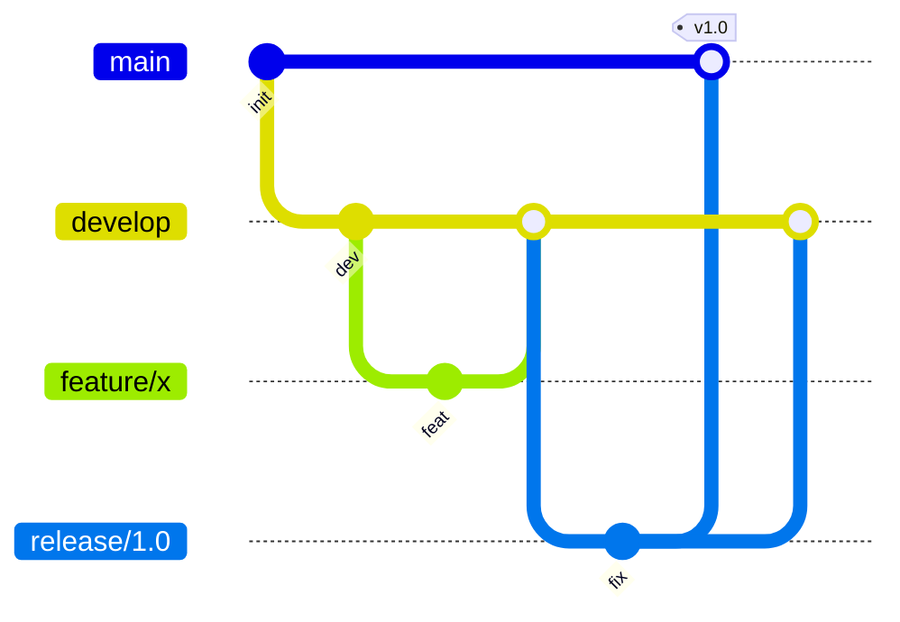

<!-- Generated by SpecStory, Markdown v2.1.0 -->

# 2026-10-07 12:49:16Z

<!-- VS Code Copilot IDE Session def64dd0-48bb-4be4-bb3e-8300b36d6c1c (2026-10-07 12:49:16Z) -->

_**User (2026-10-07 12:49:16Z)**_

jak krok po kroku działa metoda gitflow

---

_**Agent (copilot/claude-sonnet-5.5)**_

# Git Flow krok po kroku

## Gałęzie
- **`main`** – kod produkcyjny, każdy commit to wydanie (tag z wersją).
- **`develop`** – integracja kolejnych funkcji, baza następnego wydania.
- **`feature/*`** – nowe funkcje, odchodzą z `develop`.
- **`release/*`** – przygotowanie wydania, odchodzi z `develop`.
- **`hotfix/*`** – pilne poprawki produkcji, odchodzą z `main`.

## Przebieg

### 1. Start
Repozytorium ma `main` i `develop` (`develop` utworzony z `main`).

### 2. Nowa funkcja
```bash
git checkout develop
git checkout -b feature/koszyk
# praca, commity
git checkout develop
git merge --no-ff feature/koszyk
git branch -d feature/koszyk
```

### 3. Wydanie
```bash
git checkout develop
git checkout -b release/1.2.0
# tylko poprawki błędów, podbicie wersji, CHANGELOG – bez nowych funkcji
git checkout main
git merge --no-ff release/1.2.0
git tag -a v1.2.0 -m "Release 1.2.0"
git checkout develop
git merge --no-ff release/1.2.0
git branch -d release/1.2.0
```

### 4. Hotfix (błąd na produkcji)
```bash
git checkout main
git checkout -b hotfix/1.2.1
# poprawka
git checkout main
git merge --no-ff hotfix/1.2.1
git tag -a v1.2.1 -m "Hotfix 1.2.1"
git checkout develop
git merge --no-ff hotfix/1.2.1
git branch -d hotfix/1.2.1
```
Jeśli istnieje aktywny `release/*`, hotfix scala się do niego zamiast do `develop`.

## Schemat



## Zalety i wady
- **Zalety:** jasny podział ról gałęzi, wsparcie dla wielu wersji, stabilny `main`.
- **Wady:** dużo gałęzi i scaleń, wolniejsze wydania, słabo pasuje do CI/CD i ciągłego wdrażania (tu lepszy trunk-based lub GitHub Flow).

## Narzędzie
Rozszerzenie `git-flow` automatyzuje kroki: `git flow init`, `git flow feature start|finish`, `git flow release start|finish`, `git flow hotfix start|finish`.
