# Analiza Flow: Gość → Zalogowany

**Rola:** Gość → Zalogowany w ShopEasy

---

## Kroki użytkownika

1. **Otwiera stronę główną** `/`
   - Widzi: Hero section + produkty
   - Header: "Zaloguj się" | "Zarejestruj"

2. **Dodaje produkt do koszyka (gość)**
   - Click: "Dodaj do koszyka" (Powerbank UltraCharge 20000)
   - Otwiera: `/cart`
   - Widzi: Powerbank w koszyku (1 szt, 149,99 zł)
   - Dane: localStorage

3. **Klika "Zaloguj się"**
   - Naviguje: `/login`
   - Wpisuje: test@shopeasy.pl / Test1234!
   - Klika: submit button

4. **System loguje**
   - POST `/api/auth/login`
   - Walidacja: bcrypt.compare()
   - Sesja: setSession() → httpOnly cookie
   - Redirect: `/`

5. **Potwierdzenie zalogowania**
   - Header zmienia się: "👤 Jan Testowy" + "Wyloguj"
   - Sesja: ustanowiona w cookie

6. **Otwiera `/cart`**
   - **Merge zadziałał**: Powerbank z DB (nie z localStorage)
   - localStorage: cleared
   - Widzi: "Koszyk (1 szt.) | Powerbank 149,99 zł"

7. **Klika "Przejdź do kasy"**
   - Naviguje: `/checkout/delivery`
   - Widzi: Opcje dostawy (lista adresów)

8. **Wybiera dostawę, klika "Dalej"**
   - Naviguje: `/checkout/payment`
   - Widzi: Opcje płatności (CARD, BLIK)

9. **Płaci**
   - POST `/checkout/payment`
   - Walidacja: numer karty, CVC, etc.
   - Zwraca: `/checkout/success`
   - Widzi: Potwierdzenie zamówienia

10. **Klika na imię "Jan Testowy" w header**
    - Naviguje: `/account/profile`
    - Widzi: Dane konta (Jan Testowy, test@shopeasy.pl, ID: user-workshop)

11. **Klika "Historia zamówień"**
    - Naviguje: `/account/orders`
    - Widzi: Zamówienie + szczegóły (status, produkty, cena)

12. **Klika "Wyloguj"**
    - POST `/api/auth/logout`
    - Sesja: cleared
    - localStorage: nie zmienia się (zachowywana dla kolejnego gościa)
    - Redirect: `/`
    - Header: znowu "Zaloguj się | Zarejestruj"

---

## Diagram Flow

```mermaid
flowchart LR
    A["GET /<br/>Gość"] -->|Dodaj Powerbank| B["GET /cart<br/>localStorage"]
    B -->|Zaloguj się| C["GET /login"]
    C -->|POST email/hasło| D{Auth OK?}
    D -->|✅| E["GET /<br/>Zalogowany"]
    D -->|❌| C
    E -->|Koszyk| F["GET /cart<br/>Merge + DB ✅"]
    F -->|Kasa| G["GET /checkout/delivery"]
    G -->|Dalej| H["GET /checkout/payment"]
    H -->|Zapłać| I["GET /checkout/success"]
    I -->|Konto| J["GET /account/profile"]
    J -->|Zamówienia| K["GET /account/orders"]
    K -->|Wyloguj| L["GET /<br/>Gość"]
```



---

## Schemat Odpowiedzialności

### Warstwa 1: Sesja (auth)

| Komponent | Plik | Odpowiedzialność |
|-----------|------|------------------|
| `setSession()` | `lib/session.ts#L15` | Zapisz user+expiry do httpOnly cookie |
| `getSessionUser()` | `lib/session.ts#L6` | Odczytaj user z cookie (server-side) |
| `POST /api/auth/login` | `app/api/auth/login/route.ts` | Waliduj, hashuj, ustaw sesję |
| `GET /api/auth/session` | `app/api/auth/session/route.ts` | Zwróć user dla klienta |

### Warstwa 2: Koszyk gościa (client)

| Komponent | Plik | Odpowiedzialność |
|-----------|------|------------------|
| `useCartStore` | `store/cart.ts` | Zustand + persist (localStorage) |
| `useCart()` hook | `hooks/useCart.ts#L35` | Detektuj sesję, switch gość ↔ zalogowany |
| `CartPage` | `app/(shop)/cart/page.tsx` | Render koszyka |

### Warstwa 3: Merge (server → client)

| Komponent | Plik | Odpowiedzialność |
|-----------|------|------------------|
| `mergeGuestCart()` | `lib/actions/cart.ts#L93` | Server: loop po items, create w DB |
| `getDbCart()` | `lib/actions/cart.ts#L7` | Server: SELECT cartItems z DB |
| `GET /api/cart` | `app/api/cart/route.ts` | Endpoint do fetchDbCart |

---

## Detailowy Merge Flow

```
1️⃣ GOŚĆ DODAJE POWERBANK (localStorage)
   ├─ click "Dodaj do koszyka"
   ├─ useCart().addItem() [hooks/useCart.ts:104]
   └─ guestAdd() → store → localStorage['cart-store']

2️⃣ LOGOWANIE (httpOnly cookie)
   ├─ POST /api/auth/login [app/api/auth/login/route.ts]
   ├─ bcrypt match ✅
   └─ setSession() → cookies.set(SESSION_COOKIE..., { httpOnly: true })

3️⃣ OTWIERA /cart — MERGE DZIEJE SIĘ TU
   ├─ CartPage mount → useCart() [hooks/useCart.ts:35-46]
   │
   ├─ fetch('/api/auth/session') 
   │  └─ GET /api/auth/session [app/api/auth/session/route.ts]
   │     └─ getSessionUser() reads httpOnly cookie
   │        └─ setIsLoggedIn(true) ⭐ TRIGGER
   │
   ├─ useEffect[isLoggedIn] fires [hooks/useCart.ts:68]
   │  ├─ const guest = useCartStore.getState().items (localStorage)
   │  │
   │  ├─ mergeGuestCart(guest) [lib/actions/cart.ts#L93]
   │  │  └─ db.cartItem.create({ userId, productId, quantity })
   │  │     └─ ✅ Powerbank w bazie
   │  │
   │  ├─ clearCart() → localStorage cleared
   │  │
   │  └─ fetchDbCart() → GET /api/cart [app/api/cart/route.ts]
   │     └─ getDbCart() [lib/actions/cart.ts#L7]
   │        └─ db.cartItem.findMany({ userId })
   │           └─ setDbItems() ← React state
   │
   └─ Render: "Koszyk (1 szt.) + Powerbank 149,99 zł" ✅
```

---

## Dane Testowe

- Email: `test@shopeasy.pl`
- Hasło: `Test1234!`
- Użytkownik: Jan Testowy
- User ID: `user-workshop`

---

## Założenia

- Merge z localStorage na DB dzieje się automatycznie przy zalogowaniu
- Produkt z gościa ma tę samą `productId` co w bazie
- Użytkownik nie ma już żadnych CartItems w DB (koszyk pusty pre-merge)
- Cookie sesji jest HttpOnly (nie dostępne z JS, ale fetch go wysyła automatycznie)
- Fetch `/api/auth/session` zwraca pełne dane user z cookie
- `mergeGuestCart()` przebiega bez błędów i wyczyści localStorage
- localStorage jest persisted przez middleware Zustand
- Limit 5 produktów (BR-01) jest enforced na gościu i zalogowanym

---

## Otwarte pytania

- **UX Loading:** Czy użytkownik widzi loading state gdy merge się dzieje?
- **Error handling:** Co się stanie jeśli merge się nie powiedzie (błąd DB)?
- **Merge strategy:** Jeśli ma już produkty w DB — czy merge je nadpisze czy zmerguje?
- **Wylogowanie:** Czy po wylogowaniu localStorage Powerbank wraca? (czy jest backup?)
- **Limit:** Czy limit 5 produktów (BR-01) blokuje merge całkowicie czy częściowo?
- **Premium:** Jak wygląda flow dla Premiumów (bez limitu 5)?
- **Sesja ekspiracja:** Co się stanie jeśli sesja wygaśnie w trakcie merge?
- **Race condition:** Czy może być race condition między `mergeGuestCart()` a `fetchDbCart()`?

---

## Referencje

- **Baza:** `prisma/schema.prisma`
- **Seed:** `prisma/seed.ts`
- **Flow:** `hooks/useCart.ts`, `lib/actions/cart.ts`
- **API:** `app/api/auth/`, `app/api/cart/`
- **Routes:** `app/(shop)/cart/`, `app/(auth)/login/`
