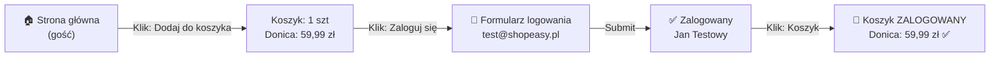

# Analiza flow - Koszyk gościa po zalogowaniu

**Rola:** Gość → Zalogowany użytkownik

## Preconditions:
- Użytkownik nie zalogowany (rola: **Gość**)
- Koszyk pusty
- Dostępny jest sklep z produktami

## Kroki:

### 1. Gość nawiguje na stronę główną
   - **Widoczne dane:**
     - Header: "ShopEasy" + nawigacja (Produkty, Koszyk, Zaloguj się, Zarejestruj)
     - Section "Polecane produkty" (6 produktów)
     - Produkt do testowania: **Donica ceramiczna TerraForm L** (59,99 zł, kategoria: Dom i ogród)

### 2. Gość dodaje produkt do koszyka
   - **Akcja:** Klik na "Dodaj do koszyka" (Donica ceramiczna TerraForm L)
   - **Rezultat na ekranie:**
     - Alert potwierdzenia (toast notification)
     - Button zmienia stan (active)

### 3. Gość otwiera koszyk (bez zalogowania)
   - **Akcja:** Klik na link "🛒 Koszyk" w nawigacji
   - **Rezultat:**
     - URL: `/cart`
     - Widoczne: **Koszyk (1 szt.)**
     - Produkt: Donica ceramiczna TerraForm L
     - Ilość: 1
     - Cena: 59,99 zł / szt.
     - Łącznie: 59,99 zł
     - Dostawa: "obliczana przy kasie"
     - Button: "Przejdź do kasy"

### 4. Gość nawiguje do logowania
   - **Akcja:** Klik na "Zaloguj się" w nawigacji
   - **URL:** `/login`
   - **Widoczne:**
     - Formularz: E-mail, Hasło
     - Button: "Zaloguj się"
     - Linki: "Zapomniałeś hasła?", "Zarejestruj się"

### 5. Zalogowany użytkownik (Jan Testowy) — logowanie
   - **Dane wejściowe:**
     - E-mail: `test@shopeasy.pl`
     - Hasło: `Test1234!`
   - **Akcja:** Klik na "Zaloguj się"
   - **Rezultat:**
     - Redirect do `/`
     - Header zmienia się: "Zaloguj się, Zarejestruj" → "👤 Jan Testowy" + Button "Wyloguj"

### 6. Zalogowany użytkownik otwiera koszyk
   - **Akcja:** Klik na "🛒 Koszyk"
   - **URL:** `/cart`
   - **Widoczne:** **Koszyk (1 szt.)**
   - **✅ PRODUKT NADAL W KOSZYKU:**
     - Donica ceramiczna TerraForm L
     - Ilość: 1
     - Cena: 59,99 zł
     - Łącznie: 59,99 zł

## Postconditions:
- ✅ Produkt z koszyka gościa **utrwalił się** po zalogowaniu
- ✅ Koszyk zachowuje dane przejścia gość → zalogowany użytkownik
- ✅ Użytkownik może przejść do kasy ("Przejdź do kasy" → `/checkout/delivery`)

---

## Diagram - Flow

---

## Założenia:
- Produkt **Donica ceramiczna TerraForm L** dostępny w sekcji "Polecane produkty"
- Konto testowe `test@shopeasy.pl` / `Test1234!` istnieje i jest aktywne
- Brak wcześniejszych produktów w koszyku (świeża sesja)
- LocalStorage/SessionStorage synchronizuje koszyk gościa z profilem zalogowanym

---

## Otwarte kwestie:
- ❓ Co się dzieje, jeśli gość doda produkt A, a zaloguje się innym kontem → czy produkt znika czy się merge'uje?
- ❓ Czy system ma limit na ilość produktów w koszyku?
- ❓ Czego dotyczy komunikat "Dostawa: obliczana przy kasie"?

---

**Data testu:** 2026-10-05  
**Status:** ✅ PASSED - Produkt utrzymany po zalogowaniu
