# Analiza flow — Niezalogowany → Dodaj produkt → Zaloguj

**Rola:** Niezalogowany gość → Zalogowany użytkownik

## Preconditions:
- Aplikacja ShopEasy jest dostępna
- Użytkownik jest niezalogowany (brak sesji)
- Baza zawiera produkty

## Kroki

### 1. **Strona główna jako gość**
- **URL**: `/`
- **Stan**: Niezalogowany
- **Widoczne elementy**: 
  - Header z linkami: "Zaloguj się", "Zarejestruj"
  - Lista polecanych produktów (8 sztuk)
- **Rezultat**: ✅ Strona załadowała się poprawnie

### 2. **Dodaj produkt do koszyka (jako gość)**
- **Akcja**: Kliknięcie "Dodaj do koszyka" przy "Donica ceramiczna TerraForm L"
- **Cena produktu**: 59,99 zł
- **Rezultat**: Alert potwierdzenia (toast notification)
- **Status**: ✅ Produkt dodany do local storage / session storage

### 3. **Przejście do koszyka**
- **URL**: `/cart`
- **Widoczne elementy**:
  - Nagłówek: "Koszyk (1 szt.)"
  - Produkt: Donica ceramiczna TerraForm L, 59,99 zł
  - Podsumowanie: Łącznie 59,99 zł
- **Rezultat**: ✅ Koszyk gościa zapamiętany lokalnie

### 4. **Przejście do logowania**
- **URL**: `/login`
- **Formularz**: E-mail, Hasło
- **Dane testowe**: `test@shopeasy.pl` / `Test1234!`
- **Rezultat**: ✅ Zalogowanie powiodło się (przekierowanie na `/`)

### 5. **Weryfikacja koszyka po zalogowaniu**
- **URL**: `/cart`
- **Stan**: Zalogowany (header pokazuje "👤 Jan Testowy")
- **Widoczne elementy**:
  - Nagłówek: "Koszyk (1 szt.)"
  - **Produkt zapamiętany**: Donica ceramiczna TerraForm L, 59,99 zł
  - Podsumowanie: Łącznie 59,99 zł
  - Przycisk: "Przejdź do kasy"
- **Status**: ✅ **Guest Cart Persistence DZIAŁA** — produkt dodany jako gość jest dostępny dla zalogowanego użytkownika

## Postconditions:
- Użytkownik jest zalogowany
- Koszyk zawiera 1 produkt (wartość: 59,99 zł)
- Przepływ gotów do kontynuacji (checkout)

## Diagram

```mermaid
graph LR
    A["🌐 Strona główna<br/>(niezalogowany)"] -->|"Klik: Dodaj do koszyka"| B["🛒 Koszyk gościa<br/>(1 szt., 59,99 zł)"]
    B -->|"Klik: Zaloguj się"| C["🔐 Formularz logowania<br/>(test@shopeasy.pl)"]
    C -->|"Enter: Submit"| D["✅ Zalogowany<br/>(Jan Testowy)"]
    D -->|"Przejście do /cart"| E["🛒 Koszyk użytkownika<br/>(1 szt., 59,99 zł)<br/>Guest Cart Merged!"]
    E -->|"Opcja: Przejdź do kasy"| F["💳 Checkout"]
    
    style A fill:#fff5e6
    style B fill:#e6f3ff
    style C fill:#e6f3ff
    style D fill:#e6ffe6
    style E fill:#e6ffe6
    style F fill:#ffe6e6
```

## Podsumowanie

| Etap | Rezultat | Status |
|------|----------|--------|
| Strona główna (gość) | Załadowana, produkty widoczne | ✅ |
| Dodanie produktu do koszyka | Donica ceramiczna (59,99 zł) dodana | ✅ |
| Przeglądanie koszyka (gość) | Koszyk zawiera 1 szt. | ✅ |
| Logowanie | test@shopeasy.pl zalogowany | ✅ |
| Koszyk zalogowanego użytkownika | Produkt zapamiętany (**guest cart persistence**) | ✅ |
| Gotowość do checkout | Przycisk "Przejdź do kasy" dostępny | ✅ |

## Założenia:
- Aplikacja używa `localStorage` lub `sessionStorage` do przechowywania koszyka gościa
- Przy zalogowaniu system scala koszyk gościa z koszykiem użytkownika w bazie danych
- Brak konfliktów pomiędzy kartą gościa a kartą zalogowanego użytkownika

## Otwarte kwestie:
- Czy produkty dodane jako gość są scalane czy zastępują istniejące pozycje w koszyku użytkownika?
- Czy system obsługuje wiele produktów dodanych jako gość?
- ⚠️ Czasowe opóźnienie załadowania danych koszyka po zalogowaniu (~3-5 sek) — czy to normalne zachowanie?

## Data analizy
2026-10-06, 08:02 UTC
