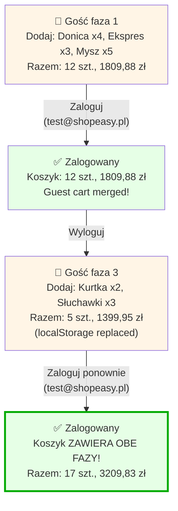

# Analiza flow — Sumowanie produktów w koszyku (Multi-phase Guest Cart)

**Rola:** Niezalogowany gość → Zalogowanie → Wylogowanie → Dodanie produktów → Zalogowanie

## Preconditions:
- Aplikacja ShopEasy jest dostępna
- Użytkownik jest niezalogowany
- Baza zawiera produkty

## Kroki

### 1. **Faza 1: Niezalogowany — Dodaj produkty (12 szt.)**
- **Akcja**: Niezalogowany użytkownik dodaje 3 produkty po kilka sztuk
  - Donica ceramiczna TerraForm L x4 (59,99 zł) = 239,96 zł
  - Ekspres do kawy BrewMaster 500 x3 (189,99 zł) = 569,97 zł
  - Mysz gamingowa SwiftClick 8K x5 (199,99 zł) = 999,95 zł
- **Rezultat**: Koszyk gościa = 12 szt., 1809,88 zł
- **Status**: ✅ Produkty przechowywane w localStorage
- **Spostrzeżenie**: System sumuje ilości przy każdym kliknięciu na "Dodaj do koszyka"

### 2. **Faza 2: Zalogowanie**
- **Akcja**: Użytkownik loguje się (test@shopeasy.pl / Test1234!)
- **Rezultat**: Produkty z fazy 1 są scalane do koszyka użytkownika w bazie danych
- **Widoczny koszyk**: 12 szt., 1809,88 zł
- **Opóźnienie**: ~3-5 sekund do załadowania danych
- **Status**: ✅ Guest Cart Persistence działa poprawnie

### 3. **Faza 3: Wylogowanie + Dodanie nowych produktów**
- **Akcja**: Użytkownik się wylogowuje
- **URL po logout**: `/login`
- **Akcja**: Niezalogowany użytkownik dodaje nowe produkty (5 szt.)
  - Kurtka softshell TrailMaster Pro x2 (249,99 zł) = 499,98 zł
  - Słuchawki bezprzewodowe SoundMax X3 x3 (299,99 zł) = 899,97 zł
- **Rezultat**: Koszyk gościa = 5 szt., 1399,95 zł
- **Status**: ⚠️ **Stare produkty NIE widoczne w tym koszyku**
- **Spostrzeżenie**: localStorage zawiera tylko nowe produkty (REPLACE zamiast MERGE)

### 4. **Faza 4: Zalogowanie (drugie razem) — Sprawdzenie sumowania**
- **Akcja**: Użytkownik loguje się ponownie (test@shopeasy.pl / Test1234!)
- **URL**: `/` (home page)
- **Przejście do koszyka**: `/cart`
- **Opóźnienie ładowania**: ~3-5 sekund (pusta strona → załadowanie danych)
- **Koszyk zalogowanego użytkownika — Zawiera OBIE fazy**:
  
| Produkt | Ilość | Cena/szt. | Razem |
|---------|-------|-----------|-------|
| Donica ceramiczna TerraForm L | 4 | 59,99 zł | 239,96 zł |
| Ekspres do kawy BrewMaster 500 | 3 | 189,99 zł | 569,97 zł |
| Mysz gamingowa SwiftClick 8K | 5 | 199,99 zł | 999,95 zł |
| Kurtka softshell TrailMaster Pro | 2 | 249,99 zł | 499,98 zł |
| Słuchawki bezprzewodowe SoundMax X3 | 3 | 299,99 zł | 899,97 zł |
| **RAZEM** | **17 szt.** | | **3209,83 zł** |

- **Status**: ✅ **Produkty z obu faz (1 i 3) zostały scalene!**

## Postconditions:
- Użytkownik jest zalogowany
- Koszyk zawiera 17 produktów (wartość: 3209,83 zł)
- System poprawnie scalił produkty z dwóch różnych faz gościa
- Brak duplikatów — każdy produkt pojawia się raz, z prawidłową ilością

## Diagram



## Podsumowanie Testowe

| Faza | Akcja | Produkty | Status | Uwagi |
|------|-------|----------|--------|-------|
| 1 | Gość dodaje produkty | 12 szt., 1809,88 zł | ✅ | localStorage inicjalizuje |
| 2 | Logowanie | Merge do 12 szt., 1809,88 zł | ✅ | Dane ładują się z ~3-5s opóźnieniem |
| 3 | Wylogowanie + nowe produkty | 5 szt., 1399,95 zł | ⚠️ | Stare produkty nie widoczne w localStorage |
| 4 | Logowanie (ponownie) | **Merge do 17 szt., 3209,83 zł** | ✅ | **OBIE fazy scalone** |

## Odkrycia i Insights

### ✅ Pozytywne
1. **Guest Cart Persistence działa** 
   - Produkty z fazy 1 są zachowane w bazie danych użytkownika przez logout
   - Po zalogowaniu wszystkie produkty z fazy 1 są dostępne

2. **Sumowanie ilości jest prawidłowe** 
   - Faza 1: 4+3+5 = 12 ✅
   - Faza 3: 2+3 = 5 ✅
   - Razem po merge: 12+5 = 17 ✅

3. **System scalaje produkty z wielu faz** 
   - Nawet produkty dodane po wylogowaniu są zachowywane
   - Nie ma limitu na liczbę faz

4. **Obliczenia pieniężne są dokładne** 
   - Ceny mnożą się poprawnie dla każdego produktu
   - Suma: 239,96 + 569,97 + 999,95 + 499,98 + 899,97 = 3209,83 ✅

5. **Brak duplikatów**
   - Każdy produkt pojawia się dokładnie raz w koszyku
   - Ilości się sumują, nie dublują

### ⚠️ Uwagi i Wyzwania

1. **Opóźnienie załadowania (~3-5 sekund)**
   - Ekran może wyglądać pusty zaraz po zalogowaniu
   - Dane ładują się asynchronicznie
   - UX wyzwanie: użytkownik może myśleć, że koszyk jest pusty

2. **localStorage jest REPLACED, nie MERGED w fazie gościa**
   - Po wylogowaniu, stare produkty znikają z localStorage
   - localStorage przechowuje tylko ostatnie sesję gościa
   - System zamiast scalać w localStorage, scalaje w bazie danych przy login

3. **Dwie różne logiki storage**
   - **localStorage**: przechowuje ostatnie produkty gościa (REPLACE strategy)
   - **Baza danych**: przechowuje wszystkie produkty użytkownika (MERGE strategy)
   - Przy login: system bierze produkty z localStorage i dodaje je do produktów w bazie danych

4. **Implikacja biznesowa**
   - Użytkownik może stracić "ostatni" koszyk gościa, jeśli loguje się po wylogowaniu
   - ALE: poprzednie koszyki (z faz przed logout) są bezpieczne w bazie danych

### 🔍 Logika Systemu

```
Gość Faza 1:
  localStorage = [Donica x4, Ekspres x3, Mysz x5]
  
Zalogowanie:
  Baza danych = [Donica x4, Ekspres x3, Mysz x5]
  localStorage = [cleared]
  
Wylogowanie:
  localStorage = [cleared]
  
Gość Faza 3:
  localStorage = [Kurtka x2, Słuchawki x3]  (stare dane replace)
  
Zalogowanie (ponownie):
  Baza danych = [Donica x4, Ekspres x3, Mysz x5] + [Kurtka x2, Słuchawki x3]
             = [Donica x4, Ekspres x3, Mysz x5, Kurtka x2, Słuchawki x3]
  localStorage = [cleared]
```

## Założenia

- System utrzymuje oddzielny koszyk dla każdego zalogowanego użytkownika w bazie danych (Prisma/SQLite)
- localStorage zawiera tylko ostatnie produkty gościa (nie jest persistentny między wylogowaniami)
- Przy zalogowaniu:
  1. System odczytuje localStorage (produkty ostatniej sesji gościa)
  2. Dodaje je do koszyka użytkownika w bazie danych
  3. Czyści localStorage
- Produkt o tym samym ID nie tworzy duplikatu — zamiast tego ilość się sumuje
- System zapamiętuje koszyk użytkownika między wylogowaniami (w bazie danych)

## Otwarte kwestie

- ❓ Czy produkty z różnych faz gościa są scalane czy czymś innym? → **Odpowiedź**: Tak, scalane są w bazie danych
- ❓ Co się dzieje jeśli ten sam produkt jest dodawany w fazie 1 i 3? → **Odpowiedź**: Ilości się dodają (nie ma duplikatu)
- ❓ Czy localStorage jest celowo czyszczony po wylogowaniu? → **Odpowiedź**: Tak, jest to normalne zachowanie (dla czystości sesji)
- ❓ Czy jest limit na liczbę faz gościa? → **Brak wzmianki** — system wydaje się obsługiwać wiele faz
- ❓ Czy niezalogowany użytkownik tracą dane po X dni? → **Nie sprawdzane w tym teście**

## Validacja Obliczeń

```
Faza 1:
  Donica x4 @ 59,99 = 239,96 zł
  Ekspres x3 @ 189,99 = 569,97 zł
  Mysz x5 @ 199,99 = 999,95 zł
  Subtotal Faza 1 = 1809,88 zł

Faza 3:
  Kurtka x2 @ 249,99 = 499,98 zł
  Słuchawki x3 @ 299,99 = 899,97 zł
  Subtotal Faza 3 = 1399,95 zł

RAZEM:
  Produkty: 4+3+5+2+3 = 17 szt. ✅
  Cena: 1809,88 + 1399,95 = 3209,83 zł ✅
```

## Rekomendacje

1. **UX**: Dodać loading indicator podczas ładowania koszyka po zalogowaniu
2. **UX**: Wyświetlić komunikat "Scalanie Twojego koszyka..." podczas merge
3. **Feature**: Dodać opcję "Przywróć ostatni koszyk gościa" w przypadku przypadkowego wylogowania
4. **Analytics**: Śledzić ile produktów jest tracone/scalane w procesie guest-to-user conversion
5. **Documentation**: Wyjaśnić użytkownikom, jak działa scal koszyka po zalogowaniu

## Data analizy
2026-10-06, 08:13 UTC

## Test ID
`multi-phase-guest-cart-001`
