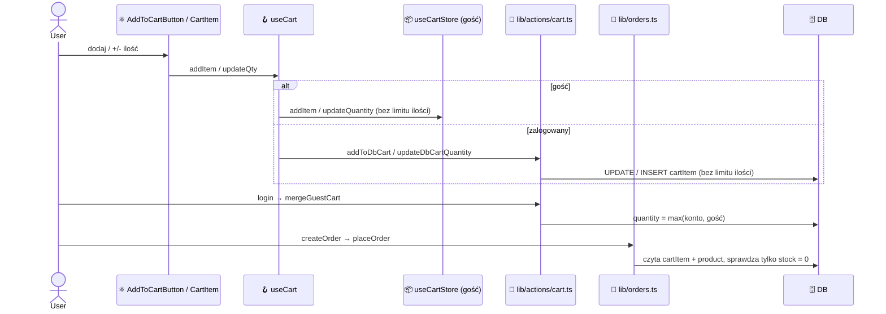
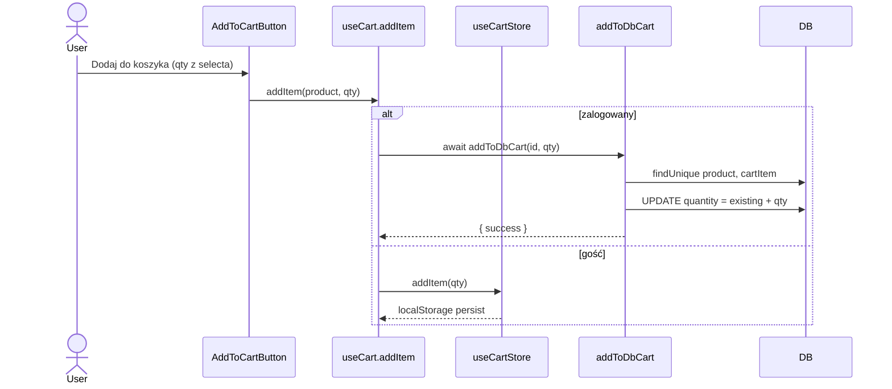
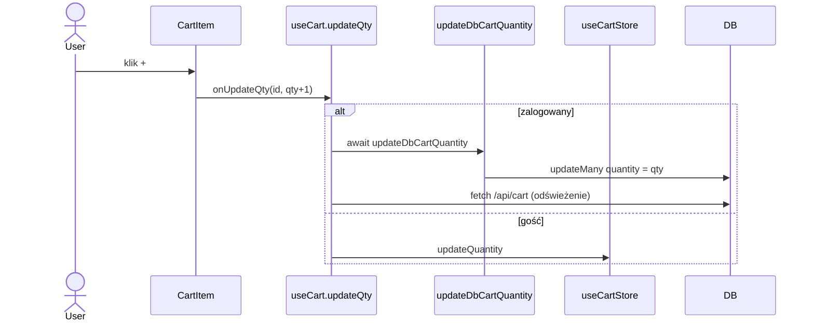
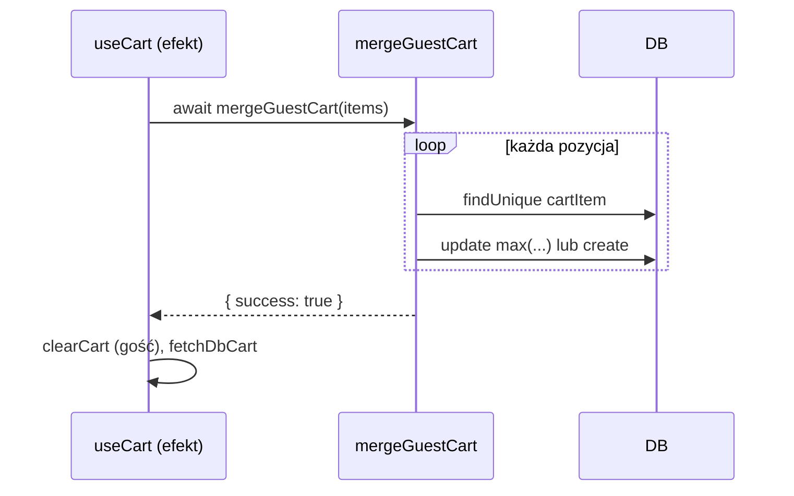
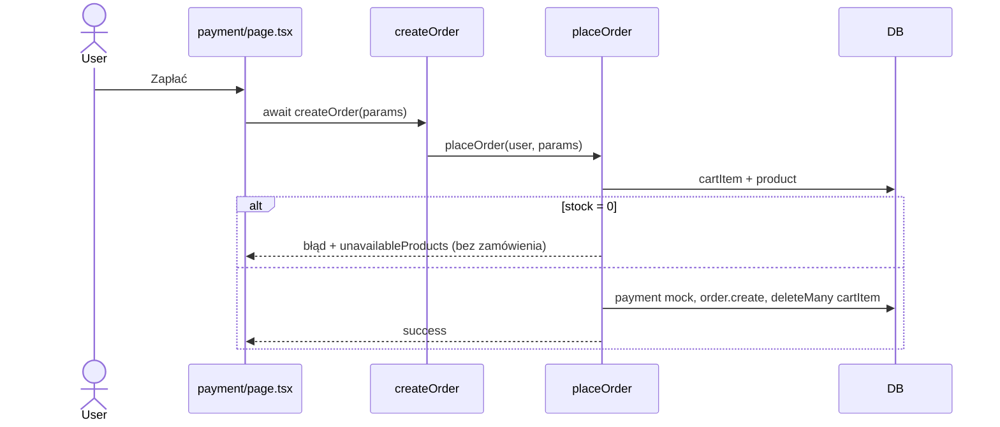

# Analiza przepływu danych: ilość produktu w koszyku (limit 10 / stan)

Data: 2026-10-07. Status: stan obecny (przed zmianą). Zakres: ścieżki zmieniające ilość pozycji lub ją konsumujące.

## Krok 1: Dodanie produktu (gość i zalogowany)

**URL**: strona produktu w `(shop)/products`

- [components/products/AddToCartButton.tsx](../components/products/AddToCartButton.tsx)
  - `AddToCartButton` (linia 57) — select ilości ograniczony do `min(10, stock)` (jedyne ograniczenie, tylko UI)
- [hooks/useCart.ts](../hooks/useCart.ts)
  - `addItem` (linia 92) — zalogowany: wywołanie akcji; gość: tylko limit 5 pozycji, potem zapis w store
- [store/cart.ts](../store/cart.ts)
  - `addItem` — sumuje ilość bez sprawdzenia limitu
- [lib/actions/cart.ts](../lib/actions/cart.ts)
  - `addToDbCart` (linia 24) — sprawdza tylko `stock === 0` i limit 5 pozycji; istniejącą pozycję zwiększa bez limitu

## Krok 2: Zmiana ilości w koszyku

**URL**: `/cart`

- [components/cart/CartItem.tsx](../components/cart/CartItem.tsx)
  - `CartItem` (linia 52) — przycisk „+” zablokowany przy ilości >= 10 (bez znajomości stanu)
- [app/(shop)/cart/page.tsx](../app/(shop)/cart/page.tsx)
  - `useCart()` (linia 12) — przekazuje `updateQty` do pozycji
- [hooks/useCart.ts](../hooks/useCart.ts)
  - `updateQty` (linia 126) — bez walidacji, wywołuje akcję lub store
- [lib/actions/cart.ts](../lib/actions/cart.ts)
  - `updateDbCartQuantity` (linia 72) — zapisuje dowolną ilość > 0 (bez limitu i stanu)

## Krok 3: Logowanie i łączenie koszyków

**URL**: dowolny widok po zalogowaniu (efekt w `useCart`)

- [hooks/useCart.ts](../hooks/useCart.ts)
  - `useEffect` po `isLoggedIn` — wysyła pozycje gościa do `mergeGuestCart`, czyści store
- [lib/actions/cart.ts](../lib/actions/cart.ts)
  - `mergeGuestCart` (linia 96) — istniejąca pozycja: `max(konto, gość)`; nowa: zapis bez limitu ilości i bez sprawdzenia stanu

## Krok 4: Checkout

**URL**: `/checkout/payment`

- [app/(shop)/checkout/payment/page.tsx](../app/(shop)/checkout/payment/page.tsx)
  - `createOrder` (linia 96) — wywołanie akcji serwerowej
- [lib/actions/checkout.ts](../lib/actions/checkout.ts)
  - `createOrder` — sesja, deleguje do `placeOrder`
- [lib/orders.ts](../lib/orders.ts)
  - `placeOrder` (linia 36) — pobiera koszyk z DB; `unavailable` (linia 52) odrzuca całe zamówienie przy stanie 0; ilość ponad limit/stan niesprawdzana; płatność, zamówienie ze snapshotem, czyszczenie koszyka

## Wnioski do planu (fakty z kodu)

- Jedyne ograniczenia ilości to kontrolki UI (select i „+”); żadna akcja serwerowa nie ma limitu ilości ani nie porównuje ilości ze stanem.
- Zmiana ilości w koszyku nie zna stanu (`CartLineItem` i `CartItem` nie niosą pola stanu).
- Ścieżki mutujące ilość w bazie: `addToDbCart`, `updateDbCartQuantity`, `mergeGuestCart`; odczyt przez `placeOrder`.
- Koszyk gościa jest w localStorage, więc serwer widzi go dopiero przy `mergeGuestCart`.

## Rozszerzenia

- Error flows: komunikaty błędu z akcji pokazuje tylko `AddToCartButton` (przez `error` z `useCart`); strona `/cart` odczytuje `error` z hooka (sprawdzić w fazie frontendu).
- Race condition: odczyt stanu i zapis ilości w `addToDbCart` nie są atomowe (dwa równoległe dodania).
